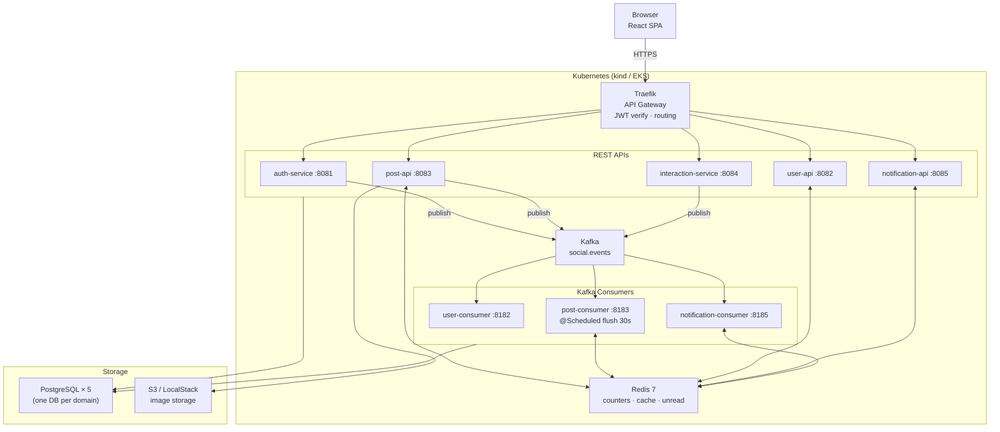
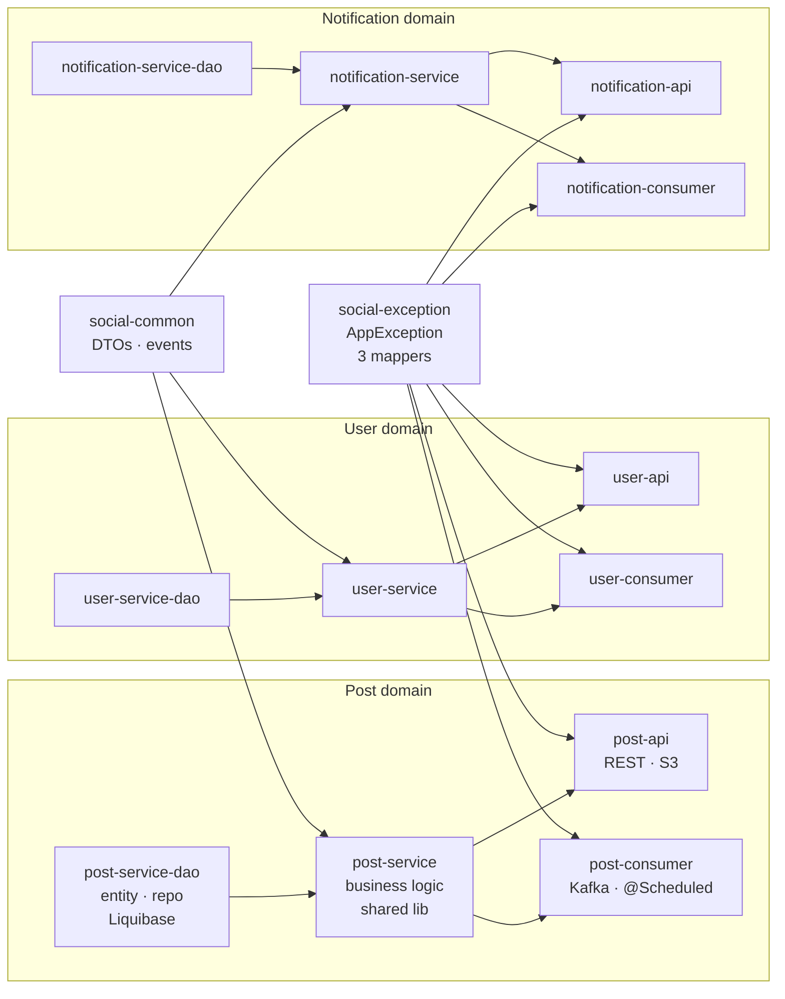
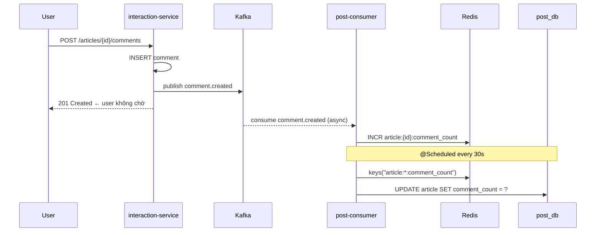
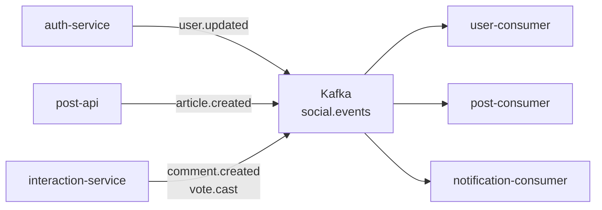
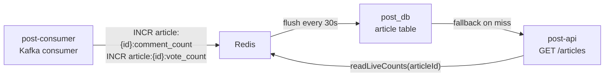

# Mini Social Network

A full-stack social media application built with a microservices architecture.

## Tech Stack

### Frontend
- React 19 · shadcn/ui · Tailwind CSS
- TanStack React Query v5 · Zustand · React Router 7
- React Hook Form · Zod

### Backend — Microservices (Quarkus + Kotlin)
- **Runtime:** Quarkus 3.11 · Kotlin 2.0 · Java 21
- **Build:** Gradle multi-project (Kotlin DSL)
- **Database:** PostgreSQL 15 · Liquibase (migrations)
- **Cache:** Redis 7
- **Messaging:** Apache Kafka
- **Auth:** JWT (RS256) via SmallRye JWT
- **Image storage:** AWS S3 (LocalStack for local dev)
- **Observability:** OpenTelemetry

### Infrastructure
- **API Gateway:** Traefik v3 (JWT validation, routing)
- **Local K8s:** kind
- **Production:** AWS EKS · AWS RDS · AWS MSK · AWS ECR
- **Container image:** Quarkus JIB (no Dockerfile)
- **Secrets:** AWS Secrets Manager + External Secrets Operator

---

## Architecture

### System Overview



---

### Module Dependency Graph



---

### Comment / Vote — Async Counter Flow



---

### Kafka Event Flow



---

### Redis — Counter Pattern



---

### Dependency graph per domain

```
x-service-dao      ← JPA entities · Panache repos · Liquibase changelogs
x-service          ← business logic (shared lib, no Quarkus plugin)
x-api              ← Quarkus app: REST endpoints only
x-consumer         ← Quarkus app: Kafka consumer only
```

Shared across all services:
```
social-common      ← DTOs · Kafka event types
social-exception   ← AppException · ErrorResponse · 3 JAX-RS mappers (OTel traceId)
```

### Redis key reference

| Key | Owner | Usage |
|---|---|---|
| `article:{id}:comment_count` | post-consumer | INCR on comment, flush to DB every 30s |
| `article:{id}:vote_count` | post-consumer | INCR/DECR on vote, flush to DB every 30s |
| `user:{id}:profile` | user-api | Cache user profile 10 min |
| `user:{id}:noti_unread` | notification-consumer | INCR on new notification |

Feed reads counts from Redis (real-time), falls back to DB on cache miss.

---

## Project Structure

```
mini-social-network/
├── services/                    # Gradle root (all backend)
│   ├── social-common/
│   ├── social-exception/
│   ├── auth-service-dao/
│   ├── auth-service/            # Quarkus app
│   ├── user-service-dao/
│   ├── user-service/            # shared lib
│   ├── user-api/                # Quarkus app
│   ├── user-consumer/           # Quarkus app
│   ├── post-service-dao/
│   ├── post-service/            # shared lib
│   ├── post-api/                # Quarkus app
│   ├── post-consumer/           # Quarkus app
│   ├── interaction-service-dao/
│   ├── interaction-service/     # Quarkus app
│   ├── notification-service-dao/
│   ├── notification-service/    # shared lib
│   ├── notification-api/        # Quarkus app
│   └── notification-consumer/   # Quarkus app
├── frontend/                    # React SPA
├── infra/
│   ├── docker-compose.dev.yml   # local infra (PostgreSQL × 5, Redis, Kafka, LocalStack)
│   └── localstack/init.sh
└── specs/                       # Architecture docs
    ├── summary.md
    ├── plan.md
    ├── current.md
    ├── frontend.md
    ├── api-standard.md
    └── loadtest.md
```

---

## API Response Format

```json
// Success
{ "success": true, "data": { ... } }

// Error
{
  "success": false,
  "error": {
    "errorCode": "03-0001",
    "errorMessage": "Article not found",
    "traceId": "4bf92f3577b34da6a3ce929d0e0e4736"
  }
}
```

Error code format: `"{service}-{type}"` — e.g. `03-0001` = post-service, not found.

---

## Running Locally

### Prerequisites
- Java 21
- Docker + Docker Compose
- IntelliJ IDEA (recommended) with Gradle 8.x

### 1. Start infrastructure

```bash
cd infra
docker compose -f docker-compose.dev.yml up -d
```

This starts: PostgreSQL (×5 databases), Redis, Kafka, LocalStack S3.

### 2. Generate JWT keys (first time only)

```bash
cd services
./setup.sh
```

### 3. Run services

Open `services/` in IntelliJ as a Gradle project, then run each service via the Quarkus `quarkusDev` task:

```bash
cd services

# Core (start first)
./gradlew :auth-service:quarkusDev

# APIs
./gradlew :user-api:quarkusDev
./gradlew :post-api:quarkusDev
./gradlew :interaction-service:quarkusDev
./gradlew :notification-api:quarkusDev

# Consumers (background workers)
./gradlew :user-consumer:quarkusDev
./gradlew :post-consumer:quarkusDev
./gradlew :notification-consumer:quarkusDev
```

### 4. Smoke test

```bash
chmod +x services/scripts/test-flow.sh
./services/scripts/test-flow.sh
```

---

## Key API Endpoints

| Method | Path | Service | Description |
|---|---|---|---|
| POST | `/api/auth/signup` | auth | Register |
| POST | `/api/auth/signin` | auth | Login → JWT |
| GET | `/api/articles` | post-api | Feed (real-time counts) |
| POST | `/api/articles` | post-api | Create post |
| POST | `/api/articles/images/presign` | post-api | S3 pre-signed upload URL |
| GET | `/api/articles/{id}/comments` | interaction | List comments |
| POST | `/api/articles/{id}/comments` | interaction | Add comment |
| POST | `/api/articles/{id}/vote` | interaction | Vote (-1 / 0 / 1) |
| GET | `/api/notifications` | notification-api | List notifications |
| GET | `/api/notifications/unread-count` | notification-api | Unread badge count |

Full API specification: [specs/api-standard.md](specs/api-standard.md)

---

## Contact

<p align="center">
  <a href="https://github.com/nguyentrinhan-dev"></a>
  <a href="https://www.linkedin.com/in/nguyentrinhan-dev/"></a>
  <a href="https://www.facebook.com/nguyentrinhan.dev/"></a>
</p>
