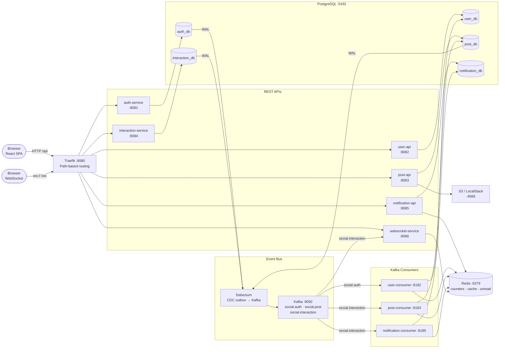

# Mini Social Network

> **Honest disclaimer:** This is a deliberately over-engineered project built to explore technologies.
> Nobody needs microservices + Kafka + Debezium CDC + Outbox Pattern + WebSocket pub/sub + a full LGTM observability stack to run a small social network. That's the point — whenever the author finds something interesting or wants to understand how something actually works under the hood, a use case gets invented and bolted on.
>
> Looking for "best practices for production social networks"? Wrong place.
> Looking for "how a bunch of technologies wire together in practice"? Right place.
>
> ⚠️ **If this repo hasn't been updated in a while**, the author is probably buried under work deadlines and hasn't had time to play. It'll be back.

---

## Table of Contents

- [What's Inside](#whats-inside)
- [Architecture](#architecture)
- [Tech Stack](#tech-stack)
- [Project Structure](#project-structure)
- [Running Locally](#running-locally)
- [API](#api)
- [Documentation](#documentation)
- [Contact](#contact)

---

## What's Inside

| Technology | How it's used |
|---|---|
| **Quarkus 3.x + Kotlin** | All backend microservices |
| **Kafka + Debezium CDC** | Outbox pattern — services never publish to Kafka directly; Debezium reads the WAL |
| **Quarkus Websockets Next** | Pub/sub realtime push — live comments, notifications |
| **Redis** | Counter cache + periodic flush-to-DB, unread badge count, profile cache |
| **Traefik v3** | API gateway, path-based routing — each service verifies its own JWT (RS256, shared public key), see [ADR 0005](specs/decisions/0005-bo-forwardauth-o-gateway.md) |
| **LGTM stack** | Grafana · Loki · Tempo · Mimir + OpenTelemetry |
| **Quarkus JIB** | Container images with no Dockerfile |
| **kind + Kubernetes** | Local cluster with full k8s manifests |
| **LocalStack** | AWS S3 locally for presigned URL upload |
| **Liquibase** | DB migrations, one changelog per service schema |
| **RSQL** | Filter/sort query language for the feed API |
| **WireMock** | Mock server for integration tests |

---

## Architecture



See [docs/architecture.md](docs/architecture.md) for detailed service breakdown, routing rules, and sequence diagrams.

---

## Tech Stack

### Backend
- **Language:** Kotlin 2.0 · JVM 21
- **Framework:** Quarkus 3.25.x
- **Build:** Gradle 9 + Kotlin DSL + BOM
- **ORM:** Hibernate ORM + Panache Kotlin
- **Messaging:** Kafka via Debezium CDC (outbox pattern)
- **Cache:** Redis 7
- **Storage:** AWS S3 / LocalStack
- **WebSocket:** Quarkus Websockets Next
- **Observability:** OpenTelemetry + LGTM (Grafana · Loki · Tempo · Mimir)
- **Container:** Quarkus JIB (no Dockerfile)

### Frontend
- React 18 · Vite · Material UI (MUI) v7
- TanStack Query v5 · Zustand · React Router 6
- React Hook Form · Zod

### Infrastructure
- **Gateway:** Traefik v3 (path-based routing; JWT verification lives in each service, not the gateway)
- **Local k8s:** kind
- **Production:** AWS EKS · RDS · MSK · S3 · ECR

---

## Project Structure

```
mini-social-network/
├── services/                        # Gradle multi-project root
│   ├── social-bom/                  # version catalog
│   ├── social-common/               # shared DTOs, Kafka event types
│   ├── social-exception/            # AppException, JAX-RS mappers, InternalAuthFilter
│   │
│   ├── auth-service-dao/
│   ├── auth-service/                # REST + JWT sign
│   │
│   ├── user-service-dao/
│   ├── user-service/                # shared logic
│   ├── user-api/                    # REST
│   ├── user-consumer/               # Kafka ← social.auth
│   │
│   ├── post-service-dao/
│   ├── post-service/                # shared logic (ArticleService, CounterService, RSQL)
│   ├── post-api/                    # REST + S3
│   ├── post-consumer/               # Kafka ← social.interaction + CounterFlushJob
│   │
│   ├── interaction-service-dao/
│   ├── interaction-service/         # REST
│   │
│   ├── notification-service-dao/
│   ├── notification-service/        # shared logic
│   ├── notification-api/            # REST
│   ├── notification-consumer/       # Kafka ← social.interaction
│   │
│   └── websocket-service/           # WebSocket server + Kafka ← social.interaction
│
├── frontend/                        # React SPA
├── k8s/
│   ├── infra/                       # Kafka, Postgres, Redis, Debezium, LGTM, LocalStack
│   ├── services/                    # one manifest per service
│   └── traefik/                     # IngressRoute + middlewares
└── docs/                            # Architecture & design docs
```

---

## Running Locally

Two options. **kind is recommended** — it's the only path that runs the full outbox/CDC pattern (Debezium needs a real WAL replication slot; the plain docker-compose setup has no Kafka Connect, so outbox events never flow there).

### Option 1 — kind (full stack, verified end-to-end)

**Prerequisites:** Java 21 · Docker Desktop (≥6 CPU / 12GB RAM recommended) · kind · Helm · kubectl

```bash
make cluster-create      # spin up kind cluster + install Traefik
make deploy               # infra → secrets → services (sequential) → Debezium → routes
```

Useful while it's running:

```bash
make status                # pod status
make logs-post-api         # tail logs for one service
make forward-up            # background port-forward: Grafana, Kafdrop, Traefik dashboard, Postgres
make forward-down          # stop them all
```

Gateway lives at `http://localhost:8080`. Rebuild + redeploy a single service after a code change: `make up-post` (build + load image + restart).
Full walkthrough, troubleshooting, and the running list of bugs hit along the way → [docs/k8s-getting-started.md](docs/k8s-getting-started.md).

### Option 2 — docker-compose + quarkusDev (lighter, NO outbox/CDC)

For quick iteration on a single service when you don't need real Kafka events (no Kafka Connect/Debezium in this compose file).

```bash
docker compose -f infra/docker-compose.dev.yml --profile all up -d
cd services && ./setup.sh          # generate JWT keys, one-time

./gradlew :auth-service:quarkusDev
./gradlew :post-api:quarkusDev
# ... same for other services, see %dev port in each application.properties
```

### Frontend (same step regardless of which option above)

```bash
make frontend-install
make frontend-dev          # Vite on :3000, proxies /api → gateway :8080
```

---

## API

All responses follow the same envelope:

```json
{ "success": true, "data": { ... } }
{ "success": false, "error": { "errorCode": "03-0001", "errorMessage": "...", "traceId": "..." } }
```

Quick reference:

| Method | Path | Auth | Description |
|---|---|---|---|
| `POST` | `/api/auth/signup` | — | Register |
| `POST` | `/api/auth/signin` | — | Login → JWT |
| `GET` | `/api/articles` | ✓ | Feed (RSQL filter/sort) |
| `POST` | `/api/articles` | ✓ | Create post |
| `POST` | `/api/articles/images/presign` | ✓ | S3 presigned upload URL |
| `GET` | `/api/comments` | ✓ | List comments |
| `POST` | `/api/comments` | ✓ | Add comment |
| `POST` | `/api/votes` | ✓ | Vote (-1 / 0 / 1) |
| `GET` | `/api/notifications` | ✓ | Notification list |
| `GET` | `/api/notifications/unread-count` | ✓ | Unread badge |
| `WS` | `/ws` | — | Realtime pub/sub |

Full reference → [docs/api.md](docs/api.md)

---

## Documentation

| Doc | Description |
|---|---|
| [docs/architecture.md](docs/architecture.md) | System diagrams, service responsibilities, routing, module structure |
| [docs/api.md](docs/api.md) | Full API reference — endpoints, auth, response format, WebSocket protocol |
| [docs/patterns.md](docs/patterns.md) | Design patterns: Outbox + Debezium, Counter Flush, WebSocket Pub/Sub |
| [docs/k8s-getting-started.md](docs/k8s-getting-started.md) | Setting up the kind cluster from scratch — build, load, deploy, verify, known issues |

---

## Contact

<p align="center">
  <a href="https://github.com/nguyentrinhan-dev"></a>
  <a href="https://www.linkedin.com/in/nguyentrinhan-dev/"></a>
  <a href="https://www.facebook.com/nguyentrinhan.dev/"></a>
</p>
