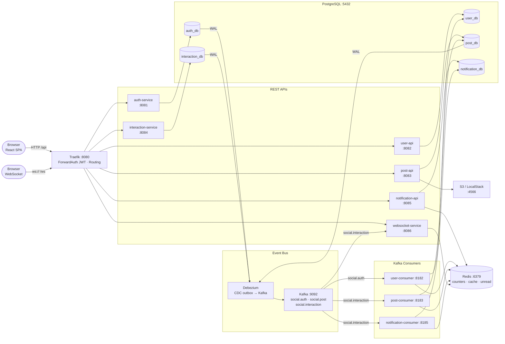
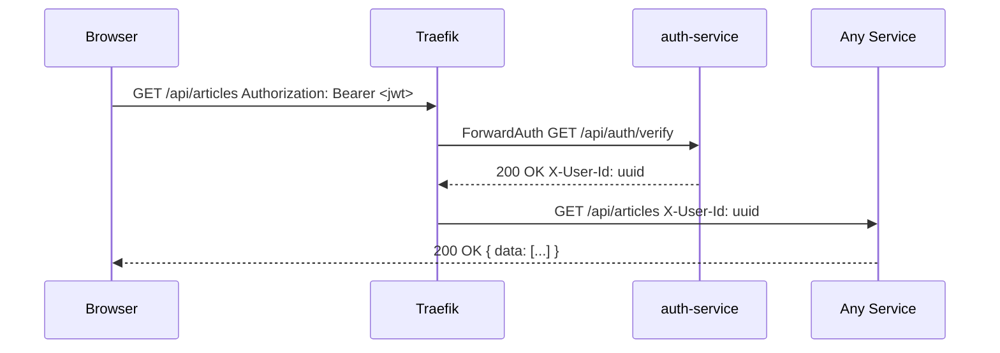

# Architecture

## System Overview



---

## API Gateway — Routing & Auth

```
http://localhost:8080
        │
        ├── /api/auth/**          → auth-service          (public — no JWT)
        │
        ├── /api/users/**         → user-api              ┐
        ├── /api/articles/**      → post-api              │ protected
        ├── /api/comments/**      → interaction-service   │ ForwardAuth JWT
        ├── /api/votes/**         → interaction-service   │ → auth-service /api/auth/verify
        ├── /api/notifications/** → notification-api      │ → inject X-User-Id header
        │                                                  ┘
        └── /ws/**                → websocket-service      (public — pub/sub channels)
```

**JWT verification flow:**
```
Request → Traefik
  → ForwardAuth: GET auth-service /api/auth/verify
                 Authorization: Bearer <jwt>
  → 200: inject X-User-Id header → forward to service
  → 401: block, return 401 to client
```

Services read `X-User-Id` header — they never verify the JWT themselves.

**Internal service-to-service:**
```
ServiceA → http://serviceB:8080/internal/**
  Header: X-Service-Secret-Key: <shared-secret>
```

---

## Services

| Service | Type | Responsibility | DB | Port |
|---|---|---|---|---|
| auth-service | REST | Credentials, JWT sign/verify | auth_db | 8081 |
| user-api | REST | User profile read/update | user_db | 8082 |
| user-consumer | Kafka | Create user_profile on signup | user_db | 8182 |
| post-api | REST | Article CRUD, S3 presign | post_db | 8083 |
| post-consumer | Kafka | Counter flush Redis → DB | post_db | 8183 |
| interaction-service | REST | Comment, Vote | interaction_db | 8084 |
| notification-api | REST | Notification list, mark seen | notification_db | 8085 |
| notification-consumer | Kafka | Create notification from events | notification_db | 8185 |
| websocket-service | WS + Kafka | Push realtime events to clients | — | 8086 |

---

## Authenticated Request Flow



---

## Kafka Topics

| Topic | Publisher | Consumers |
|---|---|---|
| `social.auth` | auth-service (via Debezium) | user-consumer |
| `social.post` | post-api (via Debezium) | _(future: search, feed ranking)_ |
| `social.interaction` | interaction-service (via Debezium) | post-consumer, notification-consumer, websocket-service |

---

## Database Schema

Each service owns its schema. No cross-DB queries.

```
auth_db       credentials, outbox
user_db       user_profile
post_db       article, outbox
interaction_db  comment, vote, outbox
notification_db notification
```

Cross-service data (e.g. author name in article feed) is resolved via Redis cache or embedded in Kafka event payload.

---

## Redis Key Reference

| Key | Owner | Purpose |
|---|---|---|
| `article:{id}:vote_count` | post-consumer | live vote counter, flushed to DB every 30s |
| `article:{id}:comment_count` | post-consumer | live comment counter, flushed to DB every 30s |
| `user:{id}:profile` | user-api | profile cache, TTL 10m |
| `user:{id}:noti_unread` | notification-consumer | unread badge count |

---

## Module Structure (Gradle)

```
services/
├── social-bom             # version catalog (wraps Quarkus BOM)
├── social-common          # DTOs, Kafka events, RSQL parser
├── social-exception       # AppException, JAX-RS mappers, InternalAuthFilter

├── auth-service-dao       # Credentials + OutboxEntry entity/repo + Liquibase
├── auth-service           # Quarkus: REST + JWT sign

├── user-service-dao       # UserProfile entity/repo + Liquibase
├── user-service           # shared business logic
├── user-api               # Quarkus: REST
├── user-consumer          # Quarkus: Kafka ← social.auth

├── post-service-dao       # Article + OutboxEntry entity/repo + Liquibase
├── post-service           # shared business logic (ArticleService, CounterService, RSQL)
├── post-api               # Quarkus: REST
├── post-consumer          # Quarkus: Kafka ← social.interaction + CounterFlushJob

├── interaction-service-dao  # Comment + Vote + OutboxEntry entity/repo + Liquibase
├── interaction-service      # Quarkus: REST

├── notification-service-dao # Notification entity/repo + Liquibase
├── notification-service     # shared business logic
├── notification-api         # Quarkus: REST
├── notification-consumer    # Quarkus: Kafka ← social.interaction

└── websocket-service        # Quarkus: WebSocket server + Kafka ← social.interaction
```
