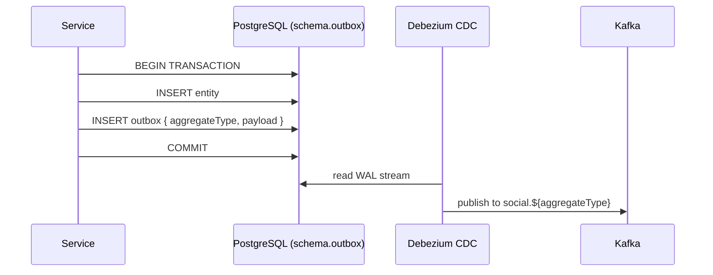
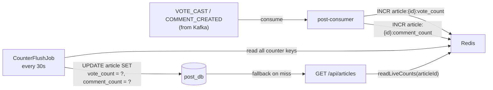

# Design Patterns

## Outbox Pattern

### The problem: Dual Write

Without the outbox pattern, services write to two separate systems in the same request — the database and Kafka. These two writes cannot be wrapped in a single transaction:

```kotlin
@Transactional
fun addComment(request: CreateCommentRequest): CommentDto {
    commentRepo.persist(comment)   // ① write to DB
    kafka.send(event)              // ② write to Kafka — NOT part of the DB transaction
}
```

This creates three failure scenarios:

- **Kafka down after DB commit** → comment exists in DB, but no notification/counter update
- **DB rollback after Kafka publish** → event consumed by downstream services for a row that doesn't exist
- **Service crash between ① and ②** → same as first case

### The solution

Instead of writing directly to Kafka, write an `outbox` record in the **same DB transaction** as the primary entity. A separate process (Debezium) reads the database WAL and publishes to Kafka.



**Guarantees:**
- If the service crashes after commit → Debezium resumes from WAL offset on restart
- If Kafka is down → Debezium retries with backoff
- **At-least-once delivery** → consumers must be idempotent

### Idempotent consumers

Since events can be delivered more than once, every consumer deduplicates by `eventId` (the outbox row UUID):

```kotlin
fun createFromEvent(event: SocialEvent) {
    val eventId = event.eventId?.let { UUID.fromString(it) }
    if (eventId != null && repo.existsByEventId(eventId)) return  // duplicate, skip

    repo.persist(Notification().apply {
        this.eventId = eventId
        ...
    })
}
```

### Topic routing

Debezium routes outbox events to Kafka topics using the `aggregate_type` column:

| `aggregate_type` | Kafka topic | Publisher |
|---|---|---|
| `auth` | `social.auth` | auth-service |
| `post` | `social.post` | post-api |
| `interaction` | `social.interaction` | interaction-service |

---

## Counter Flush Pattern

Vote and comment counts are not written to the article row on every request. Instead:



**Why:**
- High-traffic votes/comments would create write contention on the `article` row
- Redis `INCR` is atomic and O(1)
- 30s staleness in DB is acceptable; feed always reads from Redis (real-time)

**Idempotency:** The counter service guards against duplicate Kafka events by tracking processed event IDs in Redis with a 24h TTL.

---

## WebSocket Pub/Sub Channels

### Model

FE subscribes to named topic channels. The server maintains an in-memory registry of `topic → connections`. Kafka events are consumed and routed to the right connections by topic name.

```
FE connects ws://host/ws
FE sends:   { "type": "SUBSCRIBE", "topic": "user_{userId}_notification" }

Kafka COMMENT_CREATED arrives at websocket-service
  → resolve topics: "user_{authorId}_notification", "article_{articleId}_comment_added"
  → TopicRegistry.getConnections(topic)
  → conn.sendText(json) for each connection
```

### Why no auth on the WebSocket connection

WebSocket topics contain no sensitive data — notifications tell you "someone commented on a post", not private messages. The `userId` used in the topic name is already known to the FE from the JWT it holds client-side. Anyone who subscribes to `user_B_notification` gets notified when B receives a comment — which is harmless at this scale.

### Multi-instance scaling (Phase 2)

With multiple replicas, a Kafka event arriving at Instance A needs to reach users connected to Instance B. Redis pub/sub handles the fan-out:

```
Kafka event → Instance A
  → push to local connections
  → redis.publish("ws:topic:{topicName}", json)
       ↓
  Instance B (subscribed to Redis channel)
  → push to its local connections
```

### Topic naming

| Topic | Subscribed by | Receives |
|---|---|---|
| `user_{userId}_notification` | FE on login | `NOTIFICATION` (comment/vote on own post) |
| `article_{articleId}_comment_added` | FE when viewing article | `COMMENT_ADDED` (live comments) |
| `room_{roomId}_chat` | FE in chat room _(Phase 3)_ | `CHAT_MESSAGE` |
