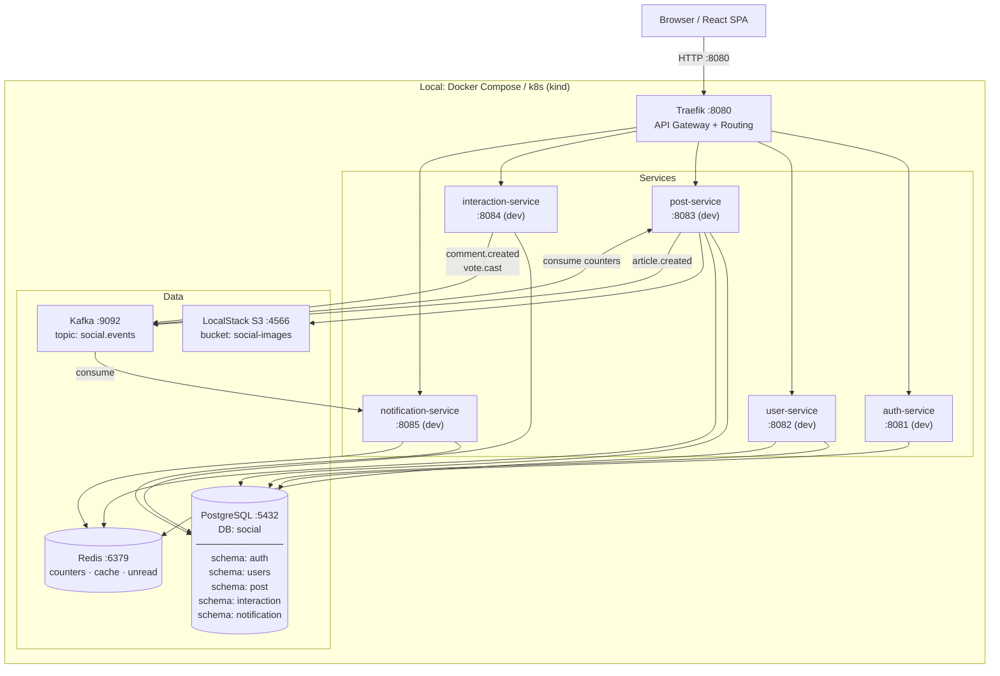
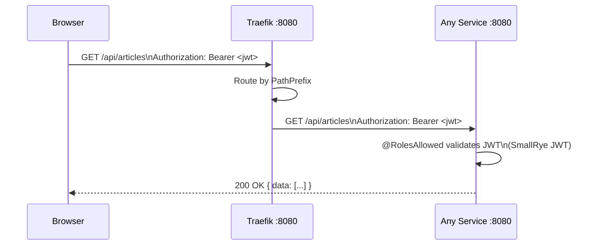
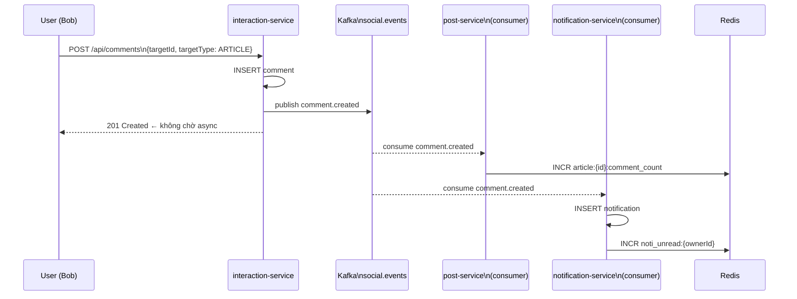
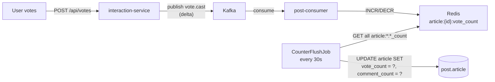
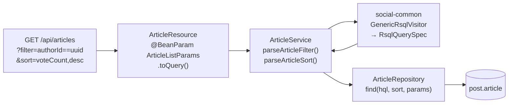

# Backend Overview
## Mini Social Network — High Level Diagrams

---

## 1. System Architecture



---

## 2. API Gateway — Routing Rules

```
http://localhost:8080
        │
        ├── /api/auth/**          → auth-service
        ├── /api/users/**         → user-service
        ├── /api/articles/**      → post-service
        ├── /api/comments/**      → interaction-service
        ├── /api/votes/**         → interaction-service
        └── /api/notifications/** → notification-service
```

> Không còn routing conflict — mỗi service sở hữu prefix độc lập.

---

## 3. Service Responsibilities

| Service | Owns | DB Schema | Port (dev) |
|---|---|---|---|
| **auth-service** | Credentials, JWT issue | `auth` | 8081 |
| **user-service** | User profile, avatar | `users` | 8082 |
| **post-service** | Article CRUD, S3 image, counter flush | `post` | 8083 |
| **interaction-service** | Comment, Vote (targetId + targetType) | `interaction` | 8084 |
| **notification-service** | Notification events, unread count | `notification` | 8085 |

---

## 4. Request Flow — Authenticated Request



---

## 5. Async Event Flow — Comment → Notification



---

## 6. Counter Flush — Redis → PostgreSQL



---

## 7. Image Upload Flow — S3 Presigned URL


---

## 8. RSQL Filter Flow — GET /api/articles



**Whitelisted filter fields:** `authorId`, `createdAt`
**Whitelisted sort fields:** `createdAt` · `voteCount` · `commentCount`

---

## 9. Database — Schema per Service

```
PostgreSQL  db: social
│
├── schema: auth
│   └── credentials (id, username, email, password_hash, user_id)
│
├── schema: users
│   └── user_profile (id, username, email, firstname, lastname, avatar_url)
│
├── schema: post
│   └── article (id, description, image_url, author_id, visible,
│                vote_count, comment_count, created_at, updated_at)
│
├── schema: interaction
│   ├── comment (id, description, target_id, target_type, author_id, visible)
│   └── vote    (id, value, user_id, target_id, target_type)
│                UNIQUE(user_id, target_id, target_type)
│
└── schema: notification
    └── notification (id, type, actor_id, owner_id, article_id, seen)
```

---

## 10. Inter-service Communication

| From | To | Protocol | When |
|---|---|---|---|
| auth-service | user-service | REST (sync) | signup → tạo user profile |
| post-service | Redis | Direct | read/write counter |
| post-service | S3 | AWS SDK | presign + store image |
| interaction-service | Kafka | Async publish | comment.created, vote.cast |
| post-service | Kafka | Async publish | article.created |
| post-service | Kafka | Async consume | update counter via Redis |
| notification-service | Kafka | Async consume | tạo notification |
| user-service | Redis | Direct | cache profile (TTL 10m) |
| notification-service | Redis | Direct | unread count counter |

---

## 11. Module Structure (Gradle)

```
services/
├── social-common          # DTOs, Events, RSQL parser (pure Kotlin)
├── social-exception       # AppException + JAX-RS mappers

├── auth-service-dao       # Credentials entity + repo + Liquibase
├── auth-service           # Quarkus app: REST + JWT sign

├── user-service-dao       # UserProfile entity + repo + Liquibase
├── user-service           # service logic lib
├── user-api               # Quarkus app: REST
├── user-consumer          # Quarkus app: Kafka consumer

├── post-service-dao       # Article entity + repo + Liquibase
├── post-service           # service logic lib (ArticleService, S3, Counter, RSQL)
├── post-api               # Quarkus app: REST
├── post-consumer          # Quarkus app: Kafka consumer + CounterFlushJob

├── interaction-service-dao  # Comment + Vote entity + repo + Liquibase
├── interaction-service      # Quarkus app: REST + Kafka publish

├── notification-service-dao # Notification entity + repo + Liquibase
├── notification-service     # service logic lib
├── notification-api         # Quarkus app: REST
└── notification-consumer    # Quarkus app: Kafka consumer
```

---

## 12. Tech Stack

| Layer | Technology |
|---|---|
| Language | Kotlin 2.x + JVM 21 |
| Framework | Quarkus 3.x |
| ORM | Hibernate ORM + Panache Kotlin |
| DB Migration | Liquibase |
| Auth | SmallRye JWT (RS256) |
| Messaging | Kafka (SmallRye Reactive Messaging) |
| Cache | Redis 7 |
| Image Storage | AWS S3 / LocalStack |
| API Gateway | Traefik v3 |
| Build | Gradle (Kotlin DSL) |
| Container | Quarkus JIB (no Dockerfile) |
| Local infra | Docker Compose |
| Local k8s | kind |
| Production | AWS EKS + RDS + MSK + S3 |
