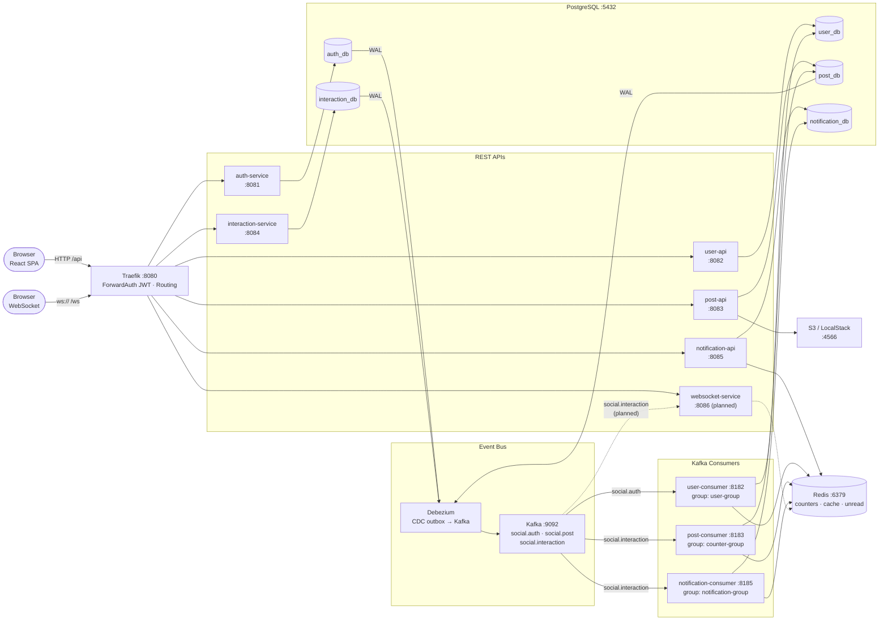
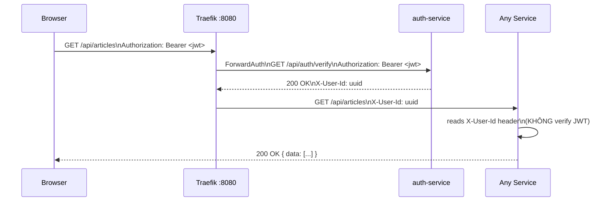
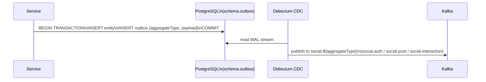
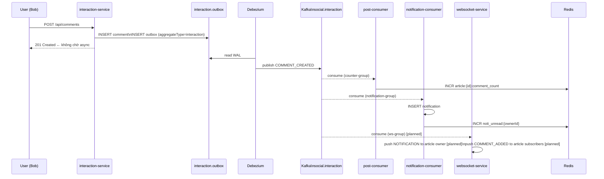
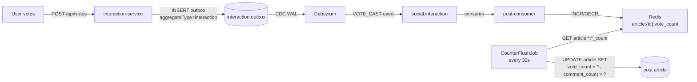
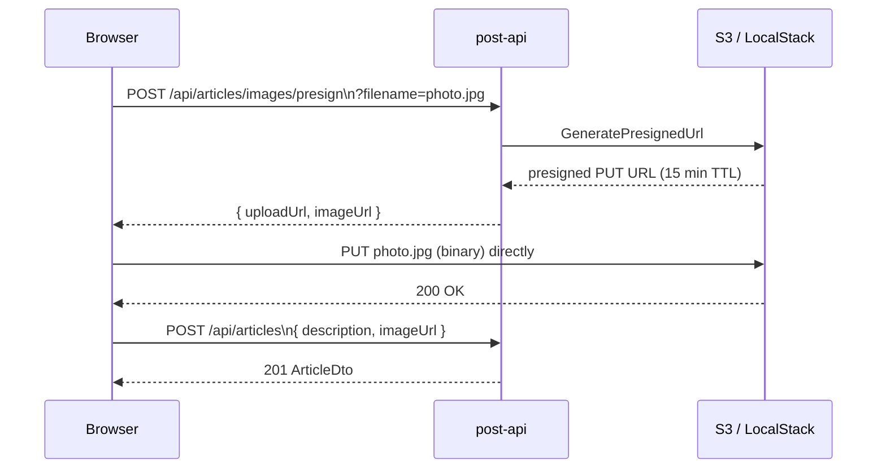

# Backend Overview
## Mini Social Network — High Level Diagrams

---

## 1. System Architecture



---

## 2. API Gateway — Routing & Auth

```
http://localhost:8080
        │
        ├── /api/auth/**          → auth-service          (PUBLIC — no JWT)
        │
        ├── /api/users/**         → user-api              ┐
        ├── /api/articles/**      → post-api              │ PROTECTED
        ├── /api/comments/**      → interaction-service   │ ForwardAuth JWT
        ├── /api/votes/**         → interaction-service   │ → auth-service /api/auth/verify
        ├── /api/notifications/** → notification-api      │ → inject X-User-Id header
        │                                                  ┘
        └── /ws/**                → websocket-service      (PUBLIC — no auth, pub/sub channels)
```

**JWT verification flow (protected routes):**
```
Request → Traefik
  → ForwardAuth: GET auth-service /api/auth/verify
                 Authorization: Bearer <jwt>
  → 200: inject X-User-Id header → forward to service
  → 401: block, return 401 to client
```

**Internal service-to-service:**
```
ServiceA → http://serviceB:8080/internal/**
  Header: X-Service-Secret-Key: <shared-secret>    ← InternalAuthFilter (social-exception)
```

---

## 3. Service Responsibilities

| Module | Type | Owns | DB Schema | Port (dev) |
|---|---|---|---|---|
| **auth-service** | REST | Credentials, JWT sign/verify | `auth` | 8081 |
| **user-api** | REST | User profile read/update | `users` | 8082 |
| **user-consumer** | Kafka | Create user_profile on signup | `users` | 8182 |
| **post-api** | REST | Article CRUD, S3 presign | `post` | 8083 |
| **post-consumer** | Kafka | Counter flush Redis → DB | `post` | 8183 |
| **interaction-service** | REST | Comment, Vote | `interaction` | 8084 |
| **notification-api** | REST | Notification list, mark seen | `notification` | 8085 |
| **notification-consumer** | Kafka | Create notification from events | `notification` | 8185 |
| **websocket-service** _(planned)_ | WS + Kafka | Push realtime events to clients | — | 8086 |

---

## 4. Request Flow — Authenticated Request



---

## 5. Outbox Pattern — Service → Kafka

Tất cả event đều đi qua outbox pattern. Services **không publish trực tiếp** vào Kafka.



**aggregateType → topic mapping:**

| aggregateType | Kafka topic | Publisher |
|---|---|---|
| `auth` | `social.auth` | auth-service |
| `post` | `social.post` | post-api (via post-service) |
| `interaction` | `social.interaction` | interaction-service |
| `chat` | `social.chat` | websocket-service (Phase 3) |

---

## 6. Async Event Flow — Comment → Notification + Counter + WebSocket



---

## 7. Counter Flush — Redis → PostgreSQL



---

## 8. WebSocket — Realtime Push _(planned — not yet implemented)_

Pub/sub channel model — FE tự subscribe vào topic cần, server route theo topic name. Không cần auth ở WS level.

```
Browser  →  ws://host/ws   (public, no auth)
                │
         websocket-service
                │  FE gửi: { "type": "SUBSCRIBE", "topic": "user_{userId}_notification" }
                │  FE gửi: { "type": "SUBSCRIBE", "topic": "article_{articleId}_comment_added" }
                │
                │  Registry: topic → Set<WsConnection>
                │
                ├── Kafka consumer: social.interaction
                │     COMMENT_CREATED → push to "user_{authorId}_notification"
                │                    → push to "article_{articleId}_comment_added"
                │     VOTE_CAST      → push to "user_{targetAuthorId}_notification"
                │
                └── Redis pub/sub (multi-instance fan-out)
                      channel: ws:topic:{topicName}
```

**Topics FE subscribe:**

| Topic | Ai subscribe | Nhận gì |
|---|---|---|
| `user_{userId}_notification` | FE tự dùng userId từ JWT client-side | `NOTIFICATION` — comment/vote vào bài của mình |
| `article_{articleId}_comment_added` | FE khi mở bài đang xem | `COMMENT_ADDED` — live comments |
| `room_{roomId}_chat` (Phase 3) | FE khi vào chat room | `CHAT_MESSAGE` |

---

## 9. Image Upload Flow — S3 Presigned URL



---

## 10. Database — DB per Service

Mỗi service sở hữu database riêng — không service nào được truy cập DB của service khác.  
Local: 1 PostgreSQL instance, mỗi service dùng 1 database riêng.  
Production: mỗi service có RDS instance riêng.

```
┌─────────────────────────────────┐
│  auth_db  (auth-service)        │
│  ├── credentials                │
│  │   id · username · email      │
│  │   password_hash · user_id    │
│  └── outbox                     │
└─────────────────────────────────┘

┌─────────────────────────────────┐
│  user_db  (user-service)        │
│  └── user_profile               │
│      id · username · email      │
│      firstname · lastname       │
│      avatar_url · created_at    │
└─────────────────────────────────┘

┌─────────────────────────────────┐
│  post_db  (post-service)        │
│  ├── article                    │
│  │   id · description           │
│  │   image_url · author_id      │
│  │   vote_count · comment_count │
│  │   visible · created_at       │
│  └── outbox                     │
└─────────────────────────────────┘

┌─────────────────────────────────┐
│  interaction_db                 │
│  (interaction-service)          │
│  ├── comment                    │
│  │   id · description           │
│  │   target_id · target_type    │
│  │   author_id · visible        │
│  ├── vote                       │
│  │   id · value · user_id       │
│  │   target_id · target_type    │
│  │   UNIQUE(user_id,            │
│  │          target_id,          │
│  │          target_type)        │
│  └── outbox                     │
└─────────────────────────────────┘

┌─────────────────────────────────┐
│  notification_db                │
│  (notification-service)         │
│  └── notification               │
│      id · type · actor_id       │
│      owner_id · article_id      │
│      seen · created_at          │
└─────────────────────────────────┘
```

> Cross-service data (vd. author name trong article feed) được resolve qua Redis cache hoặc embed vào Kafka event payload — **không có cross-DB query**.

---

## 11. Inter-service Communication

| From | To | Protocol | Channel | When |
|---|---|---|---|---|
| auth-service | PostgreSQL outbox | SQL | — | signup → ghi outbox |
| Debezium | Kafka `social.auth` | CDC WAL | — | detect outbox INSERT |
| user-consumer | PostgreSQL | SQL | `social.auth` | USER_UPDATED (action=CREATED) → tạo user_profile |
| user-service | Redis | Direct | — | cache profile (TTL 10m) |
| post-api | PostgreSQL outbox | SQL | — | article created → ghi outbox |
| Debezium | Kafka `social.post` | CDC WAL | — | detect outbox INSERT |
| interaction-service | PostgreSQL outbox | SQL | — | comment/vote → ghi outbox |
| Debezium | Kafka `social.interaction` | CDC WAL | — | detect outbox INSERT |
| post-consumer | Redis | Direct | `social.interaction` | INCR counter |
| post-consumer | PostgreSQL | SQL | — | CounterFlushJob mỗi 30s |
| notification-consumer | PostgreSQL | SQL | `social.interaction` | INSERT notification |
| notification-consumer | Redis | Direct | — | INCR noti_unread |
| websocket-service | Redis pub/sub | Direct | `social.interaction` | push to connected clients |
| ServiceA → ServiceB | HTTP internal | `X-Service-Secret-Key` | k8s DNS | sync call `/internal/**` |

---

## 12. Module Structure (Gradle)

```
services/
├── social-bom             # java-platform: wraps Quarkus BOM + declares lib versions
├── social-common          # DTOs, Events (per-domain), RSQL parser (pure Kotlin)
├── social-exception       # AppException, JAX-RS mappers, InternalAuthFilter

├── auth-service-dao       # Credentials + OutboxEntry entity/repo + Liquibase
├── auth-service           # Quarkus app: REST + JWT sign

├── user-service-dao       # UserProfile entity/repo + Liquibase
├── user-service           # service logic lib
├── user-api               # Quarkus app: REST
├── user-consumer          # Quarkus app: Kafka ← social.auth

├── post-service-dao       # Article + OutboxEntry entity/repo + Liquibase
├── post-service           # service logic lib (ArticleService, S3Service, CounterService, RSQL)
├── post-api               # Quarkus app: REST
├── post-consumer          # Quarkus app: Kafka ← social.interaction + CounterFlushJob

├── interaction-service-dao  # Comment + Vote + OutboxEntry entity/repo + Liquibase
├── interaction-service      # Quarkus app: REST (writes outbox, no direct Kafka)

├── notification-service-dao # Notification entity/repo + Liquibase
├── notification-service     # service logic lib
├── notification-api         # Quarkus app: REST
├── notification-consumer    # Quarkus app: Kafka ← social.interaction

└── websocket-service        # Quarkus app: WebSocket + Kafka ← social.interaction
                             # (planned — per websocket-plan.md)
```

---

## 13. Tech Stack

| Layer | Technology |
|---|---|
| Language | Kotlin 2.0 + JVM 21 |
| Framework | Quarkus 3.25.x |
| ORM | Hibernate ORM + Panache Kotlin |
| DB Migration | Liquibase (per-schema changelogs) |
| Auth (external) | SmallRye JWT RS256 · Traefik ForwardAuth |
| Auth (internal) | X-Service-Secret-Key shared secret |
| Messaging | Kafka via Debezium CDC (outbox pattern) |
| Event Routing | Per-domain topics: `social.auth`, `social.post`, `social.interaction` |
| Cache | Redis 7 (counters · profile cache TTL 10m · unread count) |
| Image Storage | AWS S3 / LocalStack (presigned URL upload) |
| API Gateway | Traefik v3 (ForwardAuth, per-route middleware) |
| Build | Gradle 9 + Kotlin DSL + social-bom (version catalog) |
| Container | Quarkus JIB (no Dockerfile) |
| Local infra | Docker Compose + kind (k8s) |
| Production | AWS EKS + RDS + MSK + S3 |
| Observability | LGTM stack (Grafana · Loki · Tempo · Mimir) + OpenTelemetry |
