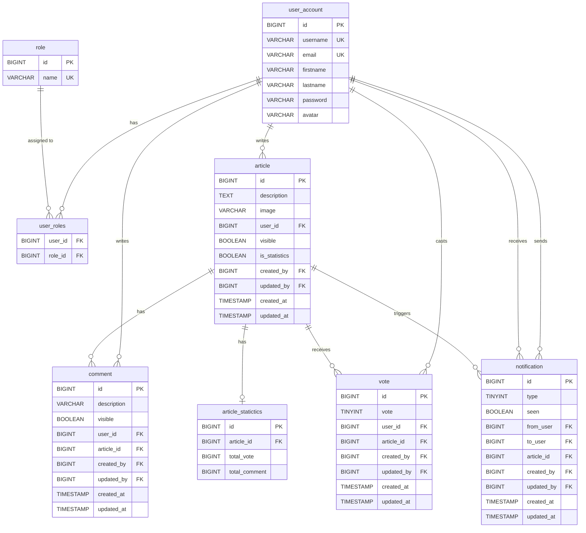
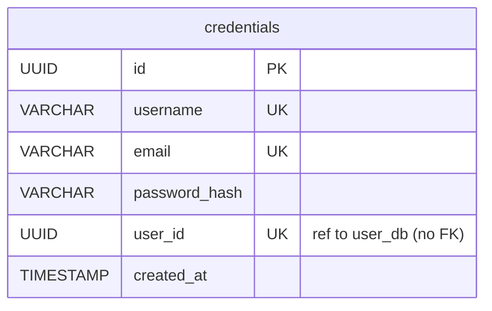
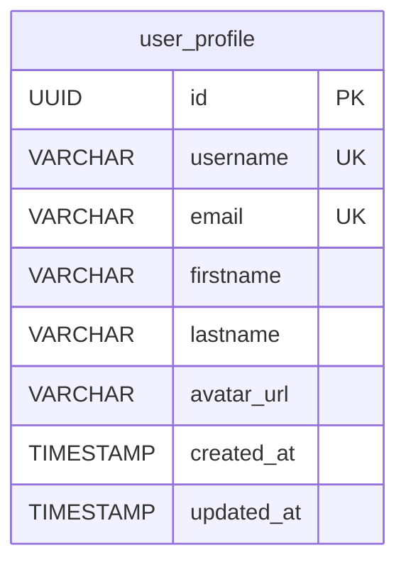
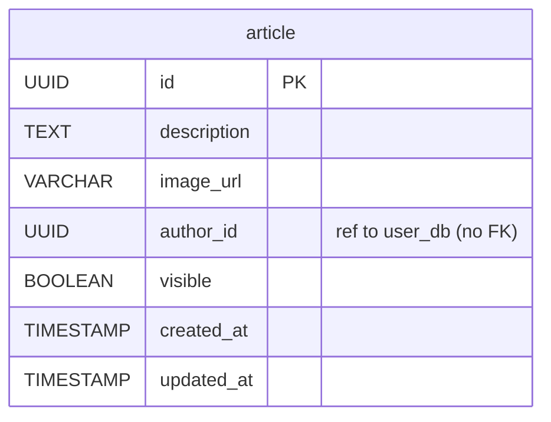
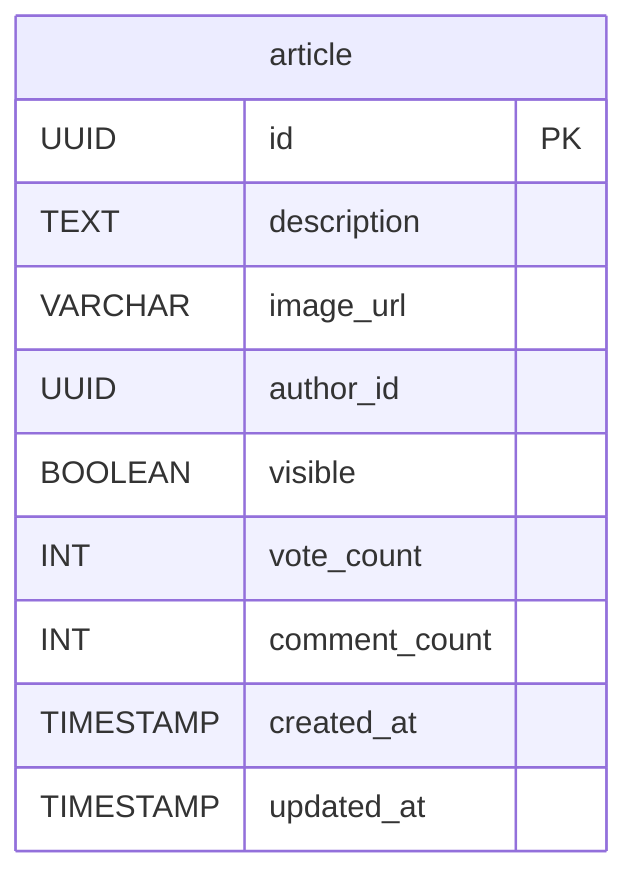
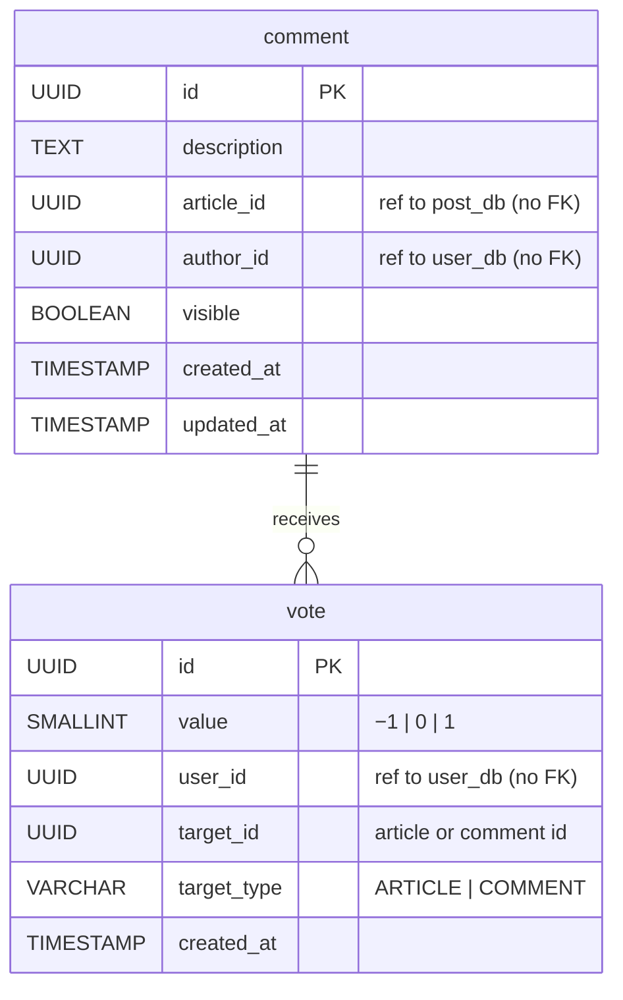
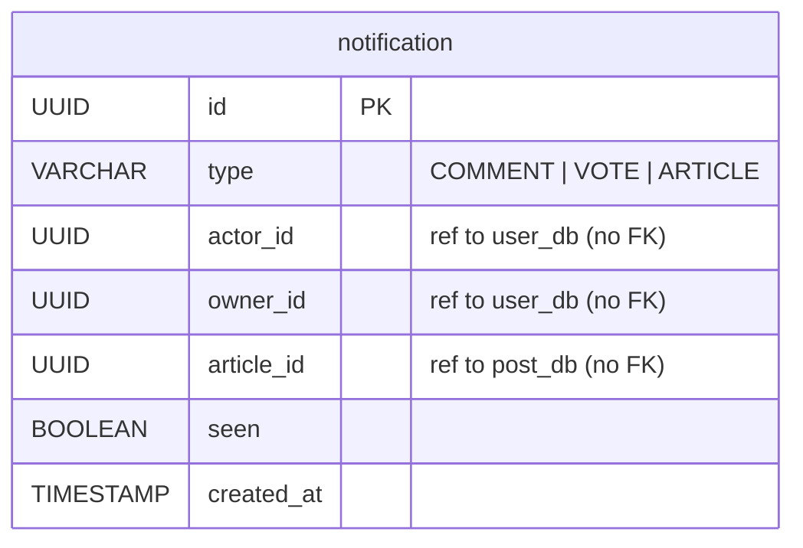
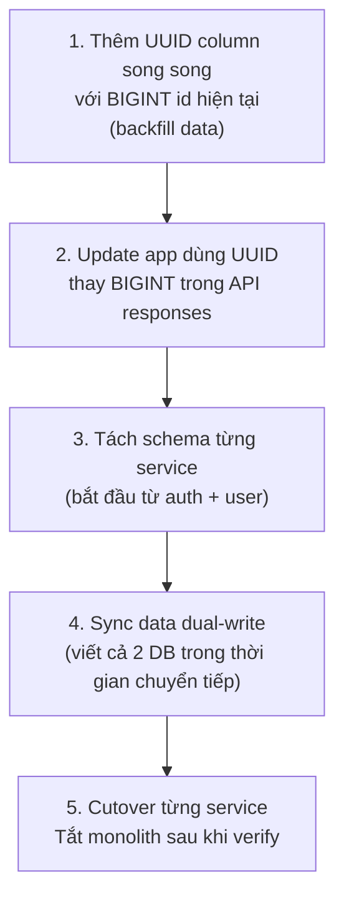

# Current Database — Analysis & New Design Suggestion

---

## 1. Current ERD (Monolith)



---

## 2. Vấn đề với DB hiện tại

| # | Vấn đề | Vị trí | Mức độ |
|---|---|---|---|
| P-01 | PK dùng `BIGINT` auto-increment — không phù hợp khi chạy nhiều service/instance song song | Tất cả bảng | High |
| P-02 | `vote` chỉ có `article_id` — không vote được comment dù thiết kế có ý định hỗ trợ | `vote` | High |
| P-03 | Không có `UNIQUE(user_id, article_id)` trên `vote` — user có thể vote nhiều lần | `vote` | High |
| P-04 | `notification.type` là `TINYINT` (magic number) — không rõ nghĩa, khó maintain | `notification` | Medium |
| P-05 | Typo: tên bảng `article_statictics` (thiếu chữ 'a') | `article_statictics` | Medium |
| P-06 | `article.is_statistics` boolean — mục đích không rõ, không có endpoint nào dùng | `article` | Medium |
| P-07 | `created_by` / `updated_by` lưu `BIGINT` (user id) nhưng không có FK constraint | Tất cả audit | Low |
| P-08 | Tất cả bảng trong 1 schema — không thể tách microservice mà giữ nguyên FK | Toàn bộ DB | High |

---

## 3. New DB Design (Per Microservice)

Nguyên tắc:
- **UUID** thay `BIGINT` cho tất cả PK — safe khi scale horizontal
- **Không có FK cross-service** — mỗi service chỉ reference `id` của service khác dưới dạng plain UUID (không enforce bằng FK)
- **Enum rõ ràng** thay magic numbers
- **Index** tường minh trên các cột query thường xuyên

---

### 3.1 auth_db — auth-service



**Thay đổi so với hiện tại:**
- Tách `password_hash` ra khỏi `user_profile` — auth-service là nơi duy nhất biết mật khẩu
- `user_id` là UUID trỏ sang `user_db` nhưng không enforce FK (cross-service)
- Bỏ `role` ra khỏi đây — role được nhúng thẳng vào JWT payload, không cần query lại

---

### 3.2 user_db — user-service



**Thay đổi so với hiện tại:**
- Bỏ `password`, `roles` — không thuộc về profile
- `avatar` đổi thành `avatar_url` lưu S3 URL
- Bỏ bảng `role` và `user_roles` — role encode trong JWT, không cần bảng riêng

---

### 3.3 post_db — post-service



**Thay đổi so với hiện tại:**
- `image` → `image_url` (S3 URL thay Imgur URL)
- `user_id` → `author_id` UUID (không FK cross-service)
- Bỏ `is_statistics`, `created_by`, `updated_by` (redundant với `author_id`)
- Bỏ `article_statictics` — counter lưu trong Redis, flush định kỳ về DB

**Schema bao gồm counter columns (source of truth là Redis):**



**Counter flow (fire-and-forget):**

```
User comment/vote
      │
      ▼
interaction-service
  INSERT row (new row, no lock contention)
  publish Kafka event
  return 201 ← user nhận response ngay
      │
      ▼ (async)
post-service Kafka consumer
  INCR Redis article:{id}:comment_count
      │
      ▼ (every 30s background job)
  UPDATE article SET comment_count = <redis value>
```

**Redis keys (post-service owns):**

| Key | Giá trị | Flush |
|---|---|---|
| `article:{id}:comment_count` | INCR mỗi comment | → DB mỗi 30s |
| `article:{id}:vote_count` | INCR/DECR mỗi vote | → DB mỗi 30s |

---

### 3.4 interaction_db — interaction-service



**Thay đổi so với hiện tại:**
- `vote.article_id` → `vote.target_id` + `vote.target_type` — hỗ trợ vote cả article lẫn comment
- Thêm `UNIQUE(user_id, target_id, target_type)` — mỗi user chỉ vote 1 lần
- `vote` TINYINT → `value` SMALLINT với giá trị rõ ràng (-1, 0, 1)
- Tất cả FK chuyển thành plain UUID reference

**Indexes:**
```sql
CREATE UNIQUE INDEX uq_vote_user_target ON vote(user_id, target_id, target_type);
CREATE INDEX idx_comment_article ON comment(article_id);
CREATE INDEX idx_vote_target ON vote(target_id, target_type);
```

---

### 3.5 notification_db — notification-service



**Thay đổi so với hiện tại:**
- `type` TINYINT → `VARCHAR` enum rõ nghĩa (`COMMENT`, `VOTE`, `ARTICLE`)
- `from_user` / `to_user` → `actor_id` / `owner_id` (tên rõ hơn)
- Bỏ audit fields (`created_by`, `updated_by`) — notification không cần track người sửa
- Không có FK cross-service

**Index:**
```sql
CREATE INDEX idx_notification_owner ON notification(owner_id, seen, created_at DESC);
```

---

## 4. So sánh tổng thể

| | Current (Monolith) | New (Microservices) |
|---|---|---|
| PK type | BIGINT auto-increment | UUID |
| FK cross-table | Có (JPA relations) | Không (plain UUID ref) |
| Vote target | Chỉ article | Article + Comment |
| Vote unique | Không có constraint | `UNIQUE(user_id, target_id, target_type)` |
| Notification type | TINYINT magic number | VARCHAR enum |
| Role storage | Bảng `role` + `user_roles` | Embedded trong JWT |
| Image storage | Imgur URL (VARCHAR) | S3 URL (VARCHAR) |
| Article stats | Bảng `article_statictics` riêng | Redis counter → flush về `article` mỗi 30s |
| Counter update | UPDATE cùng row (lock contention) | Redis INCR (non-blocking, async flush) |
| Schema count | 1 schema chung | 5 schema độc lập |

---

## 5. Migration Strategy (Monolith → Microservices)



> **Không cần migrate toàn bộ một lúc.** Tách theo thứ tự: `auth` → `user` → `post` → `interaction` → `notification`.  
> Monolith vẫn chạy song song cho đến khi tất cả service sẵn sàng.
