# EKS Study Guide — Học EKS Qua Project Thực Tế

> Tài liệu này dạy EKS từ nền tảng đến thực hành, lấy project `mini-social-network` làm ví dụ xuyên suốt. Mỗi khái niệm đều có giải thích "tại sao" trước khi giải thích "cái gì".

---

## Mục lục

1. [EKS là gì — Tại sao không tự dựng k8s?](#1-eks-là-gì)
2. [Kiến trúc tổng thể EKS](#2-kiến-trúc-tổng-thể-eks)
3. [Control Plane vs Data Plane](#3-control-plane-vs-data-plane)
4. [Node Groups — Máy chủ chạy app của bạn](#4-node-groups)
5. [VPC và Networking trong EKS](#5-vpc-và-networking)
6. [ECR — Container Registry của AWS](#6-ecr---container-registry)
7. [Service Types — Cách expose app ra ngoài](#7-service-types)
8. [Load Balancer Controller — ALB vs NLB](#8-load-balancer-controller)
9. [Traefik trên EKS](#9-traefik-trên-eks)
10. [Storage — EBS, PV, PVC, StorageClass](#10-storage)
11. [IAM — Phân quyền trong EKS](#11-iam-và-phân-quyền)
12. [IRSA — IAM Role cho từng Pod](#12-irsa)
13. [Secrets Management](#13-secrets-management)
14. [eksctl — Tool tạo cluster](#14-eksctl)
15. [Helm — Package Manager cho k8s](#15-helm)
16. [Observability trên EKS](#16-observability)
17. [EKS vs kind — Điểm khác nhau](#17-eks-vs-kind)
18. [Cheat Sheet](#18-cheat-sheet)

---

## 1. EKS là gì?

### Kubernetes tự dựng vs EKS

Kubernetes (k8s) có 2 phần: **control plane** (não của cluster) và **data plane** (nơi app chạy).

Nếu tự dựng k8s trên EC2:
- Phải tự cài `etcd`, `kube-apiserver`, `kube-scheduler`, `kube-controller-manager`
- Phải tự upgrade, backup etcd, handle HA của control plane
- Phải tự config TLS cho tất cả components

**EKS (Elastic Kubernetes Service)** = AWS quản lý control plane thay bạn:
- Control plane chạy trên infrastructure của AWS (multi-AZ, HA sẵn)
- AWS tự upgrade, patch, backup
- Bạn chỉ cần lo **data plane** (EC2 nodes chạy app)

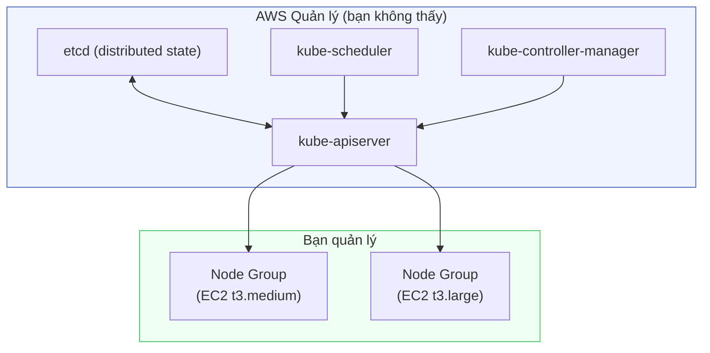

**Chi phí control plane**: $0.10/giờ (~$72/tháng) — fixed, bất kể cluster có bao nhiêu node.

---

## 2. Kiến trúc tổng thể EKS

Đây là toàn cảnh khi project `social` chạy trên EKS:

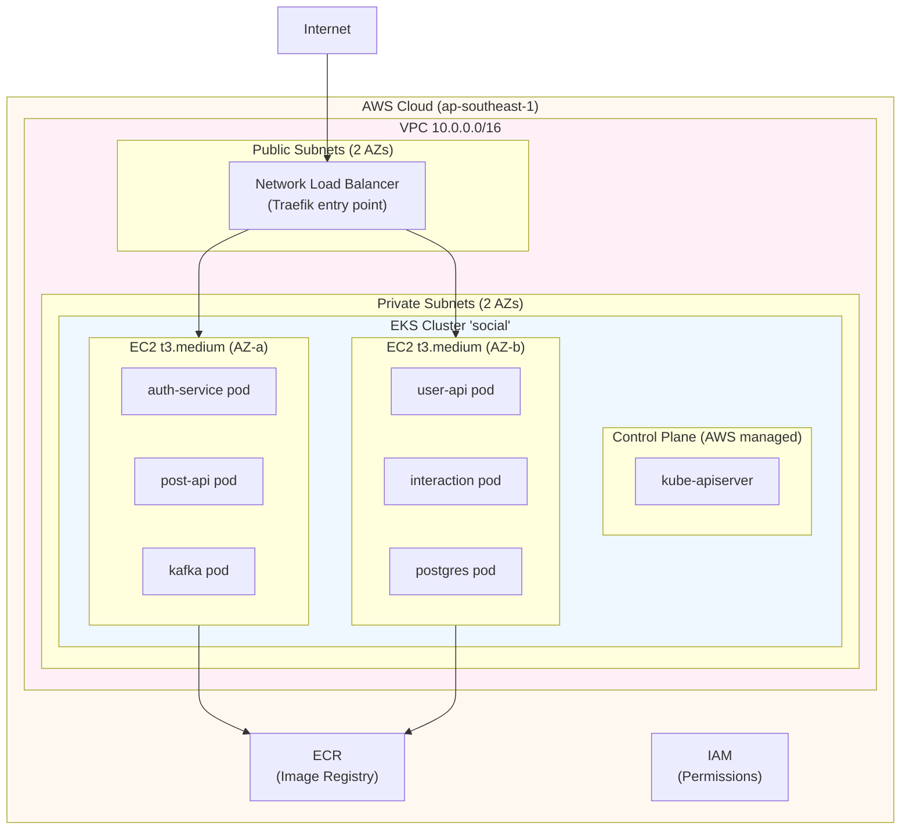

**Luồng request:**
1. Client gửi request đến NLB (public IP)
2. NLB forward vào Traefik pod (trong private subnet)
3. Traefik route đến đúng service (auth, post, user...)
4. Service query DB/Redis/Kafka cùng cluster

---

## 3. Control Plane vs Data Plane

### Control Plane (AWS quản lý)

| Component | Vai trò | Ví dụ |
|---|---|---|
| `kube-apiserver` | Cổng duy nhất vào cluster — nhận mọi `kubectl` command | `kubectl apply -f auth-service.yaml` → gọi API server |
| `etcd` | Database lưu toàn bộ state của cluster | Lưu: "có 3 pod auth-service đang chạy" |
| `kube-scheduler` | Quyết định pod chạy trên node nào | Xem node nào còn CPU/RAM, assign pod |
| `kube-controller-manager` | Vòng lặp đảm bảo thực tế = desired state | Nếu 1 pod crash → tạo pod mới |

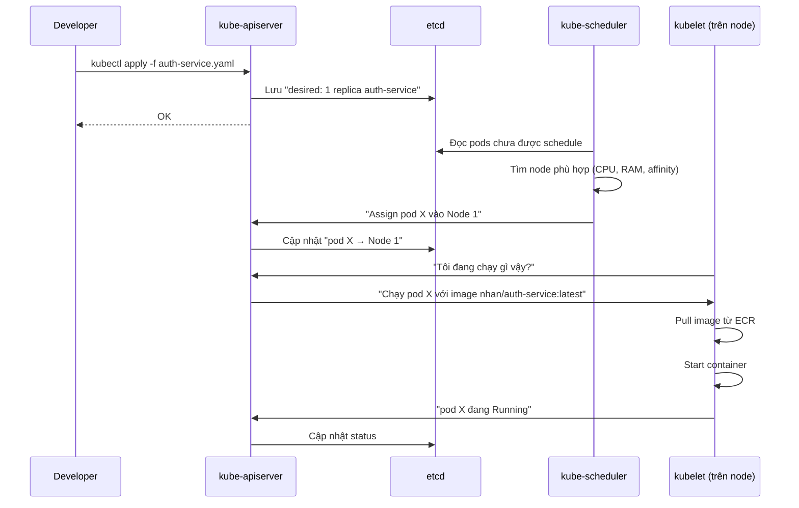

### Data Plane (bạn quản lý)

Là các EC2 instances chạy app của bạn. Mỗi node có:

```
EC2 Instance (t3.medium)
├── kubelet          ← agent nhận lệnh từ control plane
├── kube-proxy       ← quản lý iptables/routing cho Services
├── containerd       ← runtime chạy containers
└── aws-vpc-cni      ← plugin gán IP cho pods (EKS-specific)
```

---

## 4. Node Groups

### Managed Node Group là gì?

Trong EKS có 2 loại data plane:

| | Managed Node Group | Self-managed | Fargate |
|---|---|---|---|
| **EC2 provisioning** | AWS tự làm | Bạn tự làm | Không có EC2 (serverless) |
| **OS patching** | AWS upgrade AMI tự động | Bạn tự patch | Không lo |
| **Auto Scaling** | Tích hợp sẵn | Phải tự setup | Tự động |
| **Giá** | EC2 on-demand | EC2 on-demand | VCpu/RAM/giây |
| **Dùng khi** | Hầu hết cases | Cần AMI custom | Batch jobs |

**Với project social**: dùng Managed Node Group — đơn giản nhất.

### Chọn instance type

```
t3.medium: 2 vCPU, 4GB RAM
├── Pods có thể chạy: ~8-10 pods nhỏ (256Mi request)
├── Giá: $0.0416/giờ (on-demand, ap-southeast-1)
└── Phù hợp: test, dev

t3.large: 2 vCPU, 8GB RAM  
├── Pods có thể chạy: ~15-20 pods
├── Giá: $0.0832/giờ
└── Phù hợp: test với full observability stack

t3.xlarge: 4 vCPU, 16GB RAM
├── Pods có thể chạy: ~30-40 pods
└── Phù hợp: production nhỏ
```

**Tại sao t3 thay vì m5/c5?**
- `t3` = burstable — CPU có thể burst lên 100% trong thời gian ngắn, rẻ hơn
- `m5` = general purpose — CPU ổn định, đắt hơn
- Cho test: `t3.medium` đủ dùng

### eksctl config cho Node Group:

```yaml
# Từ eks-guide.md: eksctl create cluster
nodegroups:
  - name: standard
    instanceType: t3.medium
    desiredCapacity: 2
    minSize: 2
    maxSize: 4           # Auto Scaling Group
    # AWS tự thêm/bớt EC2 dựa trên tải
```

---

## 5. VPC và Networking

### VPC (Virtual Private Cloud)

VPC là "mạng riêng ảo" trong AWS. Mỗi EKS cluster cần 1 VPC với:

```
VPC: 10.0.0.0/16 (65536 IPs)
├── Public Subnet 10.0.1.0/24 (AZ-a)    ← Load Balancer, NAT Gateway
├── Public Subnet 10.0.2.0/24 (AZ-b)    ← Load Balancer (HA)
├── Private Subnet 10.0.3.0/24 (AZ-a)   ← EC2 nodes, pods
└── Private Subnet 10.0.4.0/24 (AZ-b)   ← EC2 nodes, pods (HA)
```

**Tại sao nodes ở Private Subnet?**

Nodes chạy app không nên có public IP. Attack surface nhỏ hơn. Chỉ LoadBalancer (public) → Traefik (private) → Service mới được phép.

### AWS VPC CNI — Cách pods có IP

Đây là điểm EKS khác kind nhất. Trong EKS, mỗi pod nhận 1 IP thật từ VPC subnet (không dùng overlay network như flannel/calico).

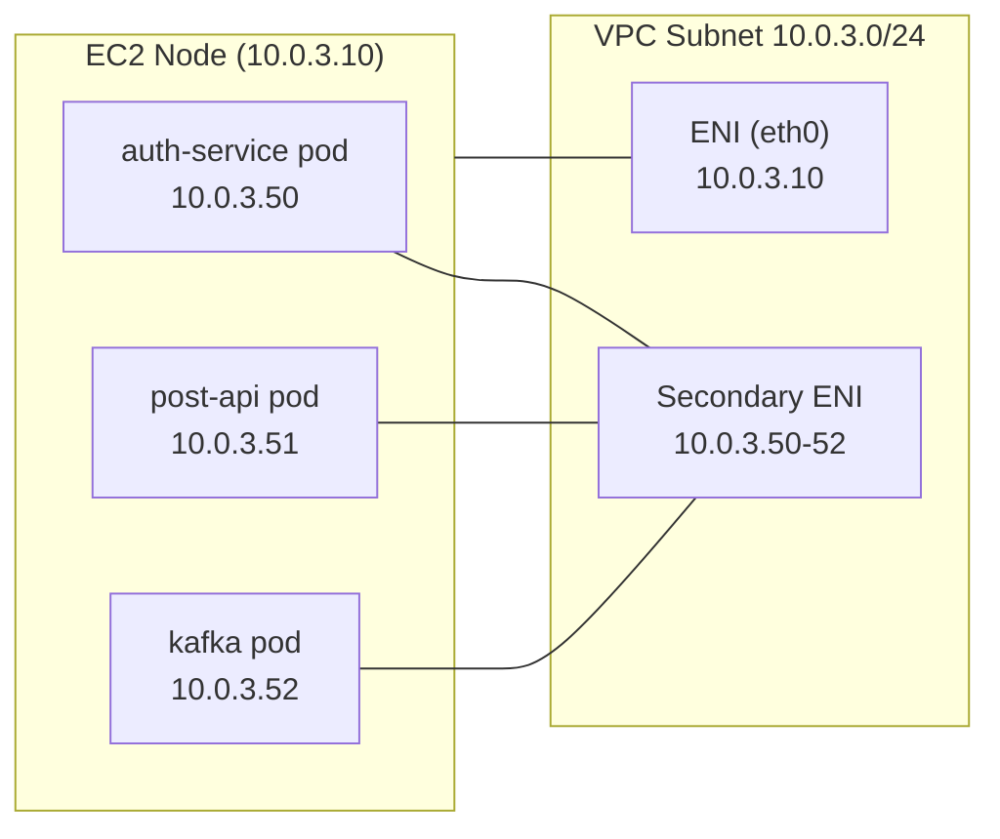

**Hệ quả thực tế:**
- Pod có thể communicate trực tiếp với bất kỳ resource nào trong VPC (RDS, MSK, ElastiCache)
- Security Group của node áp dụng cho pods → fine-grained network policy
- Nhưng: số pods/node bị giới hạn bởi số ENI và IP của instance type

**Giới hạn IP theo instance:**
```
t3.medium: 3 ENIs × 6 IPs = 18 IPs max → ~17 pods/node (trừ 1 cho node)
t3.large:  3 ENIs × 12 IPs = 36 IPs max → ~35 pods/node
```

### CoreDNS — Service Discovery

Trong k8s (cả kind lẫn EKS), pods nói chuyện với nhau qua DNS, không qua IP:

```
auth-service gọi postgres:
  postgres → postgres.social.svc.cluster.local → 10.100.x.x (ClusterIP)
                                                          ↓
                                              kube-proxy route đến pod IP
```

**Project social** đã dùng đúng pattern này:
```yaml
# k8s/services/auth-service.yaml
- name: DB_URL
  value: jdbc:postgresql://postgres:5432/social   # ← "postgres" là tên Service
```

`postgres` resolve thành `postgres.social.svc.cluster.local` vì cùng namespace `social`.

---

## 6. ECR — Container Registry

### Tại sao cần Registry?

Trong kind, image nằm trong Docker daemon local → `kind load docker-image`. EKS nodes (EC2) không có Docker daemon của laptop bạn → cần pull từ một registry.

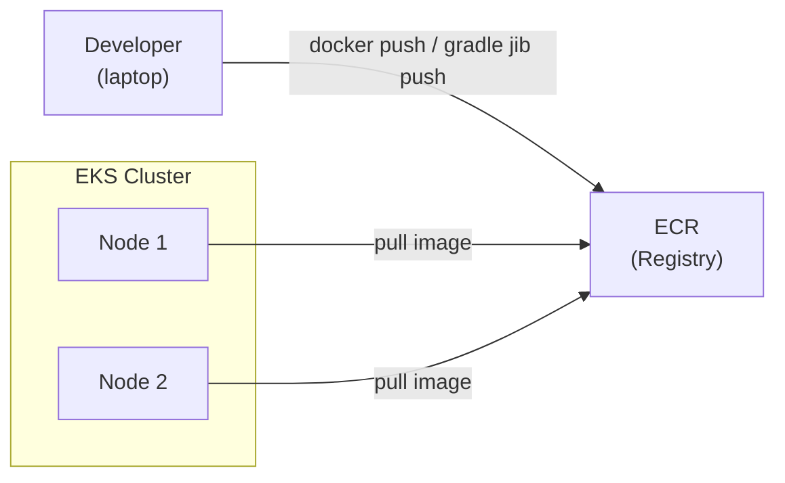

### ECR vs Docker Hub

| | ECR | Docker Hub |
|---|---|---|
| **Auth** | IAM (tự động với IAM role) | Username/password |
| **Private** | Private by default | Cần plan trả tiền |
| **Latency** | Rất thấp (cùng region với EKS) | Phụ thuộc internet |
| **Giá** | $0.10/GB/tháng storage | Free tier limited |
| **Rate limit** | Không | Có (Docker Hub pull limit) |

**Lý do dùng ECR**: nodes trong private subnet chỉ cần VPC endpoint để pull, không cần ra internet.

### ECR Image URI format

```
<account_id>.dkr.ecr.<region>.amazonaws.com/<repository>:<tag>

Ví dụ:
123456789012.dkr.ecr.ap-southeast-1.amazonaws.com/nhan/auth-service:latest
```

### Authentication ECR

ECR token hết hạn sau 12 giờ. Nhưng khi node có IAM role đúng → kubelet tự refresh, bạn không cần làm gì:

```
EC2 Node (IAM role: eks-node-role)
    │
    ├── Policy: AmazonEC2ContainerRegistryReadOnly
    │          → Cho phép pull tất cả ECR repos trong account
    │
    └── kubelet tự call ecr:GetAuthorizationToken → pull image
```

### Quarkus JIB push thẳng lên ECR

Project này dùng JIB (không cần Dockerfile). Push lên ECR:

```bash
# Build + push với JIB
./gradlew :auth-service:build \
  -Dquarkus.container-image.build=true \
  -Dquarkus.container-image.push=true \
  -Dquarkus.container-image.registry=123456789012.dkr.ecr.ap-southeast-1.amazonaws.com \
  -Dquarkus.container-image.group=nhan \
  -Dquarkus.container-image.tag=latest
```

JIB push layer by layer → chỉ push layers thay đổi → nhanh hơn `docker push`.

---

## 7. Service Types

### Vấn đề: Pod có IP động

Pod restart → IP mới. Không thể hardcode IP pod. Service giải quyết bằng cách có IP/DNS ổn định.

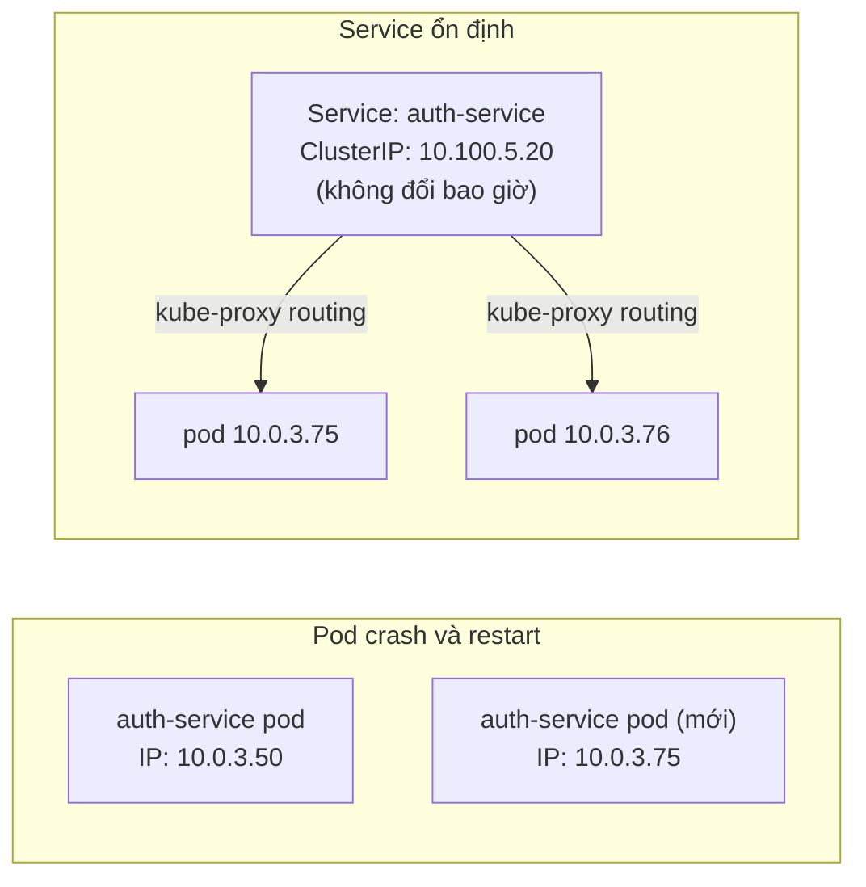

### 4 loại Service

#### ClusterIP (default)
```yaml
spec:
  type: ClusterIP    # hoặc không cần khai báo
```
- IP chỉ accessible trong cluster
- Tất cả app services của project dùng loại này (`auth-service`, `post-service`...)
- Traefik route đến Service name → Service route đến Pod

```
Internet → [KHÔNG đến được] ClusterIP
cluster pod → [OK] ClusterIP
```

#### NodePort
```yaml
spec:
  type: NodePort
  ports:
    - port: 8080
      nodePort: 30080    # Range: 30000-32767
```
- Expose service trên **mọi node** qua một port cố định
- kind dùng NodePort cho Traefik vì host → kind node là local

```
Host port 8080 → kind node port 8080 (extraPortMappings)
                              ↓
                    NodePort Service (30080)
                              ↓
                      Traefik pod
```

#### LoadBalancer
```yaml
spec:
  type: LoadBalancer
```
- Yêu cầu cloud provider (AWS) tạo NLB/ALB thật
- Service nhận External IP từ AWS
- EKS dùng cái này cho Traefik

```
Internet → NLB (public IP) → Traefik NodePort → Traefik pod
```

**Tại sao kind dùng NodePort, EKS cần LoadBalancer?**

| | kind | EKS |
|---|---|---|
| "Cloud provider" | Không có | AWS |
| `type: LoadBalancer` | Pending mãi (không có provider) | AWS tạo NLB |
| Cách test | `extraPortMappings` host→node | NLB DNS |

#### ExternalName
- Map service đến DNS ngoài (ít dùng)

---

## 8. Load Balancer Controller

### NLB vs ALB

| | NLB (Network LB) | ALB (Application LB) |
|---|---|---|
| **Layer** | L4 (TCP/UDP) | L7 (HTTP/HTTPS) |
| **Routing** | IP + Port | URL path, headers, hostname |
| **WebSocket** | Native | Có hỗ trợ |
| **TLS termination** | Có | Có |
| **Giá** | Rẻ hơn | Đắt hơn |
| **Dùng khi** | Traefik entry point | Ingress trực tiếp |

**Project social** dùng **Traefik** làm ingress controller → Traefik cần 1 LoadBalancer phía trước. Dùng NLB để forward TCP 80/443 vào Traefik, Traefik lo routing HTTP (L7).

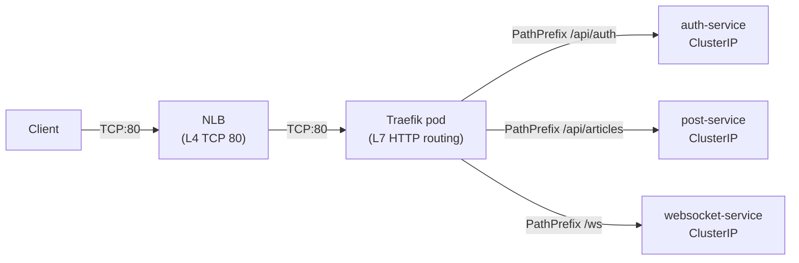

### AWS Load Balancer Controller

Để `type: LoadBalancer` tạo NLB thay vì Classic LB, cần cài **AWS Load Balancer Controller**:

```bash
# Cài qua Helm
helm repo add eks https://aws.github.io/eks-charts
helm install aws-load-balancer-controller eks/aws-load-balancer-controller \
  -n kube-system \
  --set clusterName=social \
  --set serviceAccount.create=false \
  --set serviceAccount.name=aws-load-balancer-controller
```

Khi bạn apply `type: LoadBalancer`, controller này watch event và gọi AWS API tạo NLB.

---

## 9. Traefik trên EKS

### Tại sao Traefik?

Project dùng Traefik vì:
1. **Native k8s** — hiểu Deployment/Service tự động, không cần config manual
2. **CRD IngressRoute** — config routing dạng k8s YAML
3. **ForwardAuth middleware** — JWT verification qua auth-service
4. **WebSocket** — hỗ trợ sẵn, không cần config thêm
5. **Hoạt động cả kind lẫn EKS** — chỉ cần đổi service type

### Helm install cho kind vs EKS

```bash
# KIND — service.type=NodePort
helm install traefik traefik/traefik \
  --namespace kube-system \
  --set ports.web.port=8080 \
  --set ports.web.hostPort=8080 \   # ← map ra host machine
  --set service.type=NodePort

# EKS — service.type=LoadBalancer
helm install traefik traefik/traefik \
  --namespace kube-system \
  --set service.type=LoadBalancer \
  --set ports.web.port=80 \
  --set ports.websecure.port=443
```

**`hostPort`**: Bind port của container vào port của node. Chỉ cần trong kind vì kind node là Docker container có port mapping với host.

**Sau khi install trên EKS:**
```bash
kubectl get svc -n kube-system traefik
# NAME      TYPE           CLUSTER-IP    EXTERNAL-IP                              PORT(S)
# traefik   LoadBalancer   10.100.5.20   abc123.elb.ap-southeast-1.amazonaws.com  80:31234/TCP

# EXTERNAL-IP = NLB DNS → dùng cái này để gọi API
```

### IngressRoute — Routing config

```yaml
# k8s/traefik/ingressroute.yaml
apiVersion: traefik.io/v1alpha1
kind: IngressRoute
metadata:
  name: social-routes
  namespace: social
spec:
  entryPoints: [web]    # ← port 80 (HTTP)
  routes:
    - match: PathPrefix(`/api/auth`)   # ← URL matching rule
      kind: Rule
      services:
        - name: auth-service    # ← tên K8s Service
          port: 8080
```

**`entryPoints: [web]`**: Traefik có nhiều entry points (cổng vào). `web` = port 80. `websecure` = port 443.

### ForwardAuth — JWT verification

```yaml
apiVersion: traefik.io/v1alpha1
kind: Middleware
metadata:
  name: jwt-verify
  namespace: social
spec:
  forwardAuth:
    address: http://auth-service:8080/api/auth/verify
    authResponseHeaders:
      - X-User-Id    # ← header được forward xuống service
```

**Flow chi tiết:**
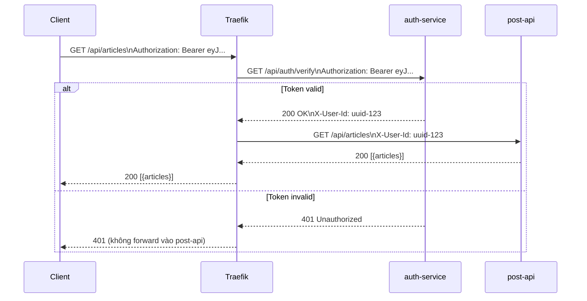

**Lợi ích:** post-api không cần verify JWT — chỉ đọc `X-User-Id` header. Đơn giản hóa business logic.

---

## 10. Storage

### Vấn đề với emptyDir

Pods trong k8s mặc định dùng `emptyDir` — storage tạm trong RAM/disk của node. **Mất khi pod restart.**

```
postgres pod restart → emptyDir mất → database trống → tất cả data mất
```

Với kind/local dev: chấp nhận được (test env).
Với EKS: cần persistent storage.

### Persistent Volume (PV) và PVC

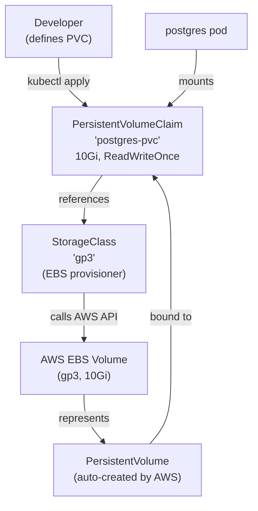

**StorageClass** là "class" quyết định loại storage. EKS có sẵn `gp2` (SSD), bạn có thể tạo `gp3` (nhanh hơn, rẻ hơn):

```yaml
apiVersion: storage.k8s.io/v1
kind: StorageClass
metadata:
  name: gp3
provisioner: ebs.csi.aws.com    # ← EBS CSI Driver (cần cài)
parameters:
  type: gp3
  iops: "3000"
  throughput: "125"
reclaimPolicy: Delete            # ← Xóa EBS khi PVC bị xóa
volumeBindingMode: WaitForFirstConsumer   # ← Tạo EBS ở AZ của pod
```

### PVC cho Postgres

```yaml
apiVersion: v1
kind: PersistentVolumeClaim
metadata:
  name: postgres-pvc
  namespace: social
spec:
  accessModes:
    - ReadWriteOnce    # ← Chỉ 1 node mount được cùng lúc (phù hợp EBS)
  storageClassName: gp2  # EKS default
  resources:
    requests:
      storage: 10Gi
```

```yaml
# Trong postgres Deployment, thêm:
containers:
  - name: postgres
    volumeMounts:
      - name: data
        mountPath: /var/lib/postgresql/data

volumes:
  - name: data
    persistentVolumeClaim:
      claimName: postgres-pvc
```

### Access Modes

| Mode | Ký hiệu | Ý nghĩa | Dùng khi |
|---|---|---|---|
| ReadWriteOnce | RWO | 1 node đọc+ghi | Postgres, Kafka (EBS) |
| ReadOnlyMany | ROX | Nhiều nodes đọc | Static assets |
| ReadWriteMany | RWX | Nhiều nodes đọc+ghi | Shared storage (EFS) |

**EBS chỉ hỗ trợ RWO** → không mount vào 2 pods cùng lúc → phù hợp Postgres (single replica).

### EBS CSI Driver

EKS không tự provisioning EBS. Cần cài **EBS CSI Driver**:

```bash
# Cài EBS CSI Driver addon
aws eks create-addon \
  --cluster-name social \
  --addon-name aws-ebs-csi-driver \
  --service-account-role-arn arn:aws:iam::<account>:role/AmazonEKS_EBS_CSI_DriverRole
```

Sau đó PVC với `storageClassName: gp2` tự động tạo EBS volume.

---

## 11. IAM và Phân quyền

### Hai cấp phân quyền trong EKS

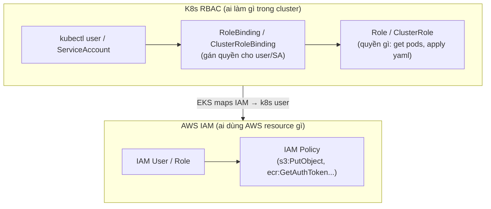

### Node IAM Role

Khi `eksctl create cluster`, nó tạo IAM role cho node group có các policy:
- `AmazonEKSWorkerNodePolicy` — node có thể join cluster
- `AmazonEC2ContainerRegistryReadOnly` — node pull image từ ECR
- `AmazonEKS_CNI_Policy` — VPC CNI gán IP cho pods

```bash
# Xem role của node group
aws eks describe-nodegroup \
  --cluster-name social \
  --nodegroup-name standard \
  --query 'nodegroup.nodeRole'
```

### aws-auth ConfigMap — Map IAM User → k8s User

Mặc định, chỉ IAM user tạo cluster mới có quyền `kubectl`. Để cho người khác:

```yaml
# kubectl edit configmap aws-auth -n kube-system
apiVersion: v1
kind: ConfigMap
metadata:
  name: aws-auth
  namespace: kube-system
data:
  mapUsers: |
    - userarn: arn:aws:iam::123456789012:user/developer
      username: developer
      groups:
        - system:masters    # ← full admin
```

### K8s RBAC

```yaml
# Role: được làm gì
apiVersion: rbac.authorization.k8s.io/v1
kind: Role
metadata:
  name: dev-role
  namespace: social
rules:
  - apiGroups: [""]
    resources: ["pods", "logs"]
    verbs: ["get", "list", "watch"]    # ← chỉ đọc, không xóa

---
# RoleBinding: ai được làm
apiVersion: rbac.authorization.k8s.io/v1
kind: RoleBinding
metadata:
  name: dev-binding
  namespace: social
subjects:
  - kind: User
    name: developer    # ← từ aws-auth mapping
roleRef:
  kind: Role
  name: dev-role
  apiGroup: rbac.authorization.k8s.io
```

---

## 12. IRSA — IAM Role cho Pod

### Vấn đề: Pod cần gọi AWS API

`post-api` cần upload ảnh lên S3. Cần AWS credentials. Cách nào?

**Cách tệ (không làm):**
```yaml
env:
  - name: AWS_ACCESS_KEY_ID
    value: AKIA...       # hardcode → lộ credentials
```

**Cách tốt: IRSA (IAM Roles for Service Accounts)**

Cho phép gán IAM role cụ thể cho từng pod, không share credentials giữa các pods.

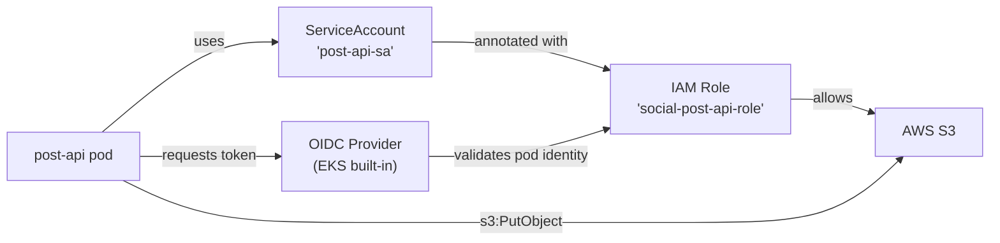

### Setup IRSA

```bash
# 1. Enable OIDC provider cho cluster
eksctl utils associate-iam-oidc-provider \
  --cluster social \
  --approve

# 2. Tạo IAM role với trust policy cho ServiceAccount
eksctl create iamserviceaccount \
  --cluster social \
  --namespace social \
  --name post-api-sa \
  --attach-policy-arn arn:aws:iam::aws:policy/AmazonS3FullAccess \
  --approve

# Lệnh này tự tạo:
# - IAM Role với trust policy
# - K8s ServiceAccount với annotation
```

**ServiceAccount được tạo:**
```yaml
apiVersion: v1
kind: ServiceAccount
metadata:
  name: post-api-sa
  namespace: social
  annotations:
    eks.amazonaws.com/role-arn: arn:aws:iam::123456789012:role/social-post-api-role
    #                            ↑ annotation này báo EKS inject token vào pod
```

**Dùng trong Deployment:**
```yaml
spec:
  template:
    spec:
      serviceAccountName: post-api-sa   # ← pod dùng SA này → có IAM role
      containers:
        - name: post-api
          # Không cần AWS_ACCESS_KEY_ID / AWS_SECRET_ACCESS_KEY
          # SDK tự lấy credentials từ token file được inject
```

**Lợi ích:**
- Mỗi pod chỉ có quyền cần thiết (least privilege)
- Không cần quản lý access key
- Token tự rotate

---

## 13. Secrets Management

### K8s Secret — Đơn giản nhưng có giới hạn

```yaml
# Tạo secret
kubectl create secret generic jwt-keys \
  --from-file=private-key.pem=services/dev-private.pem \
  --from-file=public-key.pem=services/dev-public.pem \
  -n social
```

**K8s Secret lưu như thế nào?**

```
etcd lưu: {data: {private-key.pem: "LS0tLS1CRUdJ..."}}
                                    ↑ base64 encode (KHÔNG phải encrypt!)
```

Base64 không phải mã hóa — chỉ là encoding. Ai có quyền `kubectl get secret` đều đọc được.

**Bảo mật Secret trong EKS:**
1. **Encryption at rest**: Enable EKS envelope encryption với KMS key
2. **RBAC**: Giới hạn ai được `get/list` Secrets
3. **Audit log**: CloudTrail log mọi lần access Secret

```bash
# Enable encryption at rest khi tạo cluster
eksctl create cluster \
  --name social \
  --encryption-config '[{"resources":["secrets"],"provider":{"keyArn":"arn:aws:kms:..."}}]'
```

### AWS Secrets Manager + External Secrets Operator

Cho production, lưu secret trong AWS Secrets Manager:

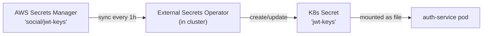

```yaml
# ExternalSecret resource
apiVersion: external-secrets.io/v1beta1
kind: ExternalSecret
metadata:
  name: jwt-keys
  namespace: social
spec:
  refreshInterval: 1h
  secretStoreRef:
    name: aws-secrets-manager
    kind: ClusterSecretStore
  target:
    name: jwt-keys    # ← tạo K8s Secret này
  data:
    - secretKey: private-key.pem
      remoteRef:
        key: social/jwt-keys        # ← tên trong Secrets Manager
        property: private_key_pem
    - secretKey: public-key.pem
      remoteRef:
        key: social/jwt-keys
        property: public_key_pem
```

**Lợi ích:**
- Secret không bao giờ hardcode trong code hay git
- Rotate secret trong Secrets Manager → ESO tự sync vào cluster
- Audit trail đầy đủ (ai đọc secret lúc nào)

---

## 14. eksctl

### eksctl là gì?

Tool CLI tạo/quản lý EKS cluster. Thay vì click AWS Console hay viết CloudFormation/Terraform dài, `eksctl` cho phép tạo cluster với 1 lệnh.

```bash
# Tạo cluster đơn giản nhất
eksctl create cluster --name social --region ap-southeast-1

# Tạo với node group cụ thể
eksctl create cluster \
  --name social \
  --region ap-southeast-1 \
  --nodegroup-name standard \
  --node-type t3.medium \
  --nodes 2 \
  --nodes-min 2 \
  --nodes-max 4 \
  --managed
```

### eksctl config file (recommended)

Thay vì flags dài, dùng file YAML:

```yaml
# infra/eks-cluster.yaml (chưa có trong project — cần tạo)
apiVersion: eksctl.io/v1alpha5
kind: ClusterConfig

metadata:
  name: social
  region: ap-southeast-1
  version: "1.30"     # K8s version

# VPC config (eksctl tự tạo nếu không chỉ định)
vpc:
  cidr: 10.0.0.0/16
  nat:
    gateway: Single    # 1 NAT gateway (rẻ hơn HA nhưng single point of failure)

managedNodeGroups:
  - name: standard
    instanceType: t3.medium
    minSize: 2
    maxSize: 4
    desiredCapacity: 2
    
    # EBS volume cho node
    volumeSize: 30     # GB cho node's OS disk
    volumeType: gp3
    
    # Lifecycle
    labels:
      environment: test
    
    # IAM policies cho node
    iam:
      attachPolicyARNs:
        - arn:aws:iam::aws:policy/AmazonEKSWorkerNodePolicy
        - arn:aws:iam::aws:policy/AmazonEC2ContainerRegistryReadOnly
        - arn:aws:iam::aws:policy/AmazonEKS_CNI_Policy

# Addons cần thiết
addons:
  - name: vpc-cni
  - name: coredns
  - name: kube-proxy
  - name: aws-ebs-csi-driver   # để dùng PVC với EBS

# Enable OIDC cho IRSA
iam:
  withOIDC: true

# CloudWatch logging
cloudWatch:
  clusterLogging:
    enableTypes: ["api", "audit", "authenticator"]
```

```bash
# Tạo cluster từ file
eksctl create cluster -f infra/eks-cluster.yaml

# Xem cluster
eksctl get cluster

# Xóa cluster (và tất cả resources)
eksctl delete cluster --name social
```

### eksctl tạo gì?

```
eksctl create cluster
├── CloudFormation Stack (quản lý lifecycle)
│   ├── VPC + Subnets + Route Tables + NAT Gateway
│   ├── Security Groups
│   ├── IAM Roles (control plane + node)
│   └── EKS Cluster resource
├── Managed Node Group
│   └── Auto Scaling Group (EC2 instances)
└── ~/.kube/config update
    └── kubectl context "social" → EKS cluster
```

---

## 15. Helm

### Helm là gì?

Package manager cho Kubernetes — giống `apt`/`brew` nhưng cho k8s manifests.

```
apt install nginx          →    helm install traefik traefik/traefik
npm install react          →    helm install cert-manager jetstack/cert-manager
```

**3 khái niệm chính:**

| Khái niệm | Ý nghĩa | Ví dụ |
|---|---|---|
| **Chart** | Package (template YAML + default values) | `traefik/traefik` |
| **Release** | Instance của chart đã install | `helm install traefik ...` → release "traefik" |
| **Values** | Config override default của chart | `--set service.type=LoadBalancer` |

### Helm trong project social

```bash
# Thêm repo
helm repo add traefik https://helm.traefik.io/traefik
helm repo update

# Install (tạo release "traefik")
helm install traefik traefik/traefik \
  --namespace kube-system \
  --set service.type=LoadBalancer \
  --set ports.web.port=80

# Xem releases đang chạy
helm list -A

# Upgrade (thay đổi config)
helm upgrade traefik traefik/traefik \
  --namespace kube-system \
  --set service.type=LoadBalancer \
  --set ports.websecure.port=443

# Xóa release
helm uninstall traefik -n kube-system
```

### Values file (khuyến nghị)

Thay vì `--set` nhiều flags, dùng file:

```yaml
# infra/traefik-values.yaml
service:
  type: LoadBalancer
  annotations:
    service.beta.kubernetes.io/aws-load-balancer-type: "nlb"
    service.beta.kubernetes.io/aws-load-balancer-cross-zone-load-balancing-enabled: "true"

ports:
  web:
    port: 80
    expose: true
  websecure:
    port: 443
    expose: true

# Enable dashboard
ingressRoute:
  dashboard:
    enabled: false    # tắt trong production

# Log format
logs:
  general:
    format: json    # structured logging cho Loki

# Resource limits
resources:
  requests:
    cpu: 100m
    memory: 128Mi
  limits:
    cpu: 500m
    memory: 256Mi
```

```bash
helm install traefik traefik/traefik \
  --namespace kube-system \
  -f infra/traefik-values.yaml
```

---

## 16. Observability

### LGTM Stack trong project

Project đã setup `k8s/infra/lgtm.yaml` — Grafana OTEL-LGTM image all-in-one:

```
grafana/otel-lgtm:0.8.1
├── Loki          → Log aggregation
├── Grafana       → Dashboard (UI: :3000)
├── Tempo         → Distributed tracing
├── Mimir         → Metrics (Prometheus-compatible)
└── OTEL Collector → Nhận OTLP từ apps (:4317 gRPC, :4318 HTTP)
```

**Quarkus tự gửi telemetry** khi có `quarkus-opentelemetry` extension:

```
auth-service → OTLP → lgtm:4317 → Loki (logs) + Tempo (traces) + Mimir (metrics)
post-api     → OTLP → lgtm:4317 → ...
```

### Xem Grafana trên EKS

```bash
# Port-forward để truy cập từ laptop
kubectl port-forward -n social svc/lgtm 3000:3000

# Mở http://localhost:3000
# Không cần login (GF_AUTH_ANONYMOUS_ENABLED=true)
```

### Traces — Distributed Tracing

Khi 1 request đi qua nhiều services, Tempo track toàn bộ:

```mermaid
gantt
    title Request: POST /api/articles/{id}/comments
    dateFormat x
    axisFormat %Lms

    section Traefik
    jwt-verify forward   :0, 10
    route to interaction :10, 15

    section interaction-service
    validate request    :15, 20
    insert comment DB   :20, 45
    publish Kafka event :45, 55
    return 201          :55, 60

    section post-consumer (async)
    consume event       :70, 80
    Redis INCR counter  :80, 85
```

Trong Grafana → Explore → Tempo → search trace ID → thấy toàn bộ span trên.

### Metrics quan trọng cần theo dõi

| Metric | Ý nghĩa | Alert khi |
|---|---|---|
| `http_server_requests_seconds` | Latency per endpoint | p95 > 500ms |
| `http_server_requests_errors_total` | Error rate | > 1% |
| `jvm_memory_used_bytes` | JVM heap | > 80% limit |
| `kafka_consumer_lag` | Consumer lag | > 1000 messages |
| `db_connections_active` | DB pool | > 80% pool size |

---

## 17. EKS vs kind — Điểm khác nhau

### Networking

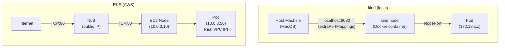

**Khác biệt IP:**
- kind: pods dùng Docker bridge network (`172.18.x.x`) — không phải IP thật
- EKS: pods dùng VPC IP thật (`10.0.x.x`) — AWS VPC CNI

### Storage

```
kind: emptyDir → Docker volume trên host → mất khi container xóa
EKS: EBS volume → persist kể cả khi pod/node restart
```

### Image pull

```
kind: kind load docker-image → image trong containerd của kind node
EKS: kubelet pull từ ECR → cần ECR registry + IAM permission
```

### Service Discovery

Cả hai giống nhau: CoreDNS + Service name.

```
postgres:5432 → postgres.social.svc.cluster.local → ClusterIP → pod
(hoạt động giống nhau trên kind và EKS)
```

### LoadBalancer

```
kind: type: LoadBalancer → Pending (không có cloud provider) → dùng NodePort
EKS: type: LoadBalancer → AWS tạo NLB tự động
```

---

## 18. Cheat Sheet

### Cluster lifecycle

```bash
# Tạo cluster
eksctl create cluster -f infra/eks-cluster.yaml

# Xem cluster
eksctl get cluster
kubectl cluster-info

# Xóa cluster (tránh tốn tiền!)
eksctl delete cluster --name social
```

### Debug pods

```bash
# Xem tất cả pods
kubectl get pods -n social -o wide   # -o wide xem thêm node, IP

# Logs
kubectl logs -n social deployment/auth-service -f --tail=100

# Describe pod (xem events, resource usage)
kubectl describe pod -n social <pod-name>

# Exec vào pod
kubectl exec -it -n social <pod-name> -- /bin/sh

# Port-forward service về laptop
kubectl port-forward -n social svc/lgtm 3000:3000
```

### Troubleshoot image pull

```bash
# Pod không pull được image
kubectl describe pod -n social auth-service-xxx
# Events: Failed to pull image ... 403 Forbidden

# Kiểm tra node IAM role có policy ECR chưa
aws iam list-attached-role-policies --role-name <node-role>

# Kiểm tra ECR repo tồn tại
aws ecr describe-repositories --repository-names nhan/auth-service
```

### Troubleshoot networking

```bash
# Service có endpoint chưa?
kubectl get endpoints -n social

# Test DNS resolution từ trong pod
kubectl run -it --rm debug --image=busybox --restart=Never -n social -- \
  nslookup postgres.social.svc.cluster.local

# Test kết nối đến postgres từ pod khác
kubectl run -it --rm debug --image=postgres:15-alpine --restart=Never -n social -- \
  pg_isready -h postgres -p 5432 -U postgres
```

### Rollout

```bash
# Deploy image mới (sau khi push ECR)
kubectl set image deployment/auth-service \
  auth-service=123456789.dkr.ecr.ap-southeast-1.amazonaws.com/nhan/auth-service:v2 \
  -n social

# Xem tiến trình rollout
kubectl rollout status deployment/auth-service -n social

# Rollback nếu có vấn đề
kubectl rollout undo deployment/auth-service -n social

# Xem rollout history
kubectl rollout history deployment/auth-service -n social
```

### Scaling

```bash
# Manual scale
kubectl scale deployment/post-api --replicas=3 -n social

# Xem resource usage (cần metrics-server)
kubectl top pods -n social
kubectl top nodes
```

### kubectl output formats

```bash
kubectl get pods -n social -o wide       # thêm cột node, IP
kubectl get pods -n social -o yaml       # full YAML spec
kubectl get pods -n social -o json       # JSON
kubectl get pods -n social -o jsonpath='{.items[*].metadata.name}'  # custom

# Watch real-time
kubectl get pods -n social -w
```

### Useful aliases

```bash
alias k=kubectl
alias kgp="kubectl get pods"
alias kgs="kubectl get svc"
alias kd="kubectl describe"
alias kl="kubectl logs"
alias kns="kubectl config set-context --current --namespace"

# Dùng:
kgp -n social
kns social    # set default namespace, không cần -n social nữa
```

---

## Appendix — Thứ tự deploy đúng

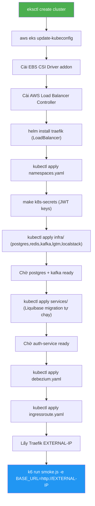
