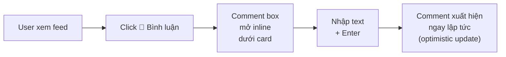
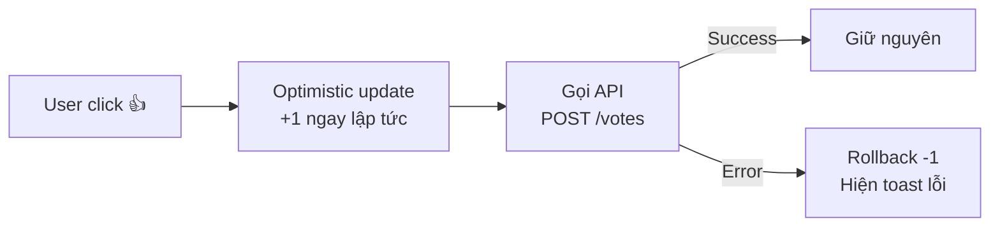
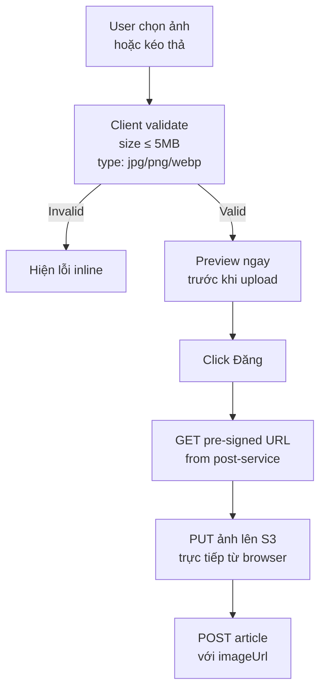

# Frontend — Current Analysis & UI/UX Recommendation

---

## 1. Current Tech Stack

| | Hiện tại | Mới (Đề xuất) |
|---|---|---|
| React | 17.0.1 | 19.x |
| UI Library | Material-UI 4.12.3 | shadcn/ui + Tailwind CSS 4 |
| Routing | React Router 5.2.0 | React Router 7 |
| Server state | useState + Axios | TanStack React Query v5 |
| Client state | localStorage | Zustand |
| HTTP | Axios 0.21.1 | fetch (native, wrapped) |
| Forms | Uncontrolled + manual | React Hook Form + Zod |
| Styling | SCSS + MUI + Reactstrap Grid | Tailwind CSS |
| Notifications | toastr (chưa dùng) | Sonner |
| Image upload | Imgur API | AWS S3 pre-signed URL |

---

## 2. Vấn đề hiện tại

### 2.1 Broken / Placeholder

| Component | Vấn đề |
|---|---|
| `Comments.jsx` | Chỉ render text `"comment place here"` — hoàn toàn chưa implement |
| `Notification.jsx` | Badge hardcode `badgeContent=1`, nội dung là link Facebook cá nhân |
| Like button | `onButtonLikeClicked` chỉ `console.log`, không gọi API |
| Search bar | Input rỗng, không có handler |
| "Bạn bè" sidebar | MenuItem không navigate đến đâu |
| "My account" | MenuItem đóng menu rồi thôi |
| Forgot password | `href="#"` |

### 2.2 Hardcode đáng lo ngại

```jsx
// ArticleOwner.jsx — admin check bằng id
{user.id === 1 && <BlueTickIcon />}

// Notification.jsx — badge cố định
<Badge badgeContent={1} color="error">

// NavigationBar.jsx — brand name cố định
<Typography variant="h6">Fakeboob</Typography>

// CreateArticleForm.jsx — timeout magic number
setTimeout(() => { ... }, 1000)
```

### 2.3 CSS bị lỗi

```scss
// login.scss — dùng string quotes (React inline style syntax, không phải CSS)
display: 'flex';
flex-direction: 'column';

// Viết đè chính nó
border: 1rem;
border: 1rem;
border: 0.1rem;

// Magic numbers
margin-top: 40%;         // login form
offsetTop: 42            // sticky sidebar, cứng bằng navbar height
max-height: 30rem;       // article image
```

### 2.4 Dependencies thừa / outdated

```json
"toastr": "2.1.4",              // không import ở đâu
"jquery": "3.5.1",              // không dùng
"react-loader-spinner": "4.0.0" // không dùng
```

### 2.5 UX / Accessibility

- Không có loading state khi gọi API
- Không có empty state (feed trống không hiển thị gì)
- Không có error boundary
- Không có aria-label trên buttons
- JWT lưu trong `localStorage` (XSS risk)
- `window.location.href` thay vì React Router navigate
- Modal dialog không responsive — layout `flex-direction: row` trên mobile

---

## 3. Layout hiện tại vs Đề xuất mới

### 3.1 Current Layout

```
┌─────────────────────────────────────────────────────┐
│  NAVBAR: [Fakeboob] [======Search======] [🔔] [▼]   │
├──────────┬──────────────────────┬────────┬──────────┤
│          │                      │        │          │
│LeftSide  │  CreateArticleForm   │ EMPTY  │  EMPTY   │
│ - Avatar │  ┌────────────────┐  │        │          │
│ - Name   │  │ Bạn đang nghĩ │  │        │          │
│ - Bạn bè │  └────────────────┘  │        │          │
│          │                      │        │          │
│          │  [Article Card]       │        │          │
│          │  [Article Card]       │        │          │
│          │  [Article Card]       │        │          │
│  md=3    │       md=6            │  lg=2  │  lg=2    │
└──────────┴──────────────────────┴────────┴──────────┘
```

**Vấn đề:** 2 cột phải hoàn toàn trống, chiếm ~30% màn hình.

### 3.2 Recommended Layout

```
┌──────────────────────────────────────────────────────────────┐
│  NAVBAR: [Logo] [=========Search=========] [+Post] [🔔] [👤] │
├─────────────┬───────────────────────────┬────────────────────┤
│             │                           │                    │
│  Left Nav   │   Create Post Card        │   Right Panel      │
│  ─────────  │   ┌───────────────────┐   │   ─────────────    │
│  🏠 Feed    │   │ [Avatar] What's   │   │   Suggested Users  │
│  🔔 Noti    │   │         on mind?  │   │   ┌────────────┐   │
│  👤 Profile │   └───────────────────┘   │   │ User  [+]  │   │
│  🔖 Saved   │                           │   │ User  [+]  │   │
│  ⚙️ Setting │   [Article Card]          │   └────────────┘   │
│             │   [Article Card]          │                    │
│  w=240px    │   [Article Card]          │   Trending Tags    │
│             │        flex-1             │   w=280px          │
└─────────────┴───────────────────────────┴────────────────────┘

Mobile (< 768px):
┌────────────────────────┐
│ [Logo]    [🔔] [👤]    │
├────────────────────────┤
│ [Create Post Card]     │
│ [Article Card]         │
│ [Article Card]         │
└────────────────────────┘
│ [🏠] [🔍] [+] [🔔] [👤] │  ← Bottom tab bar
└────────────────────────┘
```

---

## 4. Component Redesign

### 4.1 Article Card

**Hiện tại:**
```
┌──────────────────────────────────┐
│ [Avatar] Name  🔵  2-6-2026      │
├──────────────────────────────────┤
│ Description text                 │
│ ┌──────────────────────────────┐ │
│ │         Image                │ │
│ └──────────────────────────────┘ │
│ 👍 12  💬 3                      │
├──────────────────────────────────┤
│ [  👍 Like  ]  [  💬 Comment  ]  │
└──────────────────────────────────┘
```

**Đề xuất:**
```
┌──────────────────────────────────────┐
│ [Avatar] Name  ✓   · 2 giờ trước  ⋯ │  ← ⋯ = edit/delete nếu own
├──────────────────────────────────────┤
│ Description text (2 dòng, xem thêm) │
│ ┌────────────────────────────────┐   │
│ │           Image                │   │
│ └────────────────────────────────┘   │
│ 12 lượt thích · 3 bình luận          │
├──────────────────────────────────────┤
│ [👍 Thích] [💬 Bình luận] [↗ Chia sẻ]│
├──────────────────────────────────────┤
│ ──── Comments inline (top 2) ────    │
│ [Avatar] Name: comment text          │
│ [Avatar] Name: comment text          │
│ Xem tất cả 3 bình luận...            │
│ ┌──────────────────────────────────┐ │
│ │ [Avatar] Viết bình luận...    ↵  │ │
│ └──────────────────────────────────┘ │
└──────────────────────────────────────┘
```

**Thay đổi chính:**
- Comments inline trong card, không cần mở modal
- `⋯` menu cho edit/delete bài của mình
- Timestamp hiển thị relative (`2 giờ trước` thay `2-6-2026`)
- Tách rõ số like và comment count
- Inline comment input

---

### 4.2 Create Post

**Hiện tại:** Card → click → Dialog modal riêng

**Đề xuất:** Expand in-place (như Facebook/Twitter)

```
┌────────────────────────────────────────────┐
│ [Avatar]  ┌──────────────────────────────┐ │
│           │ Bạn đang nghĩ gì, Nhan?      │ │
│           └──────────────────────────────┘ │
│  (click để mở)                             │
└────────────────────────────────────────────┘

↓ Sau khi click ↓

┌────────────────────────────────────────────┐
│ [Avatar]  Đăng bài                    [×]  │
│ ┌──────────────────────────────────────┐   │
│ │ Bạn đang nghĩ gì?                    │   │  ← auto-grow textarea
│ │                                      │   │
│ └──────────────────────────────────────┘   │
│ ┌──────────────────────────────────────┐   │
│ │        [+ Thêm ảnh]                  │   │  ← drag & drop zone
│ └──────────────────────────────────────┘   │
│ [📷 Ảnh] [😊 Emoji] [📍 Check-in]  [Đăng] │
└────────────────────────────────────────────┘
```

---

### 4.3 Navbar

**Hiện tại:**
```
[Fakeboob] [=====Search=====] [🔔] [▼]
```

**Đề xuất:**
```
Desktop:
[Logo] [========Search========] [+ Tạo bài] [🔔 3] [Avatar ▼]
                                               ↑
                                        Badge từ API

Mobile:
[Logo]                              [🔔] [Avatar]
```

---

### 4.4 Notification Panel

**Hiện tại:** Hardcode badge=1, nội dung là link Facebook

**Đề xuất:**
```
🔔 Thông báo                    [Đánh dấu đã đọc]
─────────────────────────────────────────────────
🟦 [Avatar] Nam đã thích bài viết của bạn    2p
   "Hôm nay trời đẹp quá..."

🟦 [Avatar] Lan đã bình luận bài viết của bạn  1h
   "Đồng ý với bạn!"

   [Avatar] Minh đã bắt đầu theo dõi bạn       2h

[Xem tất cả thông báo]
```

---

### 4.5 Auth Pages

**Hiện tại:** Form căn giữa với `margin-top: 40%`

**Đề xuất — Split Screen:**

```
┌─────────────────────┬─────────────────────────┐
│                     │                         │
│   Brand / Artwork   │    Đăng nhập            │
│                     │                         │
│    [Logo]           │  ┌───────────────────┐  │
│                     │  │ Email hoặc username│  │
│   "Kết nối với      │  └───────────────────┘  │
│    bạn bè và chia   │  ┌───────────────────┐  │
│    sẻ khoảnh khắc"  │  │ Mật khẩu          │  │
│                     │  └───────────────────┘  │
│                     │  [        Đăng nhập    ] │
│                     │                         │
│                     │  Quên mật khẩu?          │
│                     │  ─────── hoặc ───────    │
│                     │  [  Tạo tài khoản mới  ] │
│                     │                         │
└─────────────────────┴─────────────────────────┘

Mobile: chỉ hiện form, bỏ left panel
```

---

## 5. User Flows Cần Cải thiện

### 5.1 Comment Flow



### 5.2 Like Flow



### 5.3 Image Upload Flow



---

## 6. State Management Mới

Thay vì `useState` + `localStorage` rải rác:

```
┌──────────────────────────────────────────────────────┐
│           TanStack React Query v5 (server state)      │
│                                                      │
│  useInfiniteQuery       useMutation       useQuery   │
│  ─────────────────      ───────────       ────────── │
│  articles feed          createPost        userById   │
│  - auto refetch         likeArticle       myProfile  │
│  - infinite scroll      addComment        notiList   │
│  - stale-while-revalidate  optimistic update         │
└──────────────────────────────────────────────────────┘

┌─────────────────────────────────────────────┐
│       Zustand (client/UI state only)         │
│  ┌──────────┐  ┌──────────┐                 │
│  │ authStore│  │ uiStore  │                 │
│  │ - user   │  │ - modal  │                 │
│  │ - token  │  │ - sidebar│                 │
│  └──────────┘  └──────────┘                 │
└─────────────────────────────────────────────┘
```

**Phân chia rõ trách nhiệm:**
- **TanStack Query** — mọi thứ liên quan đến server: fetch, cache, refetch, mutation, optimistic update
- **Zustand** — chỉ UI state thuần: auth session, modal open/close, sidebar collapse

**Query keys convention:**
```ts
// queryKeys.ts
export const queryKeys = {
  articles: {
    all: ['articles'] as const,
    infinite: () => [...queryKeys.articles.all, 'infinite'] as const,
    detail: (id: string) => [...queryKeys.articles.all, id] as const,
  },
  comments: {
    byArticle: (articleId: string) => ['comments', articleId] as const,
  },
  notifications: {
    list: () => ['notifications'] as const,
    unreadCount: () => ['notifications', 'unread-count'] as const,
  },
  users: {
    me: () => ['users', 'me'] as const,
    detail: (id: string) => ['users', id] as const,
  },
}
```

**Infinite scroll feed:**
```ts
const { data, fetchNextPage, hasNextPage } = useInfiniteQuery({
  queryKey: queryKeys.articles.infinite(),
  queryFn: ({ pageParam = 0 }) =>
    api.get(`/articles?page=${pageParam}&size=10`),
  getNextPageParam: (lastPage) =>
    lastPage.hasNext ? lastPage.page + 1 : undefined,
  staleTime: 30_000,
})
```

**Optimistic like:**
```ts
const likeMutation = useMutation({
  mutationFn: (articleId: string) => api.post(`/articles/${articleId}/vote`, { value: 1 }),
  onMutate: async (articleId) => {
    await queryClient.cancelQueries({ queryKey: queryKeys.articles.detail(articleId) })
    const prev = queryClient.getQueryData(queryKeys.articles.detail(articleId))
    queryClient.setQueryData(queryKeys.articles.detail(articleId), (old) => ({
      ...old, voteCount: old.voteCount + 1,
    }))
    return { prev }
  },
  onError: (_, articleId, ctx) => {
    queryClient.setQueryData(queryKeys.articles.detail(articleId), ctx?.prev)
  },
  onSettled: (_, __, articleId) => {
    queryClient.invalidateQueries({ queryKey: queryKeys.articles.detail(articleId) })
  },
})
```

---

## 7. Recommended New Stack

```
frontend/
├── src/
│   ├── app/                    # layouts, router
│   ├── features/               # feature-based structure
│   │   ├── auth/
│   │   │   ├── LoginPage.tsx
│   │   │   ├── SignUpPage.tsx
│   │   │   └── useAuth.ts
│   │   ├── feed/
│   │   │   ├── FeedPage.tsx
│   │   │   ├── ArticleCard.tsx
│   │   │   ├── CreatePost.tsx
│   │   │   └── useFeed.ts
│   │   ├── comments/
│   │   ├── notifications/
│   │   └── profile/
│   ├── components/             # shared UI
│   │   ├── ui/                 # shadcn components
│   │   ├── Avatar.tsx
│   │   └── RelativeTime.tsx
│   ├── lib/
│   │   ├── api.ts              # fetch wrapper
│   │   └── queryClient.ts
│   └── stores/
│       ├── authStore.ts        # Zustand
│       └── uiStore.ts
```

---

## 8. Checklist Ưu tiên

### Phải làm (blocking production)
- [ ] Implement Comments — inline trong card
- [ ] Implement Like/Vote — gọi API thật + optimistic update
- [ ] Form validation — Login/SignUp dùng Zod
- [ ] Loading & error states — skeleton cards, error toast
- [ ] Responsive mobile — bottom nav bar, collapse sidebar

### Nên làm (UX tốt hơn)
- [ ] Relative timestamp (`2 giờ trước`)
- [ ] Infinite scroll / pagination
- [ ] Notification system thật — nối với notification-service
- [ ] Edit/delete bài của mình
- [ ] Empty states — feed trống, không có notification
- [ ] Image drag & drop + size validation

### Nice to have
- [ ] Dark mode
- [ ] Skeleton loading thay spinner
- [ ] Optimistic updates
- [ ] Post character counter
- [ ] Image compression trên client trước khi upload
- [ ] PWA + offline support
