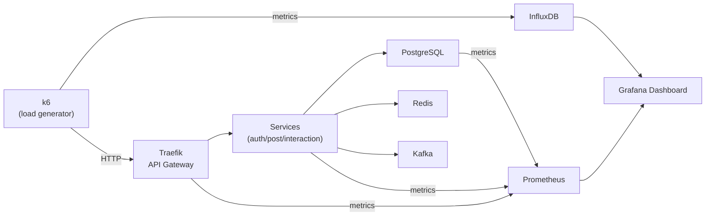
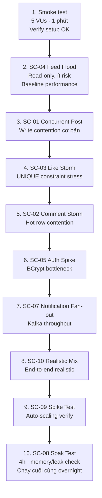

# Load Test Plan
## Mini Social Network — Microservices

---

## 1. Tool & Stack

| Tool | Mục đích |
|---|---|
| **k6** | Script load test (JS/TS), chạy local hoặc CI |
| **Grafana + InfluxDB** | Visualize metrics realtime |
| **k6 Cloud** (optional) | Distributed load từ nhiều region |

```bash
# Cài k6
brew install k6

# Chạy test
k6 run loadtest/scenarios/comment-storm.js

# Chạy với output Grafana
k6 run --out influxdb=http://localhost:8086/k6 loadtest/scenarios/comment-storm.js
```

**Cấu trúc thư mục:**
```
loadtest/
├── helpers/
│   ├── auth.js          # login + lấy token
│   ├── data.js          # seed data helpers
│   └── thresholds.js    # shared SLA thresholds
├── scenarios/
│   ├── concurrent-post.js
│   ├── comment-storm.js
│   ├── like-storm.js
│   ├── feed-flood.js
│   ├── auth-spike.js
│   ├── image-upload.js
│   ├── notification-fanout.js
│   └── realistic-mix.js
└── docker-compose.monitoring.yml  # Grafana + InfluxDB
```

---

## 2. SLA Thresholds (áp dụng chung)

```js
// helpers/thresholds.js
export const defaultThresholds = {
  http_req_duration: ['p(95)<500', 'p(99)<1000'],  // 95% dưới 500ms
  http_req_failed:   ['rate<0.01'],                 // lỗi < 1%
  http_reqs:         ['rate>100'],                  // throughput > 100 req/s
}
```

---

## 3. Scenarios

---

### SC-01 — Concurrent Post Creation
> Nhiều user cùng đăng bài một lúc — test write throughput của `post-service` và S3 upload

**Mục tiêu kiểm tra:**
- `post-service` không bị bottleneck khi insert đồng thời
- S3 pre-signed URL generation không bị rate limit
- `article.author_id` không bị conflict

```js
// scenarios/concurrent-post.js
import http from 'k6/http'
import { check, sleep } from 'k6'
import { defaultThresholds } from '../helpers/thresholds.js'
import { loginAll } from '../helpers/auth.js'

export const options = {
  scenarios: {
    concurrent_post: {
      executor: 'ramping-vus',
      stages: [
        { duration: '30s', target: 50  },   // ramp up
        { duration: '1m',  target: 200 },   // sustained
        { duration: '30s', target: 0   },   // ramp down
      ],
    },
  },
  thresholds: {
    ...defaultThresholds,
    'http_req_duration{scenario:concurrent_post}': ['p(95)<800'],
  },
}

const TOKENS = loginAll(200)  // pre-login 200 users

export default function () {
  const token = TOKENS[__VU % TOKENS.length]

  const res = http.post(
    'http://localhost/api/articles',
    JSON.stringify({
      description: `Load test post from VU ${__VU} iter ${__ITER}`,
      imageUrl: null,
    }),
    {
      headers: {
        Authorization: `Bearer ${token}`,
        'Content-Type': 'application/json',
      },
    }
  )

  check(res, {
    'status 201':         (r) => r.status === 201,
    'has article id':     (r) => r.json('id') !== undefined,
    'response < 500ms':   (r) => r.timings.duration < 500,
  })

  sleep(1)
}
```

**Kỳ vọng:**
- 200 VUs đăng bài đồng thời → p95 < 800ms
- Không có duplicate hoặc lost write
- DB connection pool không bị cạn

---

### SC-02 — Comment Storm (Hot Article)
> Hàng trăm user cùng comment vào 1 bài — test row contention trên `comment_count`

**Đây là case nguy hiểm nhất** vì nhiều transaction cùng UPDATE `article.comment_count` trên cùng 1 row.

```js
// scenarios/comment-storm.js
import http from 'k6/http'
import { check, sleep } from 'k6'
import { defaultThresholds } from '../helpers/thresholds.js'

const HOT_ARTICLE_ID = __ENV.ARTICLE_ID || '550e8400-e29b-41d4-a716-446655440000'

export const options = {
  scenarios: {
    comment_storm: {
      executor: 'constant-vus',
      vus: 300,
      duration: '2m',
    },
  },
  thresholds: {
    ...defaultThresholds,
    'http_req_duration{endpoint:comment}': ['p(95)<600', 'p(99)<1500'],
    'http_req_failed{endpoint:comment}':   ['rate<0.005'],  // < 0.5% lỗi
  },
}

export default function () {
  const token = TOKENS[__VU % TOKENS.length]

  // Comment vào cùng 1 bài
  const res = http.post(
    `http://localhost/api/articles/${HOT_ARTICLE_ID}/comments`,
    JSON.stringify({ description: `Comment từ VU ${__VU} lúc ${Date.now()}` }),
    {
      headers: {
        Authorization: `Bearer ${token}`,
        'Content-Type': 'application/json',
        'X-Endpoint': 'comment',
      },
    }
  )

  check(res, {
    'status 201':       (r) => r.status === 201,
    'no deadlock':      (r) => r.status !== 500,
    'comment saved':    (r) => r.json('id') !== undefined,
  })

  sleep(0.5)
}
```

**Kỳ vọng:**
- 300 VUs comment đồng thời → không có deadlock
- `comment_count` chính xác sau khi test (verify bằng GET article)
- Nếu dùng Redis counter: kiểm tra Redis vs DB không lệch nhau

**Verify sau test:**
```bash
# Đếm actual comments trong DB
SELECT COUNT(*) FROM comment WHERE article_id = '<HOT_ARTICLE_ID>';

# So sánh với comment_count trong article
SELECT comment_count FROM article WHERE id = '<HOT_ARTICLE_ID>';
# Hai giá trị phải bằng nhau
```

---

### SC-03 — Like Storm (Vote Contention)
> Hàng trăm user cùng like/unlike 1 bài — test UNIQUE constraint và vote_count update

```js
// scenarios/like-storm.js
import http from 'k6/http'
import { check } from 'k6'

const HOT_ARTICLE_ID = __ENV.ARTICLE_ID || '550e8400-e29b-41d4-a716-446655440000'

export const options = {
  scenarios: {
    like_storm: {
      executor: 'ramping-arrival-rate',  // fixed RPS, không phải VUs
      startRate: 50,
      timeUnit: '1s',
      preAllocatedVUs: 200,
      maxVUs: 500,
      stages: [
        { duration: '30s', target: 100 },   // 100 likes/s
        { duration: '1m',  target: 500 },   // 500 likes/s
        { duration: '30s', target: 50  },
      ],
    },
  },
  thresholds: {
    'http_req_duration{endpoint:vote}': ['p(95)<400'],
    'http_req_failed{endpoint:vote}':   ['rate<0.01'],
    // vote_count phải tăng chứ không giảm (no lost updates)
    'checks{check:no_lost_update}':     ['rate>0.99'],
  },
}

export default function () {
  const token = TOKENS[__VU % TOKENS.length]
  const value = Math.random() > 0.2 ? 1 : -1  // 80% upvote, 20% downvote

  const res = http.post(
    `http://localhost/api/articles/${HOT_ARTICLE_ID}/vote`,
    JSON.stringify({ value }),
    {
      headers: {
        Authorization: `Bearer ${token}`,
        'Content-Type': 'application/json',
        'X-Endpoint': 'vote',
      },
    }
  )

  check(res, {
    'status 200 or 201':    (r) => [200, 201].includes(r.status),
    'no duplicate vote':    (r) => r.status !== 409 || true,  // 409 = already voted, OK
    'no server error':      (r) => r.status < 500,
    'no_lost_update':       (r) => r.status < 500,
  })
}
```

**Kỳ vọng:**
- UNIQUE constraint `(user_id, target_id, target_type)` không bị bypass
- Không có lost update trên `vote_count`
- 409 Conflict khi user vote lại là expected behavior

---

### SC-04 — Feed Flood
> Nhiều user cùng load feed — test read throughput và cache effectiveness

```js
// scenarios/feed-flood.js
import http from 'k6/http'
import { check, sleep } from 'k6'

export const options = {
  scenarios: {
    feed_read: {
      executor: 'constant-arrival-rate',
      rate: 500,           // 500 req/s
      timeUnit: '1s',
      duration: '3m',
      preAllocatedVUs: 100,
      maxVUs: 300,
    },
  },
  thresholds: {
    'http_req_duration{endpoint:feed}': ['p(95)<300', 'p(99)<500'],
    'http_req_failed':                  ['rate<0.001'],
  },
}

export default function () {
  const token = TOKENS[__VU % TOKENS.length]
  const page = Math.floor(Math.random() * 5)  // random page 0-4

  const res = http.get(
    `http://localhost/api/articles?page=${page}&size=10`,
    {
      headers: {
        Authorization: `Bearer ${token}`,
        'X-Endpoint': 'feed',
      },
    }
  )

  check(res, {
    'status 200':         (r) => r.status === 200,
    'has items':          (r) => r.json('items')?.length > 0,
    'response < 300ms':   (r) => r.timings.duration < 300,
  })

  sleep(Math.random() * 2)
}
```

**Kỳ vọng:**
- 500 req/s → p95 < 300ms (đây là read-heavy, phải nhanh)
- Nếu có Redis cache: cache hit rate > 80%
- Không có N+1 query (mỗi request chỉ query 1-2 lần DB)

---

### SC-05 — Auth Spike
> Đột ngột nhiều user login cùng lúc — test BCrypt performance và JWT generation

```js
// scenarios/auth-spike.js
import http from 'k6/http'
import { check } from 'k6'

// BCrypt là blocking CPU operation — đây là bottleneck thường gặp
export const options = {
  scenarios: {
    auth_spike: {
      executor: 'ramping-vus',
      stages: [
        { duration: '10s', target: 0   },
        { duration: '5s',  target: 500 },  // spike đột ngột
        { duration: '1m',  target: 500 },  // sustained spike
        { duration: '10s', target: 0   },
      ],
    },
  },
  thresholds: {
    // BCrypt chậm hơn bình thường — threshold cao hơn
    'http_req_duration{endpoint:login}': ['p(95)<2000', 'p(99)<5000'],
    'http_req_failed{endpoint:login}':   ['rate<0.01'],
  },
}

const USERS = Array.from({ length: 1000 }, (_, i) => ({
  username: `loadtest_user_${i}`,
  password: 'LoadTest@123',
}))

export default function () {
  const user = USERS[__VU % USERS.length]

  const res = http.post(
    'http://localhost/api/auth/signin',
    JSON.stringify(user),
    {
      headers: {
        'Content-Type': 'application/json',
        'X-Endpoint': 'login',
      },
    }
  )

  check(res, {
    'status 200':      (r) => r.status === 200,
    'has token':       (r) => r.json('accessToken') !== undefined,
    'no 429':          (r) => r.status !== 429,
  })
}
```

**Kỳ vọng:**
- BCrypt work factor 10 → ~100ms/request CPU time
- 500 VUs login đồng thời → auth-service cần scale horizontally
- Phát hiện thread pool exhaustion

---

### SC-06 — Image Upload Concurrent
> Nhiều user upload ảnh cùng lúc — test S3 pre-signed URL generation và multipart upload

```js
// scenarios/image-upload.js
import http from 'k6/http'
import { check } from 'k6'

const IMAGE_PAYLOAD = open('../fixtures/test-image.jpg', 'b')  // 500KB test image

export const options = {
  scenarios: {
    image_upload: {
      executor: 'constant-vus',
      vus: 50,
      duration: '2m',
    },
  },
  thresholds: {
    'http_req_duration{endpoint:upload}': ['p(95)<3000'],  // upload có thể chậm hơn
    'http_req_failed{endpoint:upload}':   ['rate<0.02'],
    'data_sent':   ['count>1000000'],  // verify data actually sent
  },
}

export default function () {
  const token = TOKENS[__VU % TOKENS.length]

  // Step 1: lấy pre-signed URL
  const urlRes = http.post(
    'http://localhost/api/articles/images/presign',
    JSON.stringify({ filename: `test-${__VU}-${__ITER}.jpg`, contentType: 'image/jpeg' }),
    { headers: { Authorization: `Bearer ${token}`, 'Content-Type': 'application/json' } }
  )

  check(urlRes, { 'got presigned url': (r) => r.status === 200 })

  const { uploadUrl, imageUrl } = urlRes.json()

  // Step 2: upload thẳng lên S3/LocalStack
  const uploadRes = http.put(uploadUrl, IMAGE_PAYLOAD, {
    headers: { 'Content-Type': 'image/jpeg', 'X-Endpoint': 'upload' },
  })

  check(uploadRes, { 'upload success': (r) => r.status === 200 })
}
```

---

### SC-07 — Notification Fan-out
> 1 bài post viral nhận nhiều comment/like liên tục — test Kafka consumer lag và notification-service throughput

```js
// scenarios/notification-fanout.js
import http from 'k6/http'
import { check, sleep } from 'k6'

// Simulate: 1 bài hot, 500 user comment liên tục
// → 500 Kafka events → notification-service consume → 500 DB inserts

const HOT_ARTICLE_ID = __ENV.ARTICLE_ID
const ARTICLE_OWNER_TOKEN = __ENV.OWNER_TOKEN

export const options = {
  scenarios: {
    // Commenters gửi events
    commenters: {
      executor: 'constant-vus',
      vus: 200,
      duration: '2m',
      exec: 'doComment',
    },
    // Owner poll notifications
    owner_polls: {
      executor: 'constant-arrival-rate',
      rate: 10,
      timeUnit: '1s',
      duration: '2m',
      preAllocatedVUs: 5,
      exec: 'pollNotifications',
    },
  },
  thresholds: {
    'http_req_duration{exec:doComment}':       ['p(95)<600'],
    'http_req_duration{exec:pollNotifications}':['p(95)<200'],
    // Kafka lag check (external — via JMX/Grafana)
  },
}

export function doComment() {
  const token = TOKENS[__VU % TOKENS.length]
  http.post(
    `http://localhost/api/articles/${HOT_ARTICLE_ID}/comments`,
    JSON.stringify({ description: `Fan comment ${__VU}` }),
    { headers: { Authorization: `Bearer ${token}`, 'Content-Type': 'application/json' } }
  )
  sleep(0.5)
}

export function pollNotifications() {
  const res = http.get(
    'http://localhost/api/notifications?seen=false',
    { headers: { Authorization: `Bearer ${ARTICLE_OWNER_TOKEN}` } }
  )
  check(res, {
    'notifications growing': (r) => r.json('total') >= 0,
    'no lag > 5s':           (r) => {
      const items = r.json('items') || []
      if (!items.length) return true
      const newest = new Date(items[0].createdAt)
      return Date.now() - newest.getTime() < 5000  // notification < 5s sau event
    },
  })
}
```

**Kỳ vọng:**
- Kafka consumer lag < 5s dưới 200 events/s
- notification-service không OOM
- Owner nhận đủ notifications (không mất event)

---

### SC-08 — Soak Test (Memory / Connection Leak)
> Chạy load vừa phải trong thời gian dài — phát hiện memory leak, connection pool cạn dần

```js
// scenarios/soak.js
export const options = {
  scenarios: {
    soak: {
      executor: 'constant-vus',
      vus: 50,        // load vừa phải
      duration: '4h', // chạy 4 tiếng
    },
  },
  thresholds: {
    // p99 không được tệ hơn theo thời gian
    'http_req_duration': ['p(99)<2000'],
    'http_req_failed':   ['rate<0.01'],
  },
}

// Mix tất cả actions: read feed, post, comment, like
export default function () {
  const action = Math.random()
  if (action < 0.6)      readFeed()
  else if (action < 0.8) likeArticle()
  else if (action < 0.95) addComment()
  else                    createPost()
  sleep(2)
}
```

**Monitor trong 4h:**
- JVM heap của mỗi Quarkus service (không tăng dần)
- PostgreSQL connection count (không tăng vô hạn)
- Kafka consumer lag (ổn định)
- Response time không tệ dần theo thời gian

---

### SC-09 — Spike Test (Traffic Burst)
> Từ idle → tải cao đột ngột → về idle — test auto-scaling và warm-up

```js
// scenarios/spike.js
export const options = {
  scenarios: {
    spike: {
      executor: 'ramping-vus',
      stages: [
        { duration: '1m',  target: 10  },   // baseline
        { duration: '10s', target: 1000 },  // spike đột ngột
        { duration: '3m',  target: 1000 },  // sustained spike
        { duration: '10s', target: 10  },   // drop đột ngột
        { duration: '1m',  target: 10  },   // recovery
      ],
    },
  },
  thresholds: {
    'http_req_duration': ['p(95)<1500'],  // threshold cao hơn vì spike
    'http_req_failed':   ['rate<0.05'],   // cho phép 5% lỗi khi spike
  },
}
```

**Kỳ vọng:**
- EKS HPA kích hoạt scale-out trong vòng 60s
- Error rate tăng nhất thời nhưng tự hồi phục
- Sau spike, p95 về lại baseline

---

### SC-10 — Realistic Mixed Load
> Simulate hành vi thực tế: phần lớn đọc, ít ghi

```js
// scenarios/realistic-mix.js

// Phân phối hành vi thực tế
// 60% đọc feed
// 15% xem chi tiết bài + comments
// 10% like
// 10% comment
// 5%  đăng bài mới

export const options = {
  scenarios: {
    realistic: {
      executor: 'ramping-arrival-rate',
      startRate: 100,
      timeUnit: '1s',
      stages: [
        { duration: '2m',  target: 200 },
        { duration: '5m',  target: 500 },
        { duration: '2m',  target: 200 },
      ],
      preAllocatedVUs: 200,
      maxVUs: 1000,
    },
  },
  thresholds: {
    'http_req_duration{type:read}':  ['p(95)<300'],
    'http_req_duration{type:write}': ['p(95)<800'],
    'http_req_failed':               ['rate<0.01'],
  },
}

export default function () {
  const roll = Math.random()
  if      (roll < 0.60) readFeed()
  else if (roll < 0.75) readArticleDetail()
  else if (roll < 0.85) likeArticle()
  else if (roll < 0.95) addComment()
  else                  createPost()
}
```

---

## 4. Monitoring trong khi test



**Panels cần có trong Grafana:**

| Panel | Metric |
|---|---|
| Request rate (RPS) | `http_reqs` per scenario |
| Response time p50/p95/p99 | `http_req_duration` |
| Error rate | `http_req_failed` |
| DB connections active | `pg_stat_activity` |
| DB query time | `pg_stat_statements` |
| Kafka consumer lag | `kafka_consumer_lag` |
| JVM heap per service | `jvm_memory_used_bytes` |
| Redis hit/miss rate | `redis_keyspace_hits/misses` |
| Pod CPU/Memory (EKS) | `container_cpu_usage_seconds` |

---

## 5. Thứ tự chạy tests



---

## 6. Seed Data cần chuẩn bị

```sql
-- Tạo 1000 test users
INSERT INTO credentials (id, username, email, password_hash)
SELECT gen_random_uuid(), 'loadtest_user_' || i, 'loadtest_' || i || '@test.com', '$2a$10$...'
FROM generate_series(1, 1000) AS i;

-- Tạo 1 hot article để dùng cho SC-02, SC-03, SC-07
INSERT INTO article (id, description, author_id, visible)
VALUES ('550e8400-e29b-41d4-a716-446655440000', 'Hot article for load test', '<owner_id>', true);
```

```bash
# Script seed + lấy tokens trước khi test
node loadtest/helpers/seed.js --users 1000 --save-tokens tokens.json
```

---

## 7. Pass/Fail Criteria

| Scenario | Pass khi |
|---|---|
| SC-01 Concurrent Post | p95 < 800ms, error < 1%, không mất write |
| SC-02 Comment Storm | p95 < 600ms, không deadlock, count chính xác |
| SC-03 Like Storm | p95 < 400ms, không duplicate vote, count chính xác |
| SC-04 Feed Flood | p95 < 300ms, error < 0.1% |
| SC-05 Auth Spike | p95 < 2s, error < 1% |
| SC-06 Image Upload | p95 < 3s, error < 2% |
| SC-07 Notification Fan-out | lag < 5s, không mất event |
| SC-08 Soak | p99 ổn định suốt 4h, không memory leak |
| SC-09 Spike | Error < 5% khi spike, tự hồi phục sau 60s |
| SC-10 Realistic Mix | read p95 < 300ms, write p95 < 800ms |
