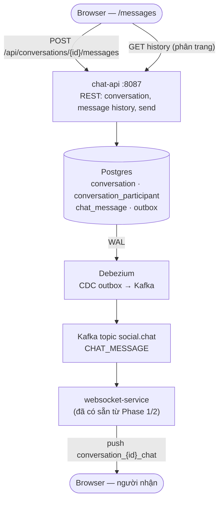

# Direct Messaging (1:1) — Implementation Plan

> Kế thừa ý tưởng "Phase 3 — Chat" đã phác ở [websocket-plan.md §11](websocket-plan.md).
> File này làm chi tiết cụ thể để implement được — schema, service, API, WS protocol.
> Trạng thái: **plan, chưa implement** — không có trong `specs/feature.md` cho tới khi bắt
> đầu code.

## 1. Phạm vi

**MVP: chỉ 1:1, không group chat.** Schema dưới vẫn hỗ trợ mở rộng lên group sau này (không
giới hạn cứng 2 participant ở tầng DB), nhưng UI/UX Phase 1 chỉ làm luồng 1-1 cho đơn giản.

Không làm ở Phase 1: read receipt, typing indicator, xoá/sửa tin nhắn, đính kèm file/ảnh.

---

## 2. Schema

Service mới `chat-service-dao`, theo đúng pattern các `*-service-dao` hiện có (Liquibase,
`outbox` table riêng, index theo truy vấn thật sự cần).

```
conversation              (id, created_at)

conversation_participant  (id, conversation_id, user_id, joined_at)
                           -- 2 row / conversation cho 1:1 (MVP)
                           -- index (conversation_id), (user_id) — tìm conversation của 1 user

chat_message               (id, conversation_id, sender_id, content, created_at)
                           -- index (conversation_id, created_at) — load lịch sử phân trang
```

Liquibase changeset (mẫu, theo đúng convention outbox/comment hiện có trong project):

```xml
<changeSet id="0001" author="nhan">
    <createTable tableName="conversation">
        <column name="id" type="uuid" defaultValueComputed="gen_random_uuid()">
            <constraints primaryKey="true" nullable="false"/>
        </column>
        <column name="created_at" type="timestamptz" defaultValueComputed="NOW()">
            <constraints nullable="false"/>
        </column>
    </createTable>

    <createTable tableName="conversation_participant">
        <column name="id" type="uuid" defaultValueComputed="gen_random_uuid()">
            <constraints primaryKey="true" nullable="false"/>
        </column>
        <column name="conversation_id" type="uuid"><constraints nullable="false"/></column>
        <column name="user_id" type="uuid"><constraints nullable="false"/></column>
        <column name="joined_at" type="timestamptz" defaultValueComputed="NOW()">
            <constraints nullable="false"/>
        </column>
    </createTable>
    <createIndex tableName="conversation_participant" indexName="idx_participant_conversation">
        <column name="conversation_id"/>
    </createIndex>
    <createIndex tableName="conversation_participant" indexName="idx_participant_user">
        <column name="user_id"/>
    </createIndex>

    <createTable tableName="chat_message">
        <column name="id" type="uuid" defaultValueComputed="gen_random_uuid()">
            <constraints primaryKey="true" nullable="false"/>
        </column>
        <column name="conversation_id" type="uuid"><constraints nullable="false"/></column>
        <column name="sender_id" type="uuid"><constraints nullable="false"/></column>
        <column name="content" type="text"><constraints nullable="false"/></column>
        <column name="created_at" type="timestamptz" defaultValueComputed="NOW()">
            <constraints nullable="false"/>
        </column>
    </createTable>
    <createIndex tableName="chat_message" indexName="idx_message_conversation_created">
        <column name="conversation_id"/>
        <column name="created_at"/>
    </createIndex>

    <!-- outbox table — giống hệt interaction-service-dao/post-service-dao -->
    <createTable tableName="outbox">
        <column name="id" type="uuid" defaultValueComputed="gen_random_uuid()">
            <constraints primaryKey="true" nullable="false"/>
        </column>
        <column name="aggregate_type" type="varchar(50)"><constraints nullable="false"/></column>
        <column name="aggregate_id" type="uuid"><constraints nullable="false"/></column>
        <column name="event_type" type="varchar(50)"><constraints nullable="false"/></column>
        <column name="payload" type="text"><constraints nullable="false"/></column>
        <column name="created_at" type="timestamptz" defaultValueComputed="NOW()">
            <constraints nullable="false"/>
        </column>
    </createTable>
</changeSet>
```

> **Đã có sẵn, không cần thêm:** `EventType.CHAT_MESSAGE` đã tồn tại trong
> `social-common/SocialEvents.kt` — dự phòng từ trước, hiện chưa dùng.

---

## 3. Kiến trúc tổng thể



Gửi tin nhắn vẫn đi qua **outbox pattern** như mọi write khác trong project (không publish
Kafka trực tiếp từ `chat-api`) — nhất quán với `interaction-service`, không phải ngoại lệ.
Lịch sử tin nhắn cũ (khi mở conversation) load qua REST thường (phân trang keyset theo
`created_at`), **không** qua Kafka — Kafka chỉ mang tin nhắn *mới* tới người đang online,
giống hệt cách `COMMENT_ADDED` đã làm cho live comment.

---

## 4. Gradle Module

Theo pattern `interaction-service` (chỉ publish, không consume Kafka — không cần module
`*-consumer` riêng):

```
services/
├── chat-service-dao/
│   └── entity: Conversation, ConversationParticipant, ChatMessage, OutboxEntry
└── chat-api/
    └── src/main/kotlin/com/nhan/social/chat/
        ├── resource/ConversationResource.kt
        ├── resource/ChatMessageResource.kt
        ├── service/ChatService.kt
        └── dto/ChatDtos.kt
```

`settings.gradle.kts` thêm `"chat-service-dao"`, `"chat-api"`. `chat-api` dev port `:8087`
(tiếp theo `:8086` của `websocket-service`).

---

## 5. REST API

| Method | Path | Auth | Mô tả |
|---|---|---|---|
| `POST` | `/api/conversations` | ✓ | Tạo conversation 1:1 với `{ targetUserId }` — idempotent, nếu đã tồn tại conversation giữa 2 user thì trả về cái cũ, không tạo trùng |
| `GET` | `/api/conversations` | ✓ | List conversation của user hiện tại (kèm tin nhắn cuối cùng để hiển thị preview) |
| `GET` | `/api/conversations/{id}/messages` | ✓ | Lịch sử tin nhắn, phân trang keyset (`?before={messageId}&size=30`) |
| `POST` | `/api/conversations/{id}/messages` | ✓ | Gửi tin nhắn — ghi `chat_message` + `outbox` cùng 1 transaction |

Auth: JWT verify cục bộ như mọi service khác (không qua gateway — xem
[ADR 0005](decisions/0005-bo-forwardauth-o-gateway.md)). Kiểm tra `sender_id` phải là 1 trong
2 participant của conversation trước khi cho gửi/đọc.

---

## 6. WebSocket Protocol

Tái dùng nguyên `websocket-service` đã có (không cần deploy thêm service) — chỉ thêm 1
topic mới.

```
Client → Server:
{ "type": "SUBSCRIBE", "topic": "conversation_{conversationId}_chat" }

Server → Client:
{
  "topic": "conversation_{conversationId}_chat",
  "type": "CHAT_MESSAGE",
  "payload": {
    "id": "uuid",
    "conversationId": "uuid",
    "senderId": "uuid",
    "content": "Hey!",
    "createdAt": "2026-09-18T10:00:00Z"
  }
}
```

> Đặt tên topic `conversation_{id}_chat` thay vì `room_{roomId}_chat` như phác thảo cũ trong
> `websocket-plan.md` — vì entity ở đây gọi là "conversation" (1:1), giữ "room" cho group
> chat nếu làm sau này để tránh lẫn 2 khái niệm. Cần đồng bộ lại ghi chú Phase 3 trong
> `websocket-plan.md` khi bắt đầu code.

`WsEventConsumer.kt` (đã có) thêm 1 case: `CHAT_MESSAGE` → resolve topic
`conversation_{conversationId}_chat` → push, cùng cơ chế `COMMENT_CREATED`/`VOTE_CAST` đang
dùng, không phải logic mới.

---

## 7. Frontend

```
frontend/src/
├── pages/MessagesPage.tsx          -- danh sách conversation (sidebar) + thread đang mở
├── api/chat.ts                     -- conversationsApi: list, create, listMessages, send
├── hooks/useConversationSubscription.ts   -- giống useArticleSubscription, subscribe khi mở thread
└── components/chat/
    ├── ConversationList.tsx
    ├── MessageThread.tsx
    └── MessageInput.tsx
```

Route mới: `/messages` (list) và `/messages/:conversationId` (thread) trong `main.tsx`, nằm
trong `RootLayout` (cần auth) như các route hiện có.

Điểm vào bắt đầu chat: nút "Nhắn tin" trên trang profile người khác (`/profile/:userId` —
xem Plan A) → gọi `POST /api/conversations { targetUserId }` → điều hướng tới
`/messages/{conversationId}`.

---

## 8. Câu hỏi cần chốt trước khi code

- `POST /api/conversations` idempotent theo cặp user — cần unique constraint kiểu gì để
  chống race (2 request tạo conversation cùng lúc giữa đúng 2 user đó)? Gợi ý:
  `UNIQUE (LEAST(user_a, user_b), GREATEST(user_a, user_b))` ở 1 bảng phụ, hoặc transaction
  + `SELECT ... FOR UPDATE` trước khi insert.
- Giới hạn độ dài `content` — cần validate ở DTO (`@field:Size`) giống các entity khác chưa
  quyết cụ thể bao nhiêu ký tự.
- Notification: tin nhắn mới có cần bắn thêm `NOTIFICATION` (khác `CHAT_MESSAGE`) để hiện
  badge/unread-count như comment/vote không, hay chat có badge riêng?

---

## 9. Phased Implementation

### Phase 1 — 1:1 messaging (MVP)
- [ ] `chat-service-dao` — entity + Liquibase changeset (§2)
- [ ] `chat-api` — `ConversationResource`, `ChatMessageResource`, `ChatService`
- [ ] Outbox → Debezium: thêm `chat.outbox` vào `table.include.list` của connector
      (`k8s/infra/debezium.yaml`), route topic `social.chat`
- [ ] `websocket-service`: thêm case `CHAT_MESSAGE` trong `WsEventConsumer.kt`
- [ ] k8s manifest `chat-api.yaml` (theo mẫu `interaction-service.yaml`)
- [ ] Traefik route `/api/conversations` (protected, không middleware — mỗi service tự verify)
- [ ] Frontend: `MessagesPage`, `ConversationList`, `MessageThread`, `MessageInput`
- [ ] Nút "Nhắn tin" trên `ProfilePage.tsx` (người khác) → tạo/mở conversation

### Phase 2 — nếu cần sau này
- [ ] Read receipt (`last_read_at` trên `conversation_participant`)
- [ ] Typing indicator (thuần WS, không cần lưu DB)
- [ ] Group chat (bỏ giới hạn 2 participant, đổi UI list participant)
- [ ] Đính kèm ảnh (tái dùng `S3Service` từ `post-service`)

---

## 10. Quyết định kiến trúc

| Quyết định | Lựa chọn | Lý do |
|---|---|---|
| Service riêng vs nhét vào interaction-service | Service riêng (`chat-api`) | Domain khác hẳn (participant/conversation vs comment/vote), không dùng chung entity |
| Publish Kafka | Qua outbox, không publish trực tiếp | Nhất quán toàn project — không có ngoại lệ |
| Lịch sử tin nhắn | REST phân trang, không qua Kafka | Kafka chỉ chở sự kiện *mới*, không phải nguồn đọc lịch sử — đúng pattern `COMMENT_ADDED` đã có |
| Push realtime | Tái dùng `websocket-service` sẵn có | Không cần thêm service/kết nối mới, chỉ thêm 1 topic |
| Phạm vi MVP | 1:1 only | Đơn giản hoá UI/UX, schema vẫn mở để lên group sau |
