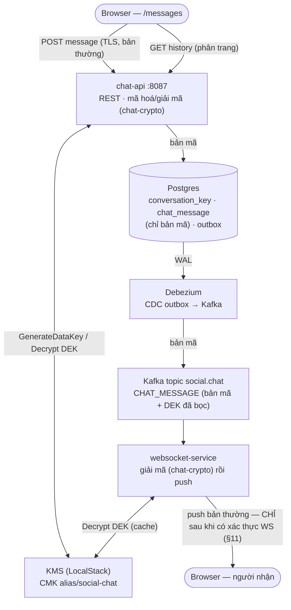

# Direct Messaging (1:1) — Implementation Plan

> Kế thừa ý tưởng "Phase 3 — Chat" đã phác ở [websocket-plan.md §11](websocket-plan.md).
> File này làm chi tiết cụ thể để implement được — schema, service, API, WS protocol.
> Trạng thái: **Bước 0 + Phase 1 đã implement và verify live (2/10/2026)** — trạng thái feature ở
> `specs/feature.md` mục 10. Đã chốt: ADR 0007 (29/9) — mã hoá envelope qua KMS khi lưu **và** trên Kafka,
> ID tin nhắn UUIDv7 (§12); ADR 0008 (1/10) — ID conversation tất định, tin ≤ 4.096 ký tự,
> icon chat/unread riêng, cache `user_ref` (§13); ADR 0009 (1/10) — xác thực WebSocket, cùng các
> chi tiết còn lại ở §14.

## 1. Phạm vi

**MVP: chỉ 1:1, không group chat.** Schema dưới vẫn hỗ trợ mở rộng lên group sau này (không
giới hạn cứng 2 participant ở tầng DB), nhưng UI/UX Phase 1 chỉ làm luồng 1-1 cho đơn giản.

Không làm ở Phase 1: read receipt, typing indicator, xoá/sửa tin nhắn, đính kèm file/ảnh.

---

## 2. Schema

Service mới `chat-service-dao`, theo đúng pattern các `*-service-dao` hiện có (Liquibase,
`outbox` table riêng, index theo truy vấn thật sự cần).

```
conversation              (id, created_at)
                           -- 1:1: id TẤT ĐỊNH từ cặp user (§13.1) → khoá chính tự chống tạo trùng

conversation_participant  (id, conversation_id, user_id, last_read_message_id, joined_at)
                           -- 2 row / conversation cho 1:1 (MVP)
                           -- last_read_message_id (UUIDv7, nullable) — tính unread cho icon chat (§13.3)
                           -- UNIQUE (conversation_id, user_id) + index (user_id) — tìm conversation của 1 user

user_ref                   (id, username, firstname, lastname, avatar_url, updated_at)
                           -- cache tên/avatar qua social.user, y hệt interaction-service (ADR 0006)

conversation_key           (conversation_id, version, encrypted_data_key, created_at)
                           -- PK (conversation_id, version) — DEK của conversation, đã bọc bởi KMS (§12)

chat_message               (id, conversation_id, sender_id, client_message_id, key_version, nonce, ciphertext, created_at)
                           -- id = UUIDv7 do server sinh (Postgres 15 chưa có uuidv7(), cần 18+) → thứ tự theo giờ server
                           -- client_message_id = crypto.randomUUID() của client, UNIQUE (sender_id, client_message_id)
                           --   → chống gửi trùng + khớp tin vừa gửi với push WS (§14.3)
                           -- KHÔNG có cột content dạng thường — nội dung chỉ tồn tại ở dạng mã hoá
                           -- index (conversation_id, id) — phân trang keyset chỉ cần id (§12)
```

Liquibase changeset (mẫu, theo đúng convention outbox/comment hiện có trong project):

```xml
<changeSet id="0001" author="nhan">
    <createTable tableName="conversation">
        <!-- 1:1: app tính id tất định từ cặp user (§13.1) — không có default ở DB -->
        <column name="id" type="uuid">
            <constraints primaryKey="true" nullable="false"/>
        </column>
        <column name="created_at" type="timestamptz" defaultValueComputed="NOW()">
            <constraints nullable="false"/>
        </column>
    </createTable>

    <createTable tableName="conversation_participant">
        <column name="id" type="uuid" defaultValueComputed="gen_random_uuid()">
            <constraints primaryKey="true" nullable="false"/>
        </column>
        <column name="conversation_id" type="uuid"><constraints nullable="false"/></column>
        <column name="user_id" type="uuid"><constraints nullable="false"/></column>
        <!-- UUIDv7 của tin cuối đã đọc; null = chưa đọc gì (§13.3) -->
        <column name="last_read_message_id" type="uuid"/>
        <column name="joined_at" type="timestamptz" defaultValueComputed="NOW()">
            <constraints nullable="false"/>
        </column>
    </createTable>
    <!-- Lưới an toàn cho race khi tạo conversation (§13.1); cũng thay index (conversation_id) -->
    <addUniqueConstraint tableName="conversation_participant"
                         columnNames="conversation_id, user_id"
                         constraintName="uq_participant_conversation_user"/>
    <createIndex tableName="conversation_participant" indexName="idx_participant_user">
        <column name="user_id"/>
    </createIndex>

    <!-- Giống hệt interaction-service-dao 0005-create-user-ref.xml (ADR 0006) -->
    <createTable tableName="user_ref">
        <column name="id" type="uuid"><constraints primaryKey="true" nullable="false"/></column>
        <column name="username" type="varchar(50)"><constraints nullable="false"/></column>
        <column name="firstname" type="varchar(100)"><constraints nullable="false"/></column>
        <column name="lastname" type="varchar(100)"><constraints nullable="false"/></column>
        <column name="avatar_url" type="text"/>
        <column name="updated_at" type="timestamptz" defaultValueComputed="NOW()">
            <constraints nullable="false"/>
        </column>
    </createTable>

    <createTable tableName="conversation_key">
        <column name="conversation_id" type="uuid"><constraints nullable="false"/></column>
        <column name="version" type="int"><constraints nullable="false"/></column>
        <!-- CiphertextBlob từ KMS GenerateDataKey — vô dụng nếu không gọi được KMS Decrypt -->
        <column name="encrypted_data_key" type="bytea"><constraints nullable="false"/></column>
        <column name="created_at" type="timestamptz" defaultValueComputed="NOW()">
            <constraints nullable="false"/>
        </column>
    </createTable>
    <addPrimaryKey tableName="conversation_key" columnNames="conversation_id, version"/>

    <createTable tableName="chat_message">
        <!-- UUIDv7 do app sinh (§12) — không có default ở DB -->
        <column name="id" type="uuid">
            <constraints primaryKey="true" nullable="false"/>
        </column>
        <column name="conversation_id" type="uuid"><constraints nullable="false"/></column>
        <column name="sender_id" type="uuid"><constraints nullable="false"/></column>
        <!-- crypto.randomUUID() của client — chỉ để chống gửi trùng, KHÔNG dùng để sắp xếp (§14.3) -->
        <column name="client_message_id" type="uuid"><constraints nullable="false"/></column>
        <column name="key_version" type="int"><constraints nullable="false"/></column>
        <column name="nonce" type="bytea"><constraints nullable="false"/></column>
        <column name="ciphertext" type="bytea"><constraints nullable="false"/></column>
        <column name="created_at" type="timestamptz" defaultValueComputed="NOW()">
            <constraints nullable="false"/>
        </column>
    </createTable>
    <createIndex tableName="chat_message" indexName="idx_message_conversation_id">
        <column name="conversation_id"/>
        <column name="id"/>
    </createIndex>
    <addUniqueConstraint tableName="chat_message"
                         columnNames="sender_id, client_message_id"
                         constraintName="uq_message_sender_client_id"/>

    <!-- outbox table — giống hệt interaction-service-dao/post-service-dao -->
    <createTable tableName="outbox">
        <column name="id" type="uuid" defaultValueComputed="gen_random_uuid()">
            <constraints primaryKey="true" nullable="false"/>
        </column>
        <column name="aggregate_type" type="varchar(50)"><constraints nullable="false"/></column>
        <column name="aggregate_id" type="uuid"><constraints nullable="false"/></column>
        <column name="event_type" type="varchar(50)"><constraints nullable="false"/></column>
        <column name="payload" type="text"><constraints nullable="false"/></column>
        <column name="created_at" type="timestamptz" defaultValueComputed="NOW()">
            <constraints nullable="false"/>
        </column>
    </createTable>
</changeSet>
```

> **Đã có sẵn, không cần thêm:** `EventType.CHAT_MESSAGE` đã tồn tại trong
> `social-common/SocialEvents.kt` — dự phòng từ trước, hiện chưa dùng.

---

## 3. Kiến trúc tổng thể


```mermaid
flowchart TD
    FE(["Browser — /messages"])
    ChatApi["chat-api :8087\nREST · mã hoá/giải mã (chat-crypto)"]
    KMS["KMS (LocalStack)\nCMK alias/social-chat"]
    DB[("Postgres\nconversation_key · chat_message\n(chỉ bản mã) · outbox")]
    Debezium["Debezium\nCDC outbox → Kafka"]
    Kafka["Kafka topic social.chat\nCHAT_MESSAGE (bản mã + DEK đã bọc)"]
    WsSvc["websocket-service\ngiải mã (chat-crypto) rồi push"]
    FE2(["Browser — người nhận"])

    FE -->|"POST message (TLS, bản thường)"| ChatApi
    FE -->|"GET history (phân trang)"| ChatApi
    ChatApi <-->|"GenerateDataKey / Decrypt DEK"| KMS
    ChatApi -->|"bản mã"| DB
    DB -->|"WAL"| Debezium
    Debezium -->|"bản mã"| Kafka
    Kafka --> WsSvc
    WsSvc <-->|"Decrypt DEK (cache)"| KMS
    WsSvc -->|"push bản thường — CHỈ sau khi có xác thực WS (§11)"| FE2
```

Bản thường chỉ tồn tại trong bộ nhớ `chat-api`/`websocket-service` và trên đường
truyền TLS tới browser — không bao giờ nằm trong Postgres, bảng outbox, Kafka
(kể cả dead-letter topic) hay log.

Gửi tin nhắn vẫn đi qua **outbox pattern** như mọi write khác trong project (không publish
Kafka trực tiếp từ `chat-api`) — nhất quán với `interaction-service`, không phải ngoại lệ.
Lịch sử tin nhắn cũ (khi mở conversation) load qua REST thường (phân trang keyset theo
`id` UUIDv7 — §12.4), **không** qua Kafka — Kafka chỉ mang tin nhắn *mới* tới người đang online,
giống hệt cách `COMMENT_ADDED` đã làm cho live comment.

---

## 4. Gradle Module

Theo đúng pattern `interaction-service` hiện tại: publish qua outbox **và** consume
`social.user` ngay trong cùng app (cache `user_ref`, ADR 0006) — không cần module
`*-consumer` riêng:

```
services/
├── chat-crypto/                      -- lib dùng chung chat-api + websocket-service (§12)
│   ├── ChatCipher.kt                 -- AES-256-GCM encrypt/decrypt + AAD
│   └── DataKeyProvider.kt            -- KMS GenerateDataKey/Decrypt + cache DEK
├── chat-service-dao/
│   └── entity: Conversation, ConversationParticipant, ConversationKey, ChatMessage,
│               UserRef, OutboxEntry
└── chat-api/
    └── src/main/kotlin/com/nhan/social/chat/
        ├── resource/ConversationResource.kt   -- cả endpoint tin nhắn (/api/conversations/{id}/messages)
        ├── service/ChatService.kt
        ├── consumer/UserRefEventConsumer.kt   -- social.user, failure-strategy=dead-letter-queue
        └── dto/ChatDtos.kt
```

`settings.gradle.kts` thêm `"chat-crypto"`, `"chat-service-dao"`, `"chat-api"`. `chat-api`
dev port `:8087` (tiếp theo `:8086` của `websocket-service`).

`chat-crypto` tự khai `api(platform("io.quarkus.platform:quarkus-amazon-services-bom:…"))`
+ `quarkus-amazon-kms` — đúng pattern ADR 0004 (lib nào dùng AWS thì lib đó khai platform;
`chat-api`/`websocket-service` **không** khai lại, tránh lặp lại xung đột BOM của ADR 0002–0003).
Logic giải mã phải giống hệt ở 2 service nên để chung 1 chỗ, không copy.

---

## 5. REST API

| Method | Path | Auth | Mô tả |
|---|---|---|---|
| `POST` | `/api/conversations` | ✓ | Tạo conversation 1:1 với `{ targetUserId }` — idempotent nhờ ID tất định (§13.1): gọi bao nhiêu lần, từ phía ai, cũng trả cùng 1 conversation |
| `GET` | `/api/conversations` | ✓ | List conversation của user hiện tại, mới nhất trước — mỗi item: người kia (`id`, tên, avatar từ `user_ref`), tin cuối (đã giải mã, cắt ngắn), `unread: boolean` |
| `GET` | `/api/conversations/unread-count` | ✓ | `{ "count": n }` — số conversation có tin chưa đọc, cho badge icon chat (§13.3) |
| `GET` | `/api/conversations/{id}` | ✓ | 1 conversation (người kia + tin cuối + `unread`) — header của thread khi mở thẳng URL |
| `POST` | `/api/conversations/{id}/read` | ✓ | `{ messageId }` — đặt `last_read_message_id`, chỉ tiến lên (bỏ qua nếu nhỏ hơn giá trị đang có) |
| `GET` | `/api/conversations/{id}/messages` | ✓ | Lịch sử tin nhắn, phân trang keyset (`?before={messageId}&size=30`) |
| `POST` | `/api/conversations/{id}/messages` | ✓ | Gửi tin nhắn `{ clientMessageId, content }` (≤ 4.096 ký tự, §13.2) — ghi `chat_message` + outbox cùng 1 transaction; gửi lại cùng `clientMessageId` → trả tin đã có, không tạo tin/event mới (§14.3) |

Auth: JWT verify cục bộ như mọi service khác (không qua gateway — xem
[ADR 0005](decisions/0005-bo-forwardauth-o-gateway.md)). Mọi endpoint có `{id}` phải kiểm
tra user hiện tại là participant — bắt buộc, vì conversationId 1:1 tính được từ 2 userId
public (§13.1), không phải bí mật.

---

## 6. WebSocket Protocol

Tái dùng nguyên `websocket-service` đã có (không cần deploy thêm service) — chỉ thêm 1
topic mới.

```
Client → Server (1 lần sau khi login — nhận tin của MỌI conversation của mình):
{ "type": "SUBSCRIBE", "topic": "user_{myUserId}_chat" }

Server → Client:
{
  "topic": "user_{myUserId}_chat",
  "type": "CHAT_MESSAGE",
  "payload": {
    "id": "uuid",
    "clientMessageId": "uuid",
    "conversationId": "uuid",
    "senderId": "uuid",
    "content": "Hey!",
    "createdAt": "2026-09-18T10:00:00Z"
  }
}
```

> Topic theo **người nhận** (`user_{id}_chat`), không theo conversation — bản cũ dùng
> `conversation_{id}_chat`, bỏ vì từ ADR 0008 conversationId tính được từ 2 userId public
> (§11). Một topic/user cũng đúng nhu cầu icon chat: badge phải cập nhật khi có tin ở
> **bất kỳ** conversation nào, không chỉ thread đang mở. Phác thảo `room_{roomId}_chat` trong
> `websocket-plan.md` Phase 3 cần đồng bộ lại khi bắt đầu code.

Payload trên là cái browser nhận (bản thường). Event trên **Kafka** thì khác — chỉ
chở bản mã (§12). Vì `SocialEvent.payload` là `Map<String, String>`, binary encode
base64 và danh sách nối bằng dấu phẩy:

```json
{
  "eventType": "CHAT_MESSAGE",
  "eventId": "<outbox id>",
  "payload": {
    "messageId": "<uuidv7>",
    "clientMessageId": "uuid",
    "conversationId": "uuid",
    "senderId": "uuid",
    "participantIds": "uuid1,uuid2",
    "keyVersion": "1",
    "wrappedKey": "<base64 — CiphertextBlob của DEK>",
    "nonce": "<base64, 12 byte>",
    "ciphertext": "<base64 — AES-GCM, gồm tag 16 byte>",
    "createdAt": "2026-09-18T10:00:00Z"
  }
}
```

`websocket-service` cần **channel Kafka mới** `chat-events-in` → `social.chat` (không
chỉ thêm case, xem §11 #1). Khi nhận `CHAT_MESSAGE`: unwrap DEK qua KMS (có cache),
giải mã, rồi push bản thường. Nhúng `wrappedKey` thẳng vào event để websocket-service
không phải gọi `chat-api` hay đọc DB của chat (giữ đúng nguyên tắc không chia sẻ DB).
Push tới `user_{participantId}_chat` của **mọi** participant, kể cả người gửi — để tab/thiết
bị khác của người gửi cũng thấy tin vừa gửi; tab đang gửi bỏ trùng theo `clientMessageId` —
biết **trước** khi gửi nên không phụ thuộc push WS hay response HTTP về trước (§14.3). Topic
này an toàn nhờ xác thực WS + luật "chỉ subscribe topic của chính mình" (ADR 0009).

---

## 7. Frontend

```
frontend/src/
├── lib/wsClient.ts                 -- WS client dùng chung, gửi token qua subprotocol (ADR 0009)
├── pages/MessagesPage.tsx          -- danh sách conversation (sidebar) + thread đang mở
├── pages/UserProfilePage.tsx       -- /users/:id — profile + bài viết người khác + nút "Nhắn tin" (§14.2)
├── api/chat.ts                     -- conversationsApi: list, create, listMessages, send
├── hooks/useChatSocket.ts          -- nghe CHAT_MESSAGE qua wsClient
└── components/chat/
    ├── ChatMenu.tsx                -- icon chat + badge + dropdown trong Navbar (§13.3)
    ├── ConversationList.tsx
    ├── MessageThread.tsx
    └── MessageInput.tsx
```

Route mới: `/messages` (list) và `/messages/:conversationId` (thread) trong `main.tsx`, nằm
trong `RootLayout` (cần auth) như các route hiện có.

**Icon chat kiểu Facebook (§13.3):** `Navbar.tsx` có icon chat riêng cạnh chuông, badge
riêng. Tin nhắn **không** đi vào chuông/`notification-service`.

Điểm vào bắt đầu chat (§14.2): trang mới `/users/:id` (bấm tên/avatar tác giả ở bài viết hoặc
comment để tới) → nút "Nhắn tin" → `POST /api/conversations { targetUserId }` → điều hướng tới
`/messages/{conversationId}`.

---

## 8. Câu hỏi cần chốt trước khi code — ✅ đã chốt 1/10/2026 (ADR 0008, chi tiết §13)

- ~~Idempotent khi tạo conversation~~ → ID tất định từ cặp user + `ON CONFLICT DO NOTHING`
  (§13.1).
- ~~Giới hạn độ dài `content`~~ → cột `text`, API giới hạn 4.096 ký tự để bảo vệ connector
  Debezium dùng chung (§13.2).
- ~~Chat có dùng `NOTIFICATION` không~~ → không; icon chat + badge riêng kiểu Facebook, unread
  tính từ `last_read_message_id` (§13.3).

---

## 9. Phased Implementation

### Bước 0 — Xác thực WebSocket (ADR 0009) — làm trước, độc lập với chat
Vá luôn lỗ hổng notification hiện có; có giá trị kể cả khi chat chưa làm.
- [x] `websocket-service`: `quarkus-smallrye-jwt` + config verify + `supported-subprotocols=bearer-token-carrier`
      + `propagate-subprotocol-headers=true` + `@Authenticated` trên `WsEndpoint`
- [x] `WsEndpoint`: phân quyền SUBSCRIBE theo `jwt.subject` (ADR 0009) + test từng luật
- [x] k8s `websocket-service.yaml`: mount secret `jwt-keys` + env như các service khác
- [x] FE `lib/wsClient.ts`: 1 kết nối/tab, token qua subprotocol, reconnect + subscribe lại, phát sự
      kiện "reconnected" (§14.6), đóng khi logout; chuyển `useNotificationSocket` + `waitForUserReady`
      sang dùng nó
- [x] Verify live: không token → upgrade bị từ chối; subscribe `user_<người khác>_notification` → bị từ chối

### Phase 1 — 1:1 messaging (MVP)
- [x] `social-common`: bộ sinh UUIDv7 (§12.4) + test (đúng version/variant, tăng theo thời gian)
- [x] LocalStack bật KMS: `SERVICES=s3,kms` + init hook tạo CMK `alias/social-chat` (§12)
- [x] `chat-crypto` — `ChatCipher` + `DataKeyProvider` + test (round-trip, sai AAD → lỗi, sai key → lỗi)
- [x] Postgres init script thêm `CREATE SCHEMA IF NOT EXISTS chat` (§11 #2)
- [x] `chat-service-dao` — entity + Liquibase changeset (§2)
- [x] `chat-api` — `ConversationResource`, `ChatService` (tạo conversation
      idempotent §13.1, `@Size(max = 4096)` §13.2, unread/read §13.3, `clientMessageId` §14.3,
      danh sách conversation §14.5)
- [x] `chat-api` — `UserRefEventConsumer` (`social.user` → `user_ref`, DLQ) — copy pattern
      interaction-service
- [x] Outbox → Debezium: thêm `chat.outbox` vào `table.include.list` của connector
      (`k8s/infra/debezium.yaml`), route topic `social.chat`
- [x] `websocket-service`: channel `chat-events-in` → `social.chat`, phụ thuộc `chat-crypto`,
      giải mã rồi push (§6); cấp quyền KMS Decrypt qua env giống `chat-api`
- [x] k8s manifest `chat-api.yaml` (theo mẫu `interaction-service.yaml`) + checklist vận hành §11
- [x] Verify live (2/10/2026): 20 check API/WS + UI 2 trình duyệt (Playwright) — chi tiết ở
      `tracking.md`. LocalStack cần limit 768Mi khi bật KMS; CMK cố định id + key material để
      LocalStack restart (không persist) vẫn giải được DEK cũ — đã verify
- [x] Traefik route `/api/conversations` (protected, không middleware — mỗi service tự verify)
- [x] FE `UserProfilePage` (`/users/:id`) + tên/avatar tác giả ở `ArticleCard`/`CommentItem` thành
      link + nút "Nhắn tin" (§14.2)
- [x] FE `MessagesPage`, `ConversationList`, `MessageThread`, `MessageInput` (zod `.max(4096)`,
      gửi kèm `clientMessageId`, hiện tin ngay rồi khớp push theo `clientMessageId` — §14.3)
- [x] FE `ChatMenu` trong `Navbar` — icon + badge `unread-count` + dropdown (§13.3); đánh dấu đã đọc
      khi mở thread và khi tab hiện lại (§14.6); tải lại khi WS reconnect (§14.6)

### Phase 2 — nếu cần sau này
- [ ] Read receipt — hiển thị "đã xem" cho **người kia** (cột `last_read_message_id` đã có từ
      Phase 1 cho unread của chính mình, chỉ còn thiếu phần push/hiển thị)
- [ ] Tin nhắn chờ + chặn người dùng kiểu Facebook (§14.4)
- [ ] Typing indicator (thuần WS, không cần lưu DB)
- [ ] Group chat (bỏ giới hạn 2 participant, đổi UI list participant)
- [ ] Đính kèm ảnh (tái dùng `S3Service` từ `post-service`)

---

## 10. Quyết định kiến trúc

| Quyết định | Lựa chọn | Lý do |
|---|---|---|
| Service riêng vs nhét vào interaction-service | Service riêng (`chat-api`) | Domain khác hẳn (participant/conversation vs comment/vote), không dùng chung entity |
| Publish Kafka | Qua outbox, không publish trực tiếp | Nhất quán toàn project — không có ngoại lệ |
| Lịch sử tin nhắn | REST phân trang, không qua Kafka | Kafka chỉ chở sự kiện *mới*, không phải nguồn đọc lịch sử — đúng pattern `COMMENT_ADDED` đã có |
| Push realtime | Tái dùng `websocket-service` sẵn có | Không cần thêm service/kết nối mới, chỉ thêm 1 topic |
| Phạm vi MVP | 1:1 only | Đơn giản hoá UI/UX, schema vẫn mở để lên group sau |
| Mã hoá | Envelope encryption qua KMS (server giữ khoá), không E2EE — ADR 0007 | Giống Slack EKM/Telegram cloud chat: giữ được tìm kiếm, kiểm duyệt, đồng bộ đa thiết bị; E2EE trên web mất lịch sử khi xoá storage và biến Kafka thành chỗ chở blob |
| Kafka mang gì | Bản mã + DEK đã bọc, không bao giờ bản thường — ADR 0007 | Kafka giữ message nhiều ngày + có dead-letter topic; mã hoá trước khi vào outbox thì mọi bản sao phía sau đều an toàn |
| ID tin nhắn | UUIDv7 do app sinh — ADR 0007 | Sắp xếp theo thời gian → phân trang chỉ cần `id` như snowflake của Discord, không lệch khi trùng timestamp |
| ID conversation 1:1 | Tất định từ cặp user — ADR 0008 | Khoá chính sẵn có chống tạo trùng, không thêm cột/index/khoá; đổi lại ID không bí mật |
| Độ dài tin nhắn | Cột `text`, API ≤ 4.096 ký tự — ADR 0008 | Không vì lưu trữ mà vì 1 tin > ~1 MB làm chết connector Debezium dùng chung cho mọi outbox |
| Unread chat | Icon + badge riêng, `last_read_message_id` — ADR 0008 | Giống Facebook; không làm ngập danh sách notification |
| Tên/avatar người kia | Cache `user_ref` qua `social.user` — ADR 0008 | Đúng pattern ADR 0006, không gọi đồng bộ sang user-service |
| Xác thực WS | JWT qua `Sec-WebSocket-Protocol`, chỉ subscribe topic của mình — ADR 0009 | Có sẵn trong Quarkus 3.25.1; vá luôn lỗ hổng notification |
| Chống gửi trùng | `clientMessageId` riêng, `id` UUIDv7 vẫn do server sinh | Client sinh `id` thì thứ tự tin phụ thuộc đồng hồ client (lệch → đảo thứ tự) |
| Điểm vào chat | Trang `/users/:id` trong Phase 1 | Chưa có trang profile người khác thì không có chỗ bắt đầu chat |
| Ai được nhắn | Ai cũng được (MVP); chặn + tin nhắn chờ ở Phase 2 | Chưa có kết bạn/follow; giữ Phase 1 gọn |

---

## 11. Review độ sẵn sàng (29/9/2026) — ✅ sẵn sàng từ 1/10/2026

> Cập nhật 1/10/2026: blocker đã chốt bằng ADR 0009 (§9 Bước 0); mục #3, #4 bên dưới đã giải
> quyết (§14.2, ADR 0009). Phần dưới giữ nguyên làm lịch sử review.

Phần lõi (schema, REST, outbox, lịch sử qua REST) đúng pattern project. Chặn lại
bởi 1 quyết định thiết kế + vài chỗ plan giả định sai về code hiện tại.

### Blocker — WebSocket không auth + tin nhắn riêng tư (✅ ADR 0009)

`websocket-service` public, ai cũng `SUBSCRIBE` được topic bất kỳ. Với
`conversation_{id}_chat`, bảo vệ duy nhất là conversationId khó đoán — nhưng
`WsEndpoint` log mọi topic được subscribe ở DEBUG (`com.nhan` đang để DEBUG,
log đẩy lên Loki) → ai xem được Grafana là đọc được tin nhắn realtime. Cùng
lỗ hổng đó đã tồn tại với `user_{id}_notification` (userId lộ trong mọi DTO,
payload có tên actor từ ADR 0006).

Sau khi chốt mã hoá (ADR 0007), blocker này **nặng hơn**: `websocket-service` là nơi
giải mã, nên WS public nghĩa là ai subscribe đúng topic cũng nhận được **bản đã giải
mã** — toàn bộ công mã hoá bị vô hiệu ở chặng cuối.

**Đề xuất lúc review** (đã chốt thành ADR 0009 — riêng ý 3 bỏ, vì khi có xác thực thì tên topic
không còn là bí mật):
1. Xác thực lúc HTTP upgrade bằng JWT (browser không set được header
   `Authorization` cho WebSocket → dùng cơ chế Quarkus websockets-next hỗ trợ
   hoặc gửi token ở message đầu tiên; kiểm tra doc Quarkus lúc làm).
2. Đổi topic chat thành theo người nhận: `user_{recipientId}_chat` — **bắt buộc** từ khi
   chốt ID conversation tất định (ADR 0008): ai biết 2 userId đều tính được conversationId,
   nên `conversation_{id}_chat` trên WS public = ai cũng nghe lén được. `chat-api`
   nhúng `participantIds` vào event `CHAT_MESSAGE`, `websocket-service` fan-out
   tới từng participant. Luật phân quyền SUBSCRIBE khi đó chỉ còn 1 dòng: topic
   `user_{x}_*` chỉ cho phép khi `x == jwt.subject` — không cần tra participant.
   Cùng luật này vá luôn lỗ hổng notification.
3. Hạ log subscribe xuống TRACE hoặc bỏ topic name khỏi log.

### Plan giả định sai / thiếu so với code hiện tại

| # | Plan ghi | Thực tế | Cần làm |
|---|---|---|---|
| 1 | §6 "chỉ thêm 1 case trong `WsEventConsumer`" | Consumer chỉ nghe `social.interaction` và `social.user` | Thêm channel mới `chat-events-in` → `social.chat` |
| 2 | §2 schema mới (ngầm định) | Schema tạo bằng init SQL (`k8s/infra/postgres.yaml`, `infra/postgres/init-schemas.sql`) — chỉ chạy khi volume mới | Thêm `CREATE SCHEMA chat`; cluster đang chạy phải tạo tay |
| 3 | §7 điểm vào: nút trên `/profile/:userId` ("xem Plan A") | Chỉ có `/profile` (của mình); "Plan A" không tồn tại ở doc nào | ✅ Đã chốt (1/10): trang `/users/:id` trong Phase 1 — §14.2 |
| 4 | §7 hook "giống `useArticleSubscription`" | Không có hook đó; FE đang mở 1 WebSocket riêng cho mỗi tính năng (`useNotificationSocket`, `waitForUserReady`) | ✅ Đã chốt (1/10): `lib/wsClient.ts` trong Bước 0 — ADR 0009 |
| 5 | §4 "chat-api chỉ publish, không consume Kafka" | List conversation cần tên/avatar người kia — theo ADR 0006 là cache `user_ref` cục bộ qua `social.user` | ✅ Đã chốt (1/10): chat-api consume `social.user` vào `user_ref` — §4, ADR 0008 |
| 6 | Ghi outbox (ngầm định `persist`) | Từ 29/9 mọi service dùng `OutboxRepository.emit()` (insert → flush → delete) | Dùng `emit()`; consumer (nếu có) cấu hình `failure-strategy=dead-letter-queue` |
| 7 | §5 keyset `?before={messageId}` | Index chỉ `(conversation_id, created_at)` — 2 tin cùng timestamp sẽ lệch trang | ✅ Đã giải quyết (29/9): id là UUIDv7, sắp xếp và index theo `(conversation_id, id)` — §12 |

### Trả lời đề xuất cho câu hỏi §8

Đề xuất ban đầu (cột `pair_key` UNIQUE, 2.000 ký tự, `last_read_at`) đã được thay bằng
quyết định 1/10/2026 — xem §13 / ADR 0008.

### Checklist vận hành còn thiếu ở §9

ADR: đã đủ (0007 mã hoá + event `social.chat` + UUIDv7, 0008 conversation/unread, 0009 xác thực WS); target Makefile
`build-chat`/`load-chat`, thêm `chat-api` vào `scripts/deploy-sequential.sh`,
`resources.requests/limits` + mount secret `jwt-keys` trong manifest, route
Traefik, cập nhật `api-contract.md`/`service-dependencies.md`.

---

## 12. Mã hoá & ID tin nhắn (chốt 29/9/2026 — ADR 0007)

Cách các nền tảng thật làm (Signal, Messenger, Telegram, Slack, Discord) và nguồn: xem
[ADR 0007](decisions/0007-ma-hoa-tin-nhan-kms-va-uuidv7.md).

### 12.1 Bảo vệ được gì, không bảo vệ được gì

- **Được:** lộ DB/backup Postgres, lộ Kafka (topic + dead-letter topic), lộ log (Loki),
  người đọc bảng outbox — tất cả chỉ thấy bản mã.
- **Không:** ai có quyền gọi KMS `Decrypt` bằng credentials của service, hoặc chiếm được
  `chat-api`/`websocket-service` (đọc được RAM). Đó là cái giá của "server giữ khoá" so với
  E2EE — chấp nhận có chủ đích.

### 12.2 Envelope encryption

- **CMK** (khoá chính) nằm trong KMS, không bao giờ rời KMS: `alias/social-chat`.
- **DEK** (khoá dữ liệu) AES-256, **1 DEK / conversation** — không phải 1 DEK / tin nhắn
  (nếu vậy mở 1 trang lịch sử 30 tin = 30 lần gọi KMS).
  - Tạo conversation: `GenerateDataKey(KeyId=alias/social-chat, KeySpec=AES_256,
    EncryptionContext={"conversationId": <id>})` → lưu `CiphertextBlob` vào
    `conversation_key` (version 1); DEK bản thường chỉ nằm trong RAM.
  - `EncryptionContext`: KMS chỉ `Decrypt` khi truyền đúng context → DEK của conversation A
    không dùng được cho B kể cả khi ai đó tráo dữ liệu giữa các hàng. (Kiểm tra LocalStack có
    enforce context không lúc làm.)
- **Mã hoá tin nhắn:** AES-256-GCM, nonce ngẫu nhiên 12 byte mỗi tin — không bao giờ dùng
  lại nonce với cùng DEK —, tag 128 bit.
  - **AAD** = `conversationId|messageId|keyVersion` → bản mã gắn chặt với đúng hàng của nó;
    chép ciphertext sang tin/conversation khác thì giải mã báo lỗi thay vì ra nội dung sai.
- **Cache:** DEK bản thường giữ trong RAM theo `(conversationId, version)`, TTL 5 phút →
  mỗi conversation đang hoạt động tốn ~1 lần gọi KMS / 5 phút / service.
- **Xoay khoá:** `key_version` cho phép tạo DEK mới (version+1) cho tin mới, tin cũ vẫn giải
  mã bằng version cũ. MVP chỉ có version 1; cơ chế xoay để Phase 2.

### 12.3 Đường đi của dữ liệu

1. Browser → `chat-api`: bản thường qua TLS.
2. `chat-api`: lấy DEK (cache hoặc KMS), sinh `messageId` (UUIDv7) và nonce, mã hoá → trong
   **1 transaction**: insert `chat_message` (bản mã) + `OutboxRepository.emit()` event
   `CHAT_MESSAGE` (bản mã + `wrappedKey`, xem §6).
3. Debezium → Kafka `social.chat`: bản mã.
4. `websocket-service`: unwrap DEK (cache hoặc KMS, cùng `EncryptionContext`) → giải mã với
   AAD → push bản thường cho người nhận (chỉ sau khi có xác thực WS — §11).
5. `GET` lịch sử: `chat-api` kiểm tra quyền participant, đọc bản mã, giải mã theo
   `key_version` từng tin, trả bản thường.

Quy tắc: không log bản thường; giải mã lỗi thì log `messageId`, không log payload.

### 12.4 UUIDv7

- Postgres 15 chưa có `uuidv7()` (có từ bản 18) → sinh trong Kotlin (`social-common`) theo
  RFC 9562: 48 bit Unix ms · 4 bit version = 7 · 12 bit random · 2 bit variant = `10` · 62 bit
  random (`SecureRandom`). Không thêm thư viện (constitution quy tắc 3) — khoảng 15 dòng.
- Postgres so sánh `uuid` theo từng byte → UUIDv7 tự sắp theo thời gian. Phân trang:
  `WHERE conversation_id = :c AND id < :before ORDER BY id DESC LIMIT :n`, index
  `(conversation_id, id)`.
- Nhiều tin cùng 1 ms: thứ tự giữa chúng tuỳ phần random (RFC có kỹ thuật counter để đơn
  điệu tuyệt đối, MVP không cần) — vẫn là thứ tự toàn phần ổn định nên phân trang không lặp
  hay sót tin.
- Sắp xếp trong DB, không dựa vào `java.util.UUID.compareTo` (so sánh signed long, không
  phải thứ tự byte).
- UUIDv7 lộ thời điểm tạo — không sao, `createdAt` vốn đã trả ra ngoài.

### 12.5 Hạ tầng

- LocalStack: `SERVICES=s3,kms` + init hook (`/etc/localstack/init/ready.d/`) tạo CMK và
  alias `alias/social-chat`.
- LocalStack và Postgres hiện đều ephemeral nên reset cùng nhau. Nếu sau này Postgres có
  volume bền mà LocalStack không → CMK mất khi restart → **toàn bộ tin nhắn cũ không giải mã
  được nữa**. Phải nhớ điều này khi đổi persistence của một trong hai.

---

## 13. Tạo conversation, độ dài tin, icon chat (chốt 1/10/2026 — ADR 0008)

### 13.1 ID conversation tất định — idempotent không cần thêm gì vào schema

- `id = UUID.nameUUIDFromBytes("dm:$a:$b".toByteArray())` với `a`, `b` là 2 userId đã sắp xếp
  (so sánh chuỗi, cố định 1 cách). Hàm có sẵn trong JDK (UUID name-based v3/MD5) — MD5 ở đây chỉ
  để sinh ID, không phải bảo mật. Prefix `dm:` chừa chỗ cho group chat sau này (dùng ID ngẫu
  nhiên/UUIDv7, không tất định).
- Luồng trong **1 transaction**:
  1. `INSERT INTO conversation (id) VALUES (:id) ON CONFLICT (id) DO NOTHING RETURNING id`
     (native query qua `getEntityManager()` — Panache không có upsert).
  2. Có row trả về (mình tạo) → insert 2 participant, gọi KMS `GenerateDataKey`, insert
     `conversation_key` v1.
  3. Không có row (đã tồn tại, hoặc thua race — Postgres bắt chờ transaction kia commit rồi mới
     `DO NOTHING`) → bỏ qua, đọc conversation có sẵn. Không gọi KMS → không có DEK thừa.
- Unique `(conversation_id, user_id)` trên participant là lưới an toàn nếu có bug ở bước 2/3.
- `targetUserId == me` → 400 (MVP không có "nhắn cho chính mình"). `targetUserId` không có
  trong `user_ref` → 404 (`user_ref` có thể trễ vài giây sau signup — chấp nhận).
- **Đánh đổi:** conversationId tính được từ 2 userId public → không phải bí mật. Vì vậy mọi
  endpoint `{id}` bắt buộc kiểm tra participant (§5), và topic WS phải theo người nhận (§6, §11).

### 13.2 Độ dài tin nhắn — cột không giới hạn, API giới hạn 4.096

- Cột lưu là `ciphertext bytea` (§2) — không giới hạn độ dài; giới hạn **không** vì lưu trữ.
- Lý do thật: tin đi qua outbox → Debezium → Kafka; Kafka mặc định từ chối message > ~1 MB
  (project không override). Bản ghi quá lớn làm task Debezium dừng — mà 1 connector
  (`social-outbox-connector`) phục vụ **mọi** bảng outbox → đứng luôn notification, đếm comment,
  tạo profile lúc signup. Restart vô ích (đọc lại đúng bản ghi đó từ WAL, chết tiếp), trong lúc
  đó replication slot giữ WAL → đĩa Postgres phình. Nâng giới hạn Kafka chỉ dời vực ra xa.
- `@field:NotBlank @field:Size(max = 4096)` trên request + zod `.min(1).max(4096)` — cả Java
  `String.length` lẫn JS `string.length` đều đếm UTF-16 code unit nên FE/BE khớp nhau (emoji
  tính 2). Xấu nhất ~12 KB UTF-8 → ~16 KB sau mã hoá + base64 → rất xa 1 MB.
- Mốc tham chiếu: Discord 2.000 (Nitro 4.000), Telegram 4.096, Slack 40.000 ký tự.

### 13.3 Icon chat kiểu Facebook + unread

- `Navbar.tsx`: icon chat (lucide `MessageCircle`) cạnh chuông, badge = **số conversation có
  tin chưa đọc** (không đếm từng tin). Tin nhắn không bao giờ vào `notification-service`.
- Bấm icon → dropdown (MUI `Popover`): conversation gần đây — avatar, tên, xem trước tin cuối,
  `relativeTime`, in đậm nếu chưa đọc; "Xem tất cả" → `/messages`.
- Chưa đọc = có tin của **người khác** mới hơn `last_read_message_id` — nhờ UUIDv7 chỉ cần so
  sánh `id`:
  ```sql
  SELECT count(*) FROM conversation_participant p
  WHERE p.user_id = :me
    AND EXISTS (SELECT 1 FROM chat_message m
                WHERE m.conversation_id = p.conversation_id
                  AND m.sender_id <> :me
                  AND (p.last_read_message_id IS NULL OR m.id > p.last_read_message_id))
  ```
  (dùng index `(conversation_id, id)`).
- Đánh dấu đã đọc chỉ tiến lên — an toàn khi nhiều tab gửi lệch thứ tự:
  `UPDATE conversation_participant SET last_read_message_id = :mid WHERE conversation_id = :c
  AND user_id = :me AND (last_read_message_id IS NULL OR last_read_message_id < :mid)`, và
  `:mid` phải thuộc conversation `:c`.
- Realtime (`useChatSocket` nghe `user_{me}_chat`): có `CHAT_MESSAGE` →
  - đang mở đúng thread đó và tab đang hiển thị → chèn tin + gọi `/read`;
  - ngược lại → invalidate `unread-count` + danh sách conversation (badge, dropdown cập nhật).
  - Tab khác đánh dấu đã đọc → badge tab này cũ tới lần refetch sau — chấp nhận ở MVP (đồng bộ
    "đã đọc" giữa tab đi chung với read receipt ở Phase 2).
- Chi phí: xem trước tin cuối phải giải mã, mỗi conversation 1 DEK → mở dropdown 20 conversation
  lúc cache nguội = tới 20 lần gọi KMS; cache 5 phút (§12.2) làm nhẹ — chấp nhận ở MVP.
- Query key mới (`qk.chat.*`) gắn với user hiện tại — đã an toàn khi logout nhờ
  `queryClient.clear()` (fix 9/2026).

### 13.4 `user_ref` trong chat-api

Copy nguyên pattern interaction-service (ADR 0006): entity + changeset + `UserRefEventConsumer`,
consumer group riêng `chat-user-cache-group`, `auto.offset.reset=earliest` (replay `social.user`
để có đủ user cũ), `failure-strategy=dead-letter-queue`. Cùng giới hạn đã biết: user tạo trước
ADR 0006 chỉ có `userId` trong lịch sử event → hiện "User" tới khi họ sửa profile.

---

## 14. Chi tiết còn lại (chốt 1/10/2026)

### 14.1 Xác thực WebSocket

Xem [ADR 0009](decisions/0009-xac-thuc-websocket-jwt-subprotocol.md) và §9 Bước 0. Áp dụng cho
**cả hệ thống** (notification, `waitForUserReady`), không riêng chat.

### 14.2 Điểm vào chat — trang `/users/:id`

- Route mới trong `RootLayout`; dữ liệu lấy từ API **đã có**: `GET /api/users/{id}` +
  `GET /api/articles?filter=authorId==<id>` (RSQL) — không cần thay đổi backend.
- `id` là chính mình → redirect `/profile`. User không tồn tại → "User not found".
- Tên/avatar tác giả ở `ArticleCard` và `CommentItem` thành link tới `/users/:id`.
- Nút "Nhắn tin" (ẩn khi xem chính mình) → `POST /api/conversations { targetUserId }` →
  `/messages/{conversationId}`.

### 14.3 Chống gửi trùng — `clientMessageId` tách khỏi `id`

- **FE:** trước khi gửi sinh `clientMessageId = crypto.randomUUID()` (có sẵn trong trình duyệt,
  không thêm thư viện), hiện tin ngay ở trạng thái "đang gửi"; gửi lại (retry) dùng **đúng**
  `clientMessageId` cũ. Tin "đang gửi" được thay bằng bản chính thức (`id`, `createdAt`) khi
  response HTTP **hoặc** push WS có cùng `clientMessageId` về — cái nào về trước cũng được.
- **Server:** sinh `id` UUIDv7 rồi mã hoá (AAD dùng `id`), sau đó
  `INSERT … ON CONFLICT (sender_id, client_message_id) DO NOTHING RETURNING id`:
  - có row → tin mới → `OutboxRepository.emit()` event `CHAT_MESSAGE`;
  - không có row → đọc tin đã có theo `(sender_id, client_message_id)`: cùng conversation →
    trả tin đó (không tạo event mới); khác conversation → 409.
  - Tra cứu luôn theo `sender_id` nên không ai lấy được tin người khác bằng cách đoán
    `clientMessageId` — đó là lý do unique gồm cả `sender_id`.
- Vì sao không để client sinh `id`: thứ tự tin sẽ phụ thuộc đồng hồ máy client — máy lệch 50
  giây là tin xếp sai chỗ. `id` do server sinh thì thứ tự luôn theo giờ server.

### 14.4 Ai được nhắn cho ai

MVP: mọi user đã đăng nhập nhắn được cho bất kỳ ai (chưa có kết bạn/follow). Chặn người dùng +
"tin nhắn chờ" kiểu Facebook để Phase 2. Chưa có rate limit gửi tin — cùng câu hỏi mở về rate
limiting trong `api-standard.md` §9.

### 14.5 Danh sách conversation

- Chỉ hiện conversation đã có ít nhất 1 tin (giống Facebook: mở chat rồi không nhắn thì không
  hiện).
- Sắp theo tin cuối mới nhất: `id` tin cuối (UUIDv7) giảm dần — `MAX(m.id)` theo từng
  conversation, dùng index `(conversation_id, id)`.
- 20 conversation/lần, phân trang keyset `?before=<id tin cuối>`.
- Xem trước tin cuối: giải mã rồi cắt khoảng 100 ký tự — cắt theo code point, không cắt đôi emoji.

### 14.6 Rớt mạng và đánh dấu đã đọc

- WebSocket không đảm bảo giao tin: `wsClient` subscribe lại rồi phát sự kiện "reconnected" →
  invalidate `unread-count`, danh sách conversation và tải lại trang mới nhất của thread đang mở
  (gộp theo `id`). Notification hưởng lợi luôn (invalidate unread của chuông).
- Gọi `/read` với `id` tin mới nhất khi: mở thread; có tin mới lúc thread đang mở và tab đang hiện
  (`document.visibilityState === 'visible'`); tab chuyển sang hiện (`visibilitychange`) mà thread
  vẫn đang mở.

