# Microservices Migration Plan
## Mini Social Network → Quarkus + Kotlin

---

## Current Architecture (Monolith)

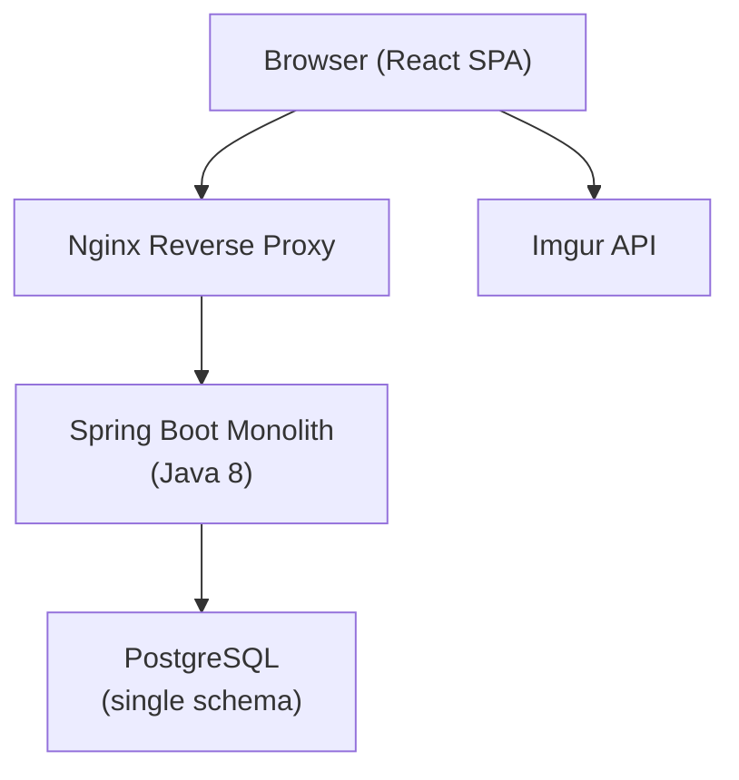

---

## Option 1 — Bounded Context Split (Recommended)

### Service Map

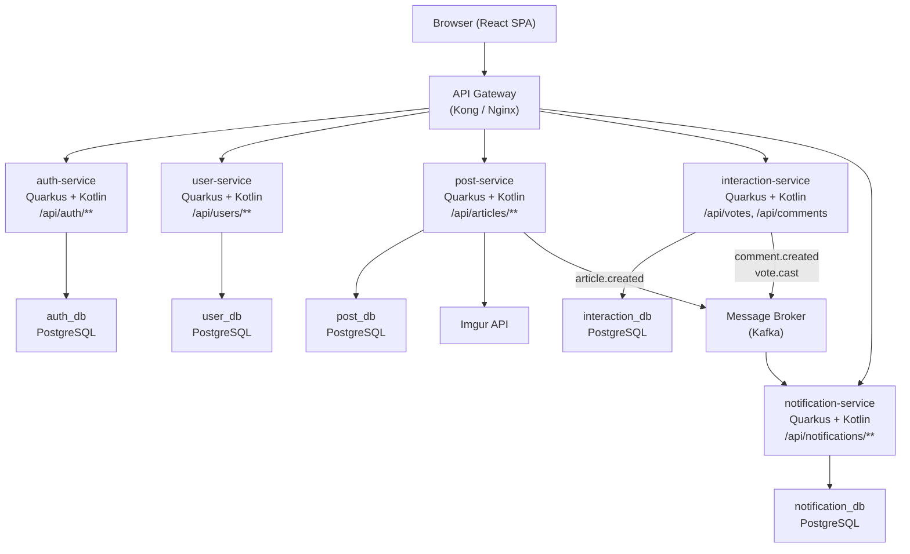

### Service Responsibilities

| Service | Owns | Exposes |
|---|---|---|
| **auth-service** | JWT issue/validate, credentials | `POST /auth/signup`, `POST /auth/signin` |
| **user-service** | User profile, avatar, roles | `GET /users/me`, `GET /users/{id}` |
| **post-service** | Article CRUD, image via Imgur | `GET/POST /articles`, `GET /articles/{id}` |
| **interaction-service** | Comments + Votes | `POST /articles/{id}/comments`, `POST /votes/{articleId}` |
| **notification-service** | Notification events, read/unread | `GET /notifications`, `PATCH /notifications/{id}/seen` |

### Inter-service Communication

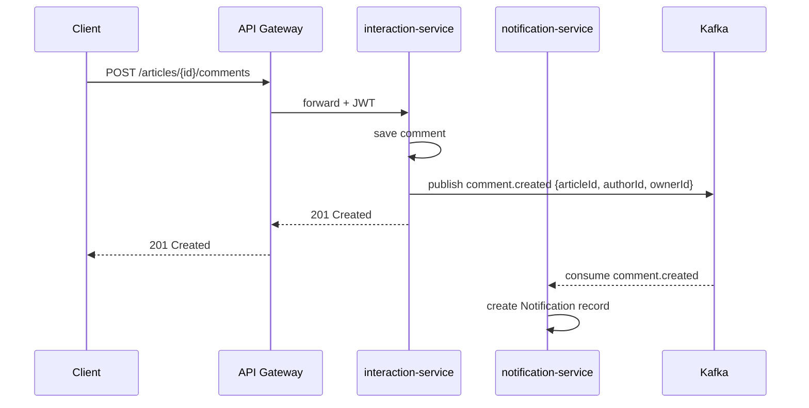

---

## Option 2 — Fine-grained (6 Services)

### Service Map

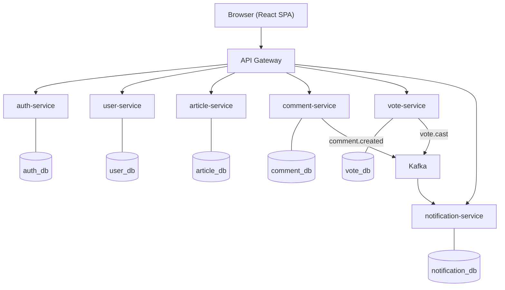

### Trade-offs

| | Option 1 | Option 2 |
|---|---|---|
| Number of services | 5 | 6 |
| Complexity | Medium | High |
| Independent scaling | Good | Best |
| Operational overhead | Medium | High |
| Recommended for | Small–Medium team | Large team / high traffic |

---

## Option 3 — Pragmatic (3 Services)

### Service Map

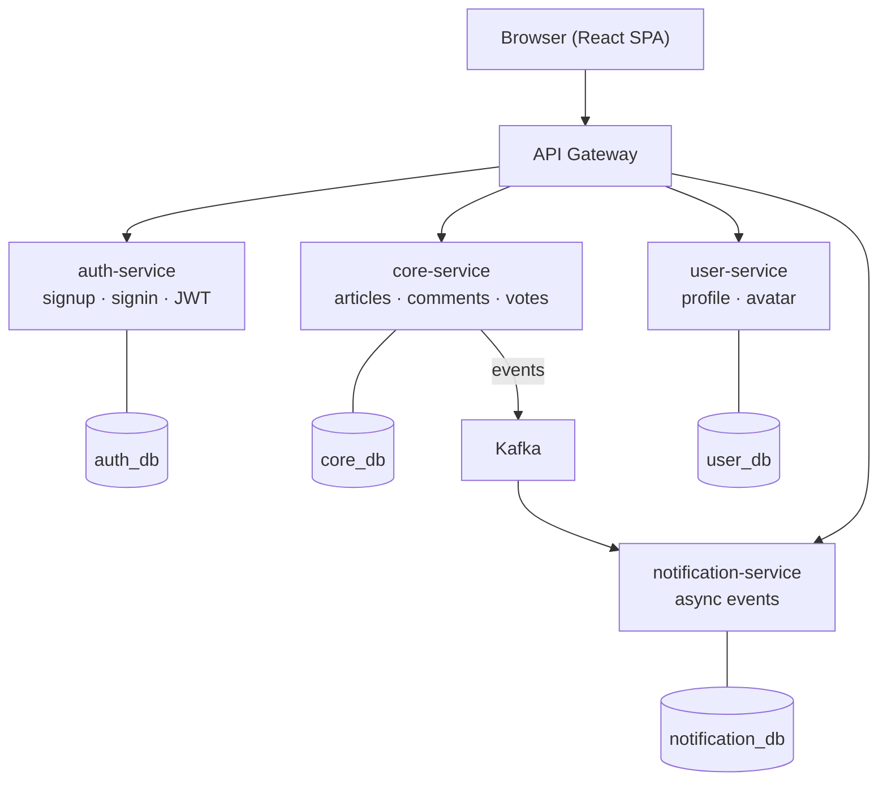

---

## Recommended: Option 1 — Migration Roadmap

### Phase Overview

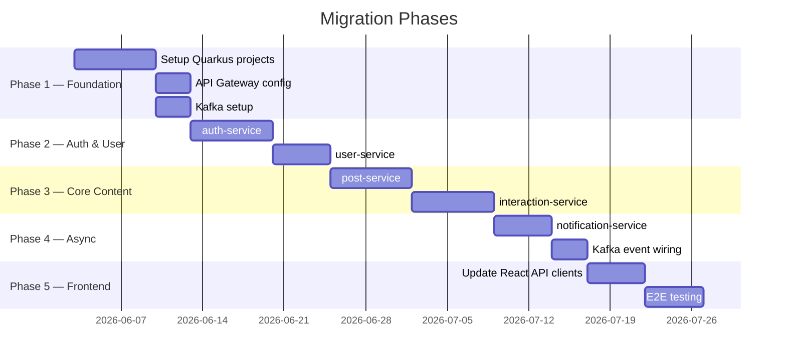

### Phase 1 — Foundation

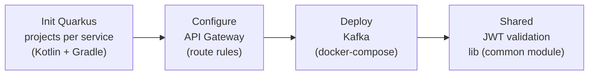

**Deliverables:**
- Mono-repo structure với 5 Quarkus subproject
- Docker Compose cập nhật (gateway + kafka + per-service DB)
- Common Kotlin module: `JwtPrincipal`, `ApiResponse`, base exceptions

### Phase 2 — Auth & User Services

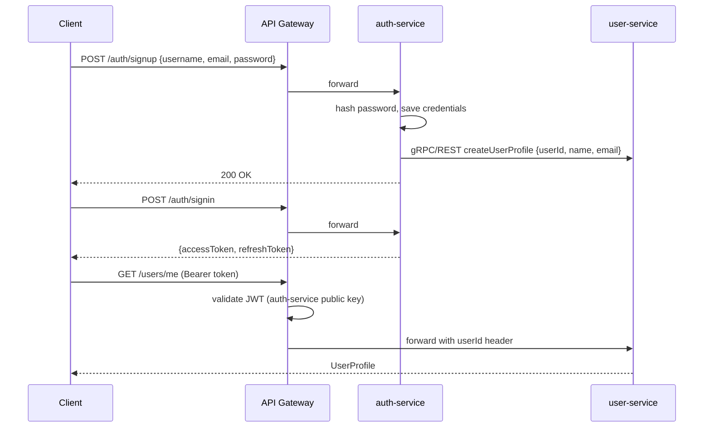

**Stack per service:**
```
quarkus-resteasy-reactive
quarkus-hibernate-orm-panache-kotlin
quarkus-smallrye-jwt          ← JWT generate/validate
quarkus-flyway                ← DB migration
quarkus-kotlin
```

### Phase 3 — Post & Interaction Services

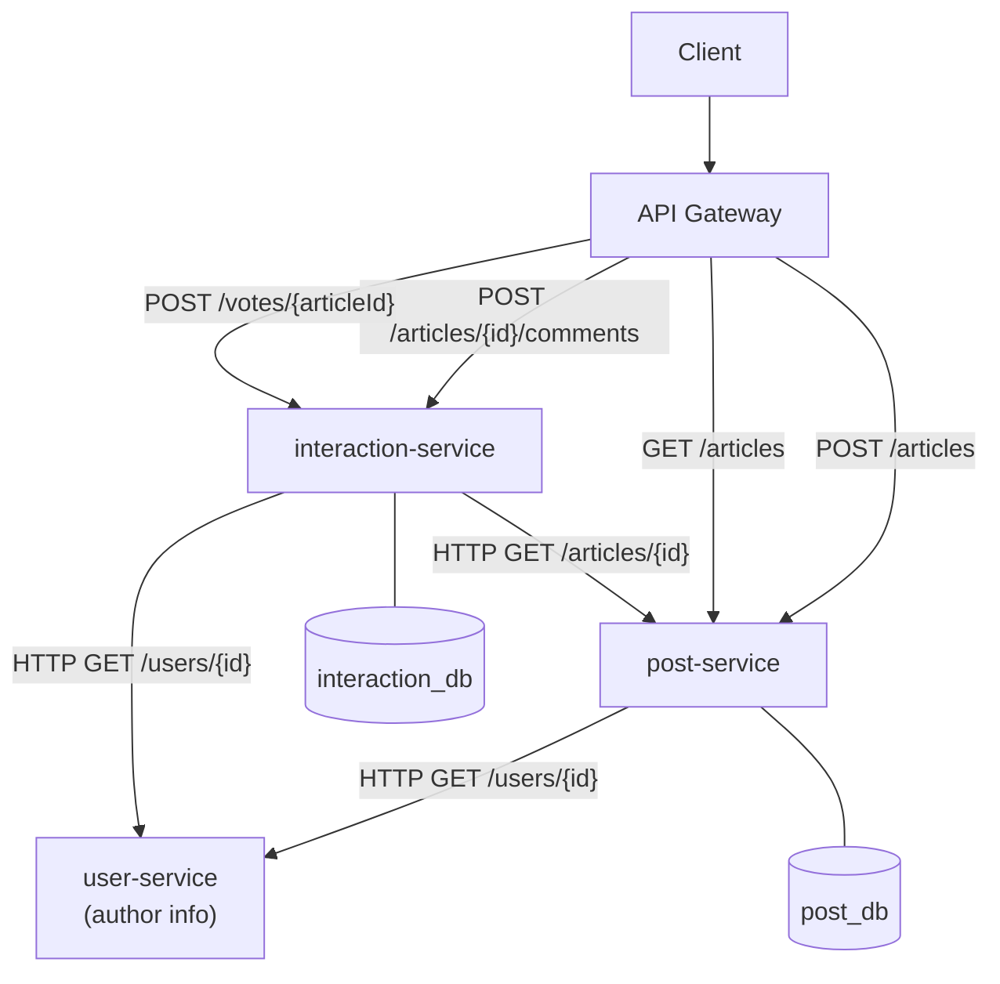

**Data ownership note:**
- `post-service` owns `article` table — interaction-service never queries it directly, calls REST.
- `interaction-service` stores `article_id` as a reference (no FK across service boundaries).

### Phase 4 — Notification Service (Async)

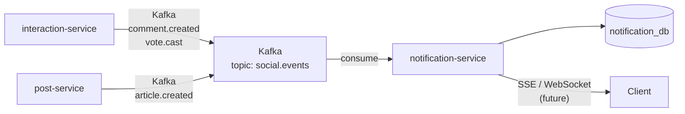

**Kafka event schema (JSON):**
```json
{
  "eventType": "comment.created",
  "actorId": 42,
  "targetUserId": 7,
  "articleId": 123,
  "occurredAt": "2026-06-03T10:00:00Z"
}
```

### Phase 5 — Frontend Migration

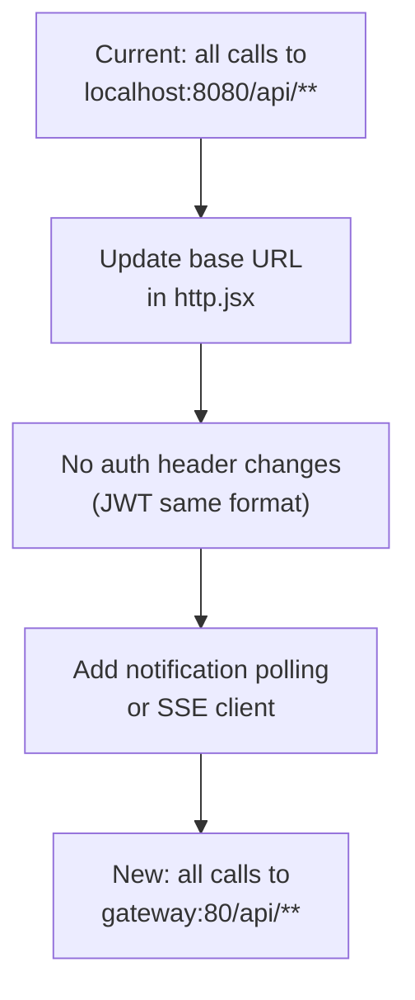

---

## Target Directory Structure

```
mini-social-network/
├── services/
│   ├── auth-service/          # Quarkus + Kotlin
│   ├── user-service/          # Quarkus + Kotlin
│   ├── post-service/          # Quarkus + Kotlin
│   ├── interaction-service/   # Quarkus + Kotlin
│   └── notification-service/  # Quarkus + Kotlin
├── common/
│   └── social-common/         # Shared Kotlin lib (DTOs, JWT utils)
├── frontend/                  # React (unchanged)
├── gateway/
│   └── kong.yml               # API Gateway config
├── infra/
│   └── docker-compose.yml     # Full stack
└── specs/
    ├── summary.md
    └── migration-plan.md
```

---

## Risk & Mitigation

| Risk | Impact | Mitigation |
|---|---|---|
| Data consistency across services | High | Saga pattern for multi-service writes; avoid distributed transactions |
| Latency increase (network hops) | Medium | gRPC for internal sync calls; cache user profiles in post-service |
| JWT validation in each service | Medium | Shared `social-common` lib with Quarkus SmallRye JWT |
| Kafka single point of failure | Medium | Kafka cluster (3 brokers) in production |
| Frontend breakage during migration | Low | Keep old monolith running; migrate behind feature flag on gateway |
