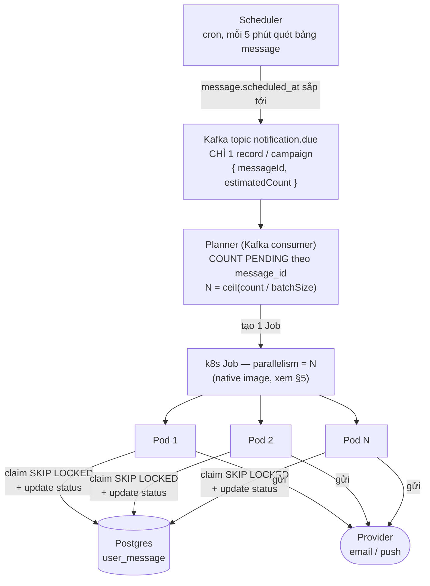
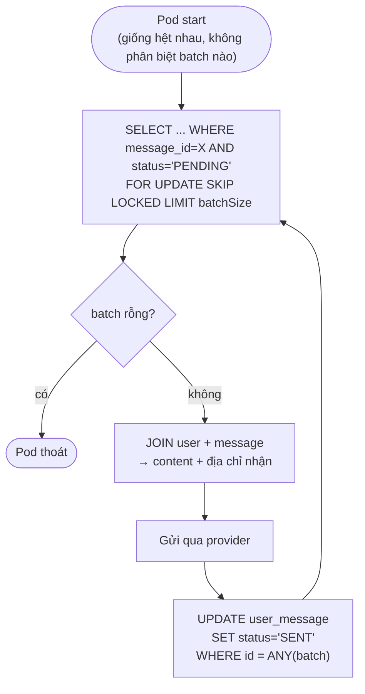

# Notification Scheduler — Design Exploration

> **Trạng thái: thiết kế khám phá, chưa implement.** Không phải feature đang làm (không có
> trong `specs/feature.md`), không phải ADR (chưa có quyết định nào được chốt). Ghi lại vì
> đã bàn khá sâu, để có chỗ tra cứu nếu sau này thật sự làm — không có gì trong file này được
> coi là "đã quyết".

## 1. Bài toán

Gửi message (email/push/noti) cho user đúng giờ hẹn trước, quy mô có thể tới **1 triệu
message** phải gửi xong trong vài phút, và **tải dao động** (không phải lúc nào cũng cao) —
không muốn giữ hạ tầng chạy full công suất 24/7.

Schema gợi ý:
```
user           (id, email, push_token, ...)
message        (id, template/content, channel, scheduled_at, ...)   -- 1 "job"/campaign
user_message   (id, user_id, message_id, status, sent_at, attempts) -- 1 row / người nhận
```

`user_message` là bảng chịu tải chính (hàng triệu row/lần gửi). Trạng thái:
`PENDING → PROCESSING → SENT / FAILED`.

---

## 2. Kiến trúc tổng thể



Logic bên trong mỗi pod (vòng claim-gửi-update) — xem diagram ở §4.

### Vì sao Kafka chỉ chở 1 record, không phải 1 triệu

Bàn ban đầu là đẩy cả 1 triệu `user_message` row qua Kafka rồi consumer xử lý từng cái —
không cần thiết. Kafka ở đây chỉ đóng vai trò **tín hiệu trigger nhẹ** ("job X đến giờ"),
việc liệt kê/xử lý 1 triệu row để Postgres làm (đã có sẵn cả index lẫn transaction, không
cần Kafka gánh việc đó). Gọn hơn, không cần lo partition/lag cho khối lượng lớn ở tầng này.

---

## 3. Planner — tính N

```
N = ceil(count / batchSize)
```
KHÔNG dùng floor — floor cho `count < batchSize` sẽ ra N=0 (không pod nào được tạo, job
không bao giờ gửi). `batchSize` để trong config (vd 5000), không hard-code.

N ở đây là **mức độ song song mong muốn**, không phải "số batch chính xác" — vì mỗi pod tự
loop tới khi hết việc (§4), N hơi dư (do ceil) không sao, pod dư chỉ claim được ít/không
claim được gì rồi thoát sớm.

---

## 4. Vì sao worker tự claim (`SKIP LOCKED`), không nhận range cố định từ planner

Phương án đầu: planner tính sẵn range cho từng pod (`pod A: id 1-5000, pod B: 5001-10000`).
Vấn đề: pod chết giữa chừng (OOM, node evict) → ai phát hiện? ai gửi nốt phần còn lại? Cần
thêm tầng theo dõi Job nào fail để re-provision.

Chọn: mỗi pod tự claim bằng `SELECT ... FOR UPDATE SKIP LOCKED LIMIT batchSize`, lặp tới khi
rỗng. Pod chết thì transaction chết theo, row tự nhả khoá, pod khác (hoặc lượt sau) nhặt
tiếp — không cần bookkeeping riêng, không mất message, tự cân bằng tải (pod nhanh claim được
nhiều hơn pod chậm thay vì chia đều cứng).



Pod chết ở bất kỳ bước nào trong vòng lặp → transaction đang giữ lock chết theo → row quay
về `PENDING`, không kẹt ở `PROCESSING` mãi mãi — pod khác/lượt sau tự nhặt lại, không cần ai
theo dõi Job nào đã fail.

`k8s Job` với `parallelism: N` là primitive có sẵn cho việc này — k8s tự tạo/dọn N pod, tự
retry pod fail theo `backoffLimit`. Không cần planner tự tạo N pod riêng lẻ. Cần: planner có
RBAC (ServiceAccount) được phép tạo Job trong namespace — chi tiết vận hành thật, không chỉ
là "provision" nói suông.

---

## 5. Cold-start — lý do cần native image

Đo được thật trong session làm việc trên cluster của project này: `post-api` chạy Quarkus
**JVM mode** mất **35.957s** để start (JIT warmup + Liquibase) trước khi xử lý được request
đầu. Nếu batchSize=5000 → ~200 pod cho 1 triệu message, mỗi pod cold-start ~30-35s trước khi
gửi được gì — với ngân sách 5 phút (300s), riêng cold-start đã ăn 1/10 đến 1/3 thời gian,
chưa tính việc gửi thật.

→ Nếu làm thật, worker này **cần build native image** (GraalVM, Quarkus hỗ trợ sẵn) — cold
start xuống dưới 1s. Không native thì nên tăng `batchSize` (ít pod hơn, mỗi pod làm nhiều
việc hơn) để overhead cold-start không chiếm phần lớn ngân sách thời gian.

---

## 6. Thứ tự nút thắt thật (đã xác minh, không phải trực giác)

| # | Nút thắt | Có phải vấn đề thật không |
|---|---|---|
| 1 | Query/join 1 triệu row từ Postgres | **Không**, nếu index đúng `(status, scheduled_at, id)` + keyset pagination (không `OFFSET`) — vài giây đến vài chục giây cho 1 triệu row |
| 2 | Ghi ngược `status='SENT'` | **Có**, nếu update từng row/commit riêng (WAL fsync mỗi lần) — phải batch update |
| 3 | Số partition Kafka topic | **Có**, nếu chỉ 1 partition thì chỉ 1 consumer xử lý được — nhưng ở thiết kế này Kafka chỉ chở 1 record/job nên không phải vấn đề nữa (đã loại bỏ ở §2) |
| 4 | Provider rate limit (email/push) | **Có, trần cứng** — không sửa được bằng kiến trúc, phải xin quota/dùng provider khối lượng lớn |
| 5 | Pod cold-start (nếu JVM mode) | **Có**, xem §5 |

---

## 7. Phương án thay thế đã cân nhắc — khi nào dùng cái nào

| Kiểu tải | Phương án | Vì sao |
|---|---|---|
| Trickle liên tục, thỉnh thoảng dồn cục | **Kafka + KEDA** — giữ Kafka làm buffer bền, KEDA autoscale consumer Deployment theo consumer lag (`minReplicaCount: 0`, scale theo lag threshold) | Kafka rẻ khi idle; phần tốn tài nguyên (worker gọi API ngoài) mới cần scale động — KEDA làm đúng việc đó, không mất message nếu worker theo không kịp |
| Từng đợt campaign rời rạc, không liên tục (đúng use case bài toán này) | **k8s Job theo yêu cầu**, không cần Kafka cho luồng gửi | Không tốn gì lúc rảnh; đánh đổi: tự viết retry dựa vào cột `attempts`/`status`, mất khả năng replay/audit-trail như Kafka |

Thiết kế ở §2 dùng Kafka **chỉ để trigger** (1 record/job) + k8s Job để gửi — kết hợp cả 2:
nhẹ như phương án Job thuần, nhưng vẫn có 1 điểm vào chuẩn hoá (Kafka) nếu sau này có nhiều
nguồn trigger khác nhau (không chỉ cron scan bảng `message`).

---

## 8. Câu hỏi còn mở (chưa quyết, cần bàn tiếp nếu làm thật)

- `batchSize` tối ưu là bao nhiêu? Phụ thuộc thời gian gửi 1 message thật (round-trip tới
  provider) — chưa đo được vì provider cụ thể chưa chọn.
- Retry chính sách khi `FAILED` — retry bao nhiêu lần, backoff ra sao, khi nào coi là chết
  hẳn (dead-letter)?
- Có cần dedupe nếu planner vô tình chạy 2 lần cho cùng 1 `message_id` (vd Kafka redeliver)?
  `SKIP LOCKED` tự nhiên chống được double-send ở tầng row, nhưng tạo 2 Job trùng thì tốn
  compute thừa (không tốn đúng — vẫn đúng, chỉ phí tài nguyên).
- Native image build cho riêng service này tốn thêm gì vào pipeline JIB hiện tại (project
  đang dùng JIB, không phải GraalVM container build) — chưa khảo sát.
