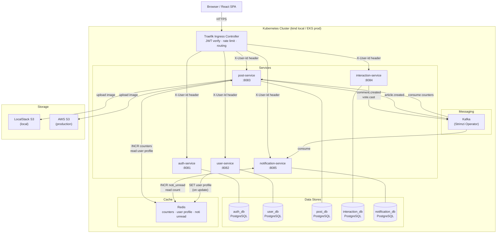
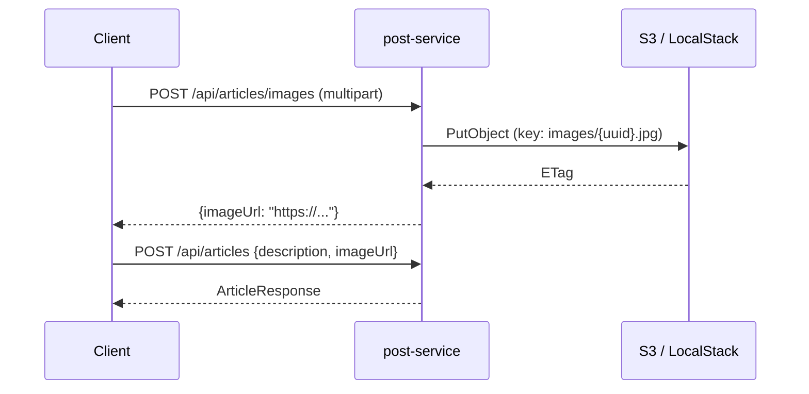
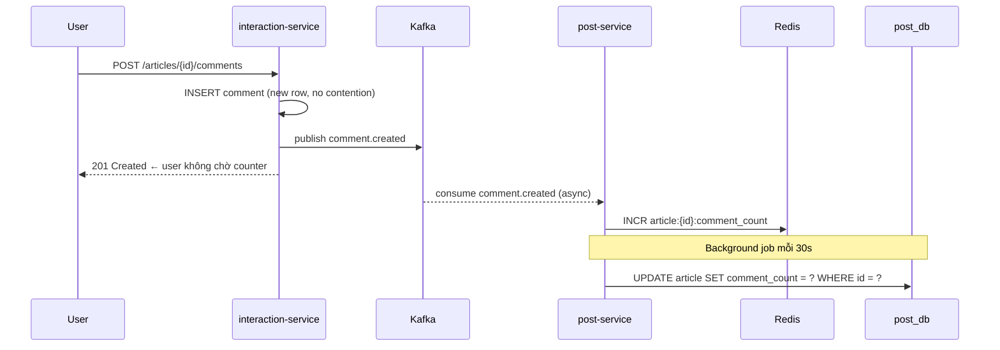
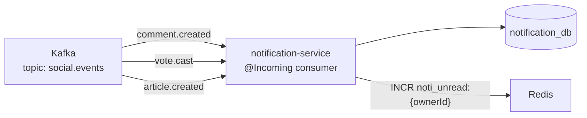
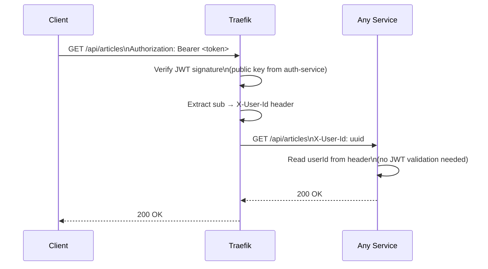
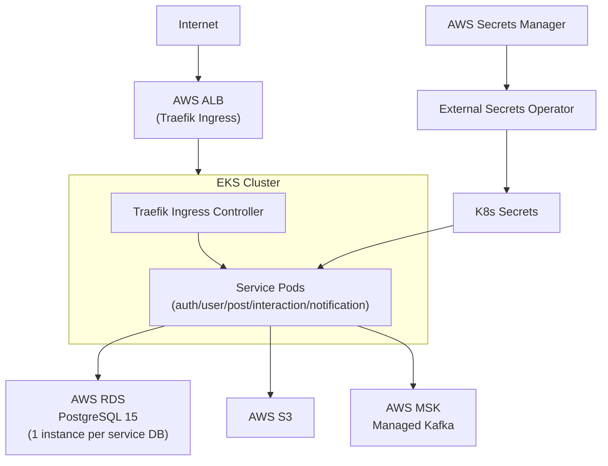
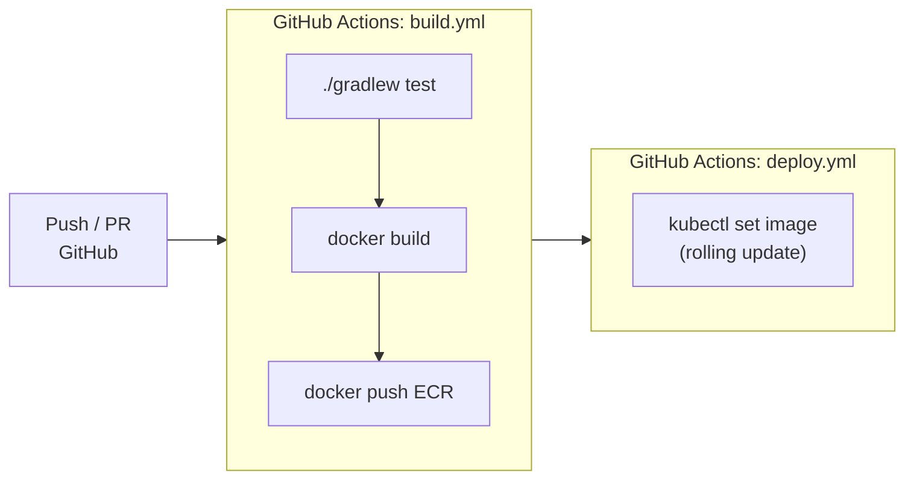
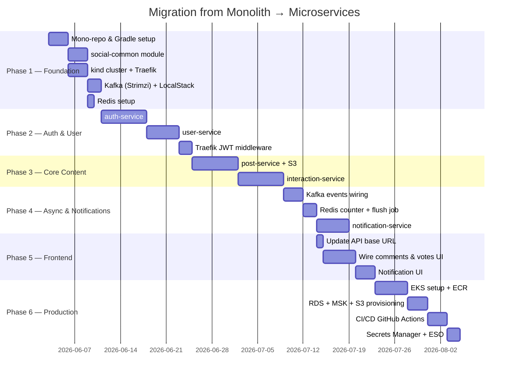

# Implementation Plan — Option 1: Bounded Context Microservices
## Quarkus + Kotlin · Traefik · kind (local) · EKS (production)

---

## 1. Target Architecture



---

## 2. Tech Stack

| Component | Technology |
|---|---|
| Services | Quarkus 3.x + Kotlin |
| Build | Gradle (Kotlin DSL) |
| ORM | Hibernate Reactive + Panache Kotlin |
| Database | PostgreSQL 15 |
| Migration | Liquibase |
| Auth | SmallRye JWT (MicroProfile) |
| Messaging | Kafka (SmallRye Reactive Messaging) |
| Cache | Redis 7 (Quarkus Redis client) |
| Image Storage | AWS S3 SDK (LocalStack local / S3 prod) |
| API Gateway | Traefik v3 |
| Container image | Quarkus JIB (no Dockerfile) |
| Local K8s | kind |
| Production K8s | AWS EKS |
| CI/CD | GitHub Actions |
| Image Registry | AWS ECR |
| Secrets | AWS Secrets Manager + External Secrets Operator |

---

## 3. Repository Structure

```
mini-social-network/
├── services/                        # Gradle root project (all Quarkus)
│   ├── settings.gradle.kts
│   ├── build.gradle.kts
│   ├── social-common/               # shared DTOs, events (plain Kotlin)
│   ├── social-exception/            # AppException + 3 mappers (plug-in, no Dockerfile)
│   │
│   ├── auth-service-dao/            # DAO layer: entities, repos, Liquibase changelogs
│   │   ├── src/main/kotlin/         # Credentials entity, CredentialsRepository
│   │   ├── src/main/resources/
│   │   │   └── db/changelog/        # Liquibase changelogs
│   │   └── build.gradle.kts        # NO quarkus plugin, chỉ hibernate-orm-panache-kotlin
│   ├── auth-service/                # Quarkus app (business logic, REST, JWT, Kafka)
│   │   ├── src/main/kotlin/
│   │   ├── src/main/resources/
│   │   │   └── application.properties
│   │   ├── k8s/
│   │   └── build.gradle.kts        # depends on :auth-service-dao, :social-exception
│   │
│   ├── user-service-dao/
│   ├── user-service/
│   ├── post-service-dao/
│   ├── post-service/
│   ├── interaction-service-dao/
│   ├── interaction-service/
│   ├── notification-service-dao/
│   └── notification-service/
├── frontend/
├── infra/
│   ├── kind-cluster.yaml
│   ├── traefik/
│   ├── kafka/
│   ├── localstack/
│   └── redis/
├── k8s/
├── .github/
└── specs/
```

### DAO Layer — Trách nhiệm

Mỗi `x-service-dao` là **plain Kotlin library** (không có Quarkus plugin), chứa:

| Thành phần | Ví dụ |
|---|---|
| JPA Entities | `Credentials`, `UserProfile`, `Article` |
| Panache Repositories | `CredentialsRepository`, `ArticleRepository` |
| Liquibase changelogs | `db/changelog/db.changelog-master.xml` |
| DB-level DTOs (optional) | Projection classes cho complex queries |

```
auth-service-dao/
└── src/main/
    ├── kotlin/com/nhan/social/auth/dao/
    │   ├── entity/
    │   │   └── Credentials.kt
    │   └── repository/
    │       └── CredentialsRepository.kt
    └── resources/
        └── db/changelog/
            ├── db.changelog-master.xml
            └── changes/
                ├── 0001-create-credentials.xml
                └── 0002-add-index.xml
```

### DAO build.gradle.kts

```kotlin
// services/auth-service-dao/build.gradle.kts
plugins {
    kotlin("jvm")
    kotlin("plugin.allopen")   // cần cho @Entity classes
    // KHÔNG có id("io.quarkus")
}

dependencies {
    // Hibernate ORM Panache Kotlin — không cần Quarkus plugin để compile
    implementation("io.quarkus:quarkus-hibernate-orm-panache-kotlin")
    implementation("io.quarkus:quarkus-liquibase")
    implementation("org.jetbrains.kotlin:kotlin-stdlib-jdk8")
}

allOpen {
    annotation("jakarta.persistence.Entity")
    annotation("jakarta.persistence.MappedSuperclass")
}

tasks.withType<org.jetbrains.kotlin.gradle.tasks.KotlinCompile> {
    kotlinOptions.jvmTarget = "21"
}
```

### Service build.gradle.kts (depends on DAO)

```kotlin
// services/auth-service/build.gradle.kts
plugins {
    kotlin("jvm")
    kotlin("plugin.allopen")
    id("io.quarkus")
}

dependencies {
    implementation(enforcedPlatform("$quarkusPlatformGroupId:$quarkusPlatformArtifactId:$quarkusPlatformVersion"))
    implementation(project(":social-common"))
    implementation(project(":social-exception"))   // ← exception mappers
    implementation(project(":auth-service-dao"))   // ← DAO layer

    implementation("io.quarkus:quarkus-kotlin")
    implementation("io.quarkus:quarkus-arc")
    implementation("io.quarkus:quarkus-resteasy-reactive-jackson")
    implementation("io.quarkus:quarkus-hibernate-orm-panache-kotlin")
    implementation("io.quarkus:quarkus-liquibase")
    implementation("io.quarkus:quarkus-jdbc-postgresql")
    implementation("io.quarkus:quarkus-smallrye-jwt-build")
    implementation("io.quarkus:quarkus-messaging-kafka")
    implementation("io.quarkus:quarkus-container-image-jib")  // ← no Dockerfile
}
```

### Gradle settings — tất cả subprojects

```kotlin
// services/settings.gradle.kts
rootProject.name = "social-services"

include(
    "social-common",
    "social-exception",
    "auth-service-dao",
    "auth-service",
    "user-service-dao",
    "user-service",
    "post-service-dao",
    "post-service",
    "interaction-service-dao",
    "interaction-service",
    "notification-service-dao",
    "notification-service",
)
```

### Liquibase Changelog Structure

```xml
<!-- auth-service-dao/src/main/resources/db/changelog/db.changelog-master.xml -->
<?xml version="1.0" encoding="UTF-8"?>
<databaseChangeLog
    xmlns="http://www.liquibase.org/xml/ns/dbchangelog"
    xmlns:xsi="http://www.w3.org/2001/XMLSchema-instance"
    xsi:schemaLocation="http://www.liquibase.org/xml/ns/dbchangelog
        http://www.liquibase.org/xml/ns/dbchangelog/dbchangelog-4.20.xsd">

    <include file="changes/0001-create-credentials.xml"
             relativeToChangelogFile="true"/>
</databaseChangeLog>
```

```xml
<!-- changes/0001-create-credentials.xml -->
<?xml version="1.0" encoding="UTF-8"?>
<databaseChangeLog ...>
    <changeSet id="0001" author="nhan">
        <createTable tableName="credentials">
            <column name="id" type="uuid" defaultValueComputed="gen_random_uuid()">
                <constraints primaryKey="true"/>
            </column>
            <column name="username" type="varchar(50)">
                <constraints nullable="false" unique="true"/>
            </column>
            <column name="email" type="varchar(255)">
                <constraints nullable="false" unique="true"/>
            </column>
            <column name="password_hash" type="varchar(255)">
                <constraints nullable="false"/>
            </column>
            <column name="user_id" type="uuid">
                <constraints nullable="false" unique="true"/>
            </column>
            <column name="created_at" type="timestamptz" defaultValueComputed="NOW()">
                <constraints nullable="false"/>
            </column>
        </createTable>
        <createIndex tableName="credentials" indexName="idx_credentials_email">
            <column name="email"/>
        </createIndex>
    </changeSet>
</databaseChangeLog>
```

### application.properties — Liquibase config

```properties
# Liquibase (thay Flyway)
quarkus.liquibase.migrate-at-start=true
quarkus.liquibase.change-log=db/changelog/db.changelog-master.xml
```

### social-exception — Shared Error Handling

`social-exception` là **plain Kotlin library** chứa toàn bộ exception handling. Mỗi service chỉ cần `implementation(project(":social-exception"))` là tự động có:

| Class | Mô tả |
|---|---|
| `AppException` | Abstract base, có `errorCode`, `errorMessage`, `httpStatus`, `traceId` |
| `NotFoundException` / `ConflictException` / `UnauthorizedException` / `ForbiddenException` / `BadRequestException` | Concrete subclasses |
| `ErrorResponse` | DTO serialize ra JSON |
| `AppExceptionMapper` | `@Provider` map `AppException` → HTTP response |
| `ValidationExceptionMapper` | `@Provider` map `ConstraintViolationException` → 400 |
| `UnhandledExceptionMapper` | `@Provider` catch-all → 500 với traceId |

```kotlin
// Sử dụng trong bất kỳ service nào:
throw NotFoundException("Article $id not found", errorCode = "POST_001")
throw ConflictException("Username already taken", errorCode = "AUTH_002")
```

```json
// Response tự động:
{
  "errorCode": "POST_001",
  "errorMessage": "Article uuid not found",
  "traceId": "550e8400-e29b-41d4-a716-446655440000",
  "timestamp": "2026-06-03T10:00:00Z"
}
```

Quarkus scan beans của library thông qua:
1. `META-INF/beans.xml` trong social-exception JAR
2. `quarkus.index-dependency.social-exception.*` trong mỗi service's `application.properties`

---

### Container Image — Quarkus JIB (không cần Dockerfile)

```kotlin
// Mỗi service's build.gradle.kts
implementation("io.quarkus:quarkus-container-image-jib")
```

```properties
# application.properties
quarkus.container-image.group=nhan
quarkus.container-image.name=auth-service
quarkus.container-image.tag=latest
quarkus.jib.base-jvm-image=eclipse-temurin:21-jre-alpine
%prod.quarkus.container-image.registry=${ECR_REGISTRY:}
```

```bash
# Build image locally
./gradlew :auth-service:build -Dquarkus.container-image.build=true

# Push to ECR (CI/CD)
./gradlew :auth-service:build \
  -Dquarkus.container-image.push=true \
  -Dquarkus.container-image.registry=$ECR_REGISTRY \
  -Dquarkus.container-image.tag=$GIT_SHA
```

---

### Build Commands

```bash
# run single service (from services/)
cd services
./gradlew :auth-service:quarkusDev

# build all
./gradlew build

# test single service
./gradlew :post-service:test

# build + push all images (CI)
for svc in auth-service user-service post-service interaction-service notification-service; do
  ./gradlew :$svc:build -Dquarkus.container-image.push=true
done
```

---

## 4. Services Detail

### 4.1 auth-service

**Responsibilities:** user registration, login, JWT issue, token refresh

**API:**

| Method | Path | Auth | Description |
|---|---|---|---|
| POST | `/api/auth/signup` | Public | Register new user |
| POST | `/api/auth/signin` | Public | Login, returns JWT |
| POST | `/api/auth/refresh` | Public | Refresh access token |

**Database schema (`auth_db`):**
```sql
credentials (
  id          UUID PRIMARY KEY,
  username    VARCHAR UNIQUE NOT NULL,
  email       VARCHAR UNIQUE NOT NULL,
  password    VARCHAR NOT NULL,  -- BCrypt
  user_id     UUID NOT NULL,     -- reference to user-service
  created_at  TIMESTAMP
)
```

**JWT payload:**
```json
{
  "sub": "user-uuid",
  "username": "nhan",
  "roles": ["ROLE_USER"],
  "exp": 1234567890
}
```

**Quarkus dependencies:**
```kotlin
implementation("io.quarkus:quarkus-smallrye-jwt-build")
implementation("io.quarkus:quarkus-hibernate-orm-panache-kotlin")
implementation("io.quarkus:quarkus-flyway")
implementation("io.quarkus:quarkus-jdbc-postgresql")
```

---

### 4.2 user-service

**Responsibilities:** user profile, avatar, display name

**API:**

| Method | Path | Auth | Description |
|---|---|---|---|
| GET | `/api/users/me` | Required | Get own profile |
| GET | `/api/users/{id}` | Required | Get user by ID |
| PATCH | `/api/users/me` | Required | Update profile |

**Database schema (`user_db`):**
```sql
user_profile (
  id          UUID PRIMARY KEY,
  username    VARCHAR UNIQUE NOT NULL,
  firstname   VARCHAR,
  lastname    VARCHAR,
  email       VARCHAR,
  avatar      VARCHAR,  -- S3 URL
  created_at  TIMESTAMP
)
```

---

### 4.3 post-service

**Responsibilities:** article CRUD, image upload to S3

**API:**

| Method | Path | Auth | Description |
|---|---|---|---|
| GET | `/api/articles` | Required | List articles (paginated) |
| POST | `/api/articles` | Required | Create article |
| GET | `/api/articles/{id}` | Required | Get article by ID |
| DELETE | `/api/articles/{id}` | Required | Soft delete own article |
| POST | `/api/articles/images` | Required | Upload image → S3 |

**Database schema (`post_db`):**
```sql
article (
  id          UUID PRIMARY KEY,
  description TEXT,
  image_url   VARCHAR,   -- S3 URL
  author_id   UUID NOT NULL,
  visible     BOOLEAN DEFAULT TRUE,
  created_at  TIMESTAMP,
  updated_at  TIMESTAMP
)
```

**Image upload flow:**


**Quarkus dependencies:**
```kotlin
implementation("io.quarkus:quarkus-amazon-s3")
implementation("software.amazon.awssdk:s3")
```

**Kafka event published:**
```json
{
  "eventType": "article.created",
  "articleId": "uuid",
  "authorId": "uuid",
  "occurredAt": "2026-06-03T10:00:00Z"
}
```

---

### 4.4 interaction-service

**Responsibilities:** comments on articles, upvote/downvote articles and comments

**API:**

| Method | Path | Auth | Description |
|---|---|---|---|
| GET | `/api/articles/{id}/comments` | Required | List comments |
| POST | `/api/articles/{id}/comments` | Required | Add comment |
| DELETE | `/api/comments/{id}` | Required | Delete own comment |
| POST | `/api/articles/{id}/vote` | Required | Vote on article |
| POST | `/api/comments/{id}/vote` | Required | Vote on comment |

**Database schema (`interaction_db`):**
```sql
comment (
  id          UUID PRIMARY KEY,
  description TEXT NOT NULL,
  article_id  UUID NOT NULL,
  author_id   UUID NOT NULL,
  visible     BOOLEAN DEFAULT TRUE,
  created_at  TIMESTAMP
)

vote (
  id          UUID PRIMARY KEY,
  value       SMALLINT NOT NULL,  -- -1, 0, 1
  user_id     UUID NOT NULL,
  target_id   UUID NOT NULL,      -- article or comment id
  target_type VARCHAR NOT NULL,   -- 'ARTICLE' | 'COMMENT'
  created_at  TIMESTAMP,
  UNIQUE (user_id, target_id, target_type)
)
```

**Kafka events published:**
```json
{ "eventType": "comment.created", "commentId": "uuid", "articleId": "uuid", "actorId": "uuid", "articleAuthorId": "uuid" }
{ "eventType": "vote.cast",       "targetId": "uuid",  "targetType": "ARTICLE", "actorId": "uuid", "targetAuthorId": "uuid" }
```

**Comment flow (fire-and-forget counter):**


---

### 4.5 notification-service

**Responsibilities:** consume events from Kafka, store notifications, mark as seen

**API:**

| Method | Path | Auth | Description |
|---|---|---|---|
| GET | `/api/notifications` | Required | List my notifications |
| PATCH | `/api/notifications/{id}/seen` | Required | Mark as read |
| PATCH | `/api/notifications/seen-all` | Required | Mark all as read |

**Database schema (`notification_db`):**
```sql
notification (
  id          UUID PRIMARY KEY,
  type        VARCHAR NOT NULL,  -- 'COMMENT' | 'VOTE'
  actor_id    UUID NOT NULL,
  owner_id    UUID NOT NULL,
  article_id  UUID,
  seen        BOOLEAN DEFAULT FALSE,
  created_at  TIMESTAMP
)
```

**Kafka consumer:**


---

## 5. Redis — Cache Layer

### Redis Keys

| Key | Type | TTL | Owner | Mô tả |
|---|---|---|---|---|
| `article:{id}:comment_count` | String (counter) | No TTL | post-service | Số comment, flush về DB mỗi 30s |
| `article:{id}:vote_count` | String (counter) | No TTL | post-service | Tổng vote, flush về DB mỗi 30s |
| `user:{id}:profile` | Hash | 10 phút | user-service | Cache profile để post/interaction-service dùng |
| `user:{id}:noti_unread` | String (counter) | No TTL | notification-service | Số thông báo chưa đọc |

### Counter Flush Pattern (post-service)

```kotlin
// Quarkus scheduled job — chạy mỗi 30 giây
@ApplicationScoped
class CounterFlushJob(
    val redis: ReactiveRedisClient,
    val articleRepo: ArticleRepository,
) {
    @Scheduled(every = "30s")
    suspend fun flush() {
        val keys = redis.keys("article:*:comment_count").await()
        keys.forEach { key ->
            val articleId = key.split(":")[1]
            val count = redis.get(key).await()?.toLong() ?: return@forEach
            articleRepo.updateCommentCount(articleId, count)
        }
        // tương tự cho vote_count
    }
}
```

### User Profile Cache Pattern (post-service)

```kotlin
// Khi cần author info cho feed — không gọi user-service trực tiếp
suspend fun getAuthorProfile(authorId: String): UserDto {
    val cached = redis.hgetall("user:$authorId:profile").await()
    if (cached.isNotEmpty()) return cached.toUserDto()

    // Cache miss → gọi user-service
    val profile = userServiceClient.getUser(authorId)
    redis.hset("user:$authorId:profile", profile.toRedisMap()).await()
    redis.expire("user:$authorId:profile", 600).await()  // 10 phút
    return profile
}
```

### Invalidate khi user update profile

```kotlin
// user-service: sau khi UPDATE user_profile
kafkaProducer.publish(UserUpdatedEvent(userId = id))

// post-service Kafka consumer:
@Incoming("user.updated")
suspend fun onUserUpdated(event: UserUpdatedEvent) {
    redis.del("user:${event.userId}:profile").await()
}
```

### Quarkus dependency

```kotlin
// services/post-service/build.gradle.kts
implementation("io.quarkus:quarkus-redis-client")
```

### Local Redis (kind)

```yaml
# infra/redis/redis.conf
maxmemory 256mb
maxmemory-policy allkeys-lru  # evict LRU khi đầy
```

```yaml
# k8s manifest
apiVersion: apps/v1
kind: Deployment
metadata:
  name: redis
spec:
  template:
    spec:
      containers:
        - name: redis
          image: redis:7-alpine
          args: ["/etc/redis/redis.conf"]
```

---

## 6. Traefik — API Gateway

### JWT Middleware Flow



### Traefik Config

```yaml
# infra/traefik/middlewares.yaml
apiVersion: traefik.io/v1alpha1
kind: Middleware
metadata:
  name: jwt-verify
spec:
  plugin:
    jwt:
      secret: "${JWT_PUBLIC_KEY}"
      forwardHeaders:
        X-User-Id: sub

---
apiVersion: traefik.io/v1alpha1
kind: IngressRoute
metadata:
  name: social-routes
spec:
  entryPoints: [web]
  routes:
    - match: PathPrefix(`/api/auth`)
      kind: Rule
      services:
        - name: auth-service
          port: 8081
      # no JWT middleware on auth routes

    - match: PathPrefix(`/api/articles`)
      kind: Rule
      middlewares:
        - name: jwt-verify
      services:
        - name: post-service
          port: 8083

    - match: PathPrefix(`/api/users`)
      kind: Rule
      middlewares:
        - name: jwt-verify
      services:
        - name: user-service
          port: 8082
```

---

## 7. Local Development (kind)

### Cluster Setup

```bash
# 1. Create cluster
kind create cluster --name social --config infra/kind-cluster.yaml

# 2. Install Traefik
helm repo add traefik https://helm.traefik.io/traefik
helm install traefik traefik/traefik -f infra/traefik/values.yaml

# 3. Install Strimzi (Kafka operator)
kubectl apply -f https://strimzi.io/install/latest
kubectl apply -f infra/kafka/strimzi-kafka.yaml

# 4. Deploy LocalStack + Redis
kubectl apply -f infra/localstack/deployment.yaml
kubectl apply -f infra/redis/

# 5. Deploy services
kubectl apply -f k8s/namespaces.yaml
kubectl apply -f services/auth-service/k8s/
kubectl apply -f services/user-service/k8s/
kubectl apply -f services/post-service/k8s/
kubectl apply -f services/interaction-service/k8s/
kubectl apply -f services/notification-service/k8s/
```

### kind Cluster Config

```yaml
# infra/kind-cluster.yaml
kind: Cluster
apiVersion: kind.x-k8s.io/v1alpha4
nodes:
  - role: control-plane
    extraPortMappings:
      - containerPort: 80
        hostPort: 80       # Traefik HTTP
      - containerPort: 443
        hostPort: 443
  - role: worker
  - role: worker
```

### Local Environment Variables (per service)

```properties
# application.properties (local profile)
quarkus.datasource.jdbc.url=jdbc:postgresql://postgres-auth:5432/auth_db
quarkus.datasource.username=postgres
quarkus.datasource.password=postgres

# S3 — LocalStack
quarkus.s3.endpoint-override=http://localstack:4566
quarkus.s3.aws.region=us-east-1
quarkus.s3.aws.credentials.static-provider.access-key-id=test
quarkus.s3.aws.credentials.static-provider.secret-access-key=test

# Kafka
kafka.bootstrap.servers=kafka-cluster-kafka-bootstrap:9092
```

---

## 7. Production (EKS)

### EKS Architecture



### Secrets Management

```yaml
# k8s/external-secret.yaml
apiVersion: external-secrets.io/v1beta1
kind: ExternalSecret
metadata:
  name: auth-service-secrets
spec:
  secretStoreRef:
    name: aws-secrets-manager
    kind: ClusterSecretStore
  target:
    name: auth-service-secret
  data:
    - secretKey: JWT_PRIVATE_KEY
      remoteRef:
        key: social/auth-service
        property: jwt_private_key
    - secretKey: DB_PASSWORD
      remoteRef:
        key: social/auth-service
        property: db_password
```

### Production Config (override)

```properties
# application-prod.properties
quarkus.datasource.jdbc.url=${DB_URL}
quarkus.datasource.password=${DB_PASSWORD}

# S3 — real AWS (no endpoint override)
quarkus.s3.aws.region=ap-southeast-1
# credentials via IAM role (no static keys)

# Kafka — MSK
kafka.bootstrap.servers=${MSK_BOOTSTRAP_SERVERS}
```

---

## 8. CI/CD Pipeline



```yaml
# .github/workflows/build.yml (per service example)
jobs:
  build:
    runs-on: ubuntu-latest
    steps:
      - uses: actions/checkout@v4
      - uses: actions/setup-java@v4
        with: { java-version: '21', distribution: 'temurin' }
      - run: cd services && ./gradlew :auth-service:test
      - run: cd services && ./gradlew :auth-service:build -Dquarkus.package.type=native
      - name: Build & push Docker image
        run: |
          aws ecr get-login-password | docker login --username AWS --password-stdin $ECR_REGISTRY
          docker build -t $ECR_REGISTRY/auth-service:${{ github.sha }} services/auth-service/
          docker push $ECR_REGISTRY/auth-service:${{ github.sha }}
```

---

## 9. services/social-common Module

Shared Kotlin library dùng cho tất cả services. **Không có Quarkus plugin** — plain Kotlin lib.

```
services/social-common/src/main/kotlin/com/nhan/social/common/
├── dto/
│   ├── UserDto.kt              # user info passed between services
│   ├── ApiResponse.kt          # standard response wrapper
│   └── PageResponse.kt         # paginated response
├── exception/
│   ├── AppException.kt
│   ├── NotFoundException.kt
│   └── UnauthorizedException.kt
└── event/
    ├── SocialEvent.kt          # sealed base class
    ├── ArticleCreatedEvent.kt
    ├── CommentCreatedEvent.kt
    └── VoteCastEvent.kt
```

```kotlin
// event/SocialEvent.kt
sealed class SocialEvent(val eventType: String, val occurredAt: Instant = Instant.now())

data class ArticleCreatedEvent(val articleId: String, val authorId: String)
    : SocialEvent("article.created")

data class CommentCreatedEvent(val commentId: String, val articleId: String,
    val actorId: String, val articleAuthorId: String)
    : SocialEvent("comment.created")

data class VoteCastEvent(val targetId: String, val targetType: String,
    val actorId: String, val targetAuthorId: String)
    : SocialEvent("vote.cast")
```

> **Rule:** `social-common` chỉ chứa data classes, exceptions, và event definitions.
> CDI beans, Panache entities, REST resources — để trong từng service.

---

## 10. Migration Phases



---

## 11. Key Decisions

| Decision | Choice | Reason |
|---|---|---|
| API Gateway | Traefik | Native k8s, auto service discovery, built-in JWT middleware, works local + EKS |
| Local k8s | kind | Closest to EKS behaviour, lightweight, multi-node |
| Image storage local | LocalStack S3 | Free (non-commercial), S3-compatible API, no code change vs prod |
| Image storage prod | AWS S3 | Native, no infra to manage |
| Messaging | Kafka (Strimzi) | Durable events, replay-able, decouples notification from interaction |
| DB per service | Yes | True data isolation, independent schema evolution |
| Java version | 21 | Quarkus 3.x recommends 21, virtual threads support |
| Service communication | REST (sync) + Kafka (async) | REST for queries, Kafka for side effects |
| Counter update | Redis INCR + async flush | User không chờ DB lock; flush về PostgreSQL mỗi 30s |
| User profile cache | Redis Hash TTL 10m | Tránh N+1 cross-service HTTP call khi render feed |
| Noti unread count | Redis counter | Query cực kỳ thường xuyên (mỗi lần load navbar) |
| Secrets | AWS Secrets Manager + ESO | No secrets in k8s manifests, works same way local + prod |
| Exception handling | `social-exception` shared module | errorCode + errorMessage + traceId, plug-in là xài, không viết lại mapper |
| Container image | Quarkus JIB (no Dockerfile) | Build image trực tiếp từ Gradle, không cần Docker daemon |
| DAO layer | `x-service-dao` subproject | Entity + repo + Liquibase tách riêng, service chỉ chứa business logic |
