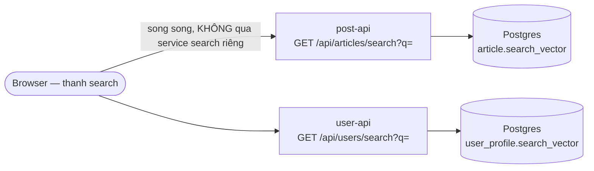

# Tìm kiếm (bài viết + người dùng) — Design Exploration

> Trạng thái: **plan, chưa implement.** Khớp `specs/feature.md` mục 8.4 "Tìm
> kiếm người dùng" (⬜) — tìm bài viết chưa có mục riêng, coi như mở rộng
> cùng lúc. Có 1 quyết định kiến trúc chưa chốt (§3) — cần ông chọn trước
> khi code.

## 1. Bài toán

1 thanh search — gõ 1 lần, ra cả bài viết lẫn người dùng khớp từ khoá.

## 2. Hiện trạng — vì sao không dùng thẳng RSQL đang có

Đã có sẵn `ArticleFilter.kt` (`social-common/rsql`) nhưng **không hợp cho
free-text search**:

```kotlin
private val FILTER_FIELDS = mapOf(
    "authorId"  to RsqlField { UUID.fromString(it) },   // parse UUID
    "createdAt" to RsqlField { Instant.parse(it) },      // parse Instant
)
```

`RsqlField` được thiết kế cho **so khớp chính xác trên field có kiểu dữ
liệu rõ ràng** (`authorId==uuid`, `createdAt=ge=...`) — không có khái niệm
"chứa từ khoá, xếp hạng theo độ liên quan" mà search cần. Schema hiện tại
(`article.description text`, `user_profile.username/firstname/lastname
varchar`) cũng **chưa có index nào phục vụ full-text** — chỉ có btree trên
`author_id`, `created_at`, `username` (unique constraint).

→ Search là **query path riêng**, không đi qua RSQL, cần thiết kế mới.

## 3. Quyết định cần chốt trước khi code — 2 phương án

| | **A. Postgres full-text search** | **B. Search engine riêng (Meilisearch)** |
|---|---|---|
| Hạ tầng thêm | Không — tận dụng Postgres sẵn có | Có — thêm 1 container mới |
| Cơ chế | `tsvector` + `GIN` index, `to_tsquery`/`websearch_to_tsquery`, `ts_rank` | Đồng bộ document qua outbox (đúng pattern đã học), Meilisearch tự lo index/rank |
| Fuzzy/typo-tolerant | Không tự nhiên có (cần thêm extension `pg_trgm` mới gần fuzzy được) | Có sẵn, mặc định |
| Độ phức tạp vận hành | Thấp — không thêm gì để quản lý | Thêm 1 service phải theo dõi resource, backup, sync lag |
| Học được gì mới | Postgres FTS thật sự (tsvector, GIN, ranking) — kỹ thuật DB sâu | Kiến trúc search-engine riêng biệt + đồng bộ qua event (outbox → search index) |

**Lưu ý quan trọng, liên quan trực tiếp tới việc vừa làm trong session này:**
cả buổi vừa rồi tốn khá nhiều công dọn resource limit vì cụm bị OOM liên
tục do quá nhiều infra component chen nhau trong RAM hạn chế (xem
`tracking.md`, `lessons/`). Thêm 1 container search engine **ngay sau khi
vừa fix xong vấn đề đó** là đánh đổi cụ thể, không trừu tượng — cần ông cân
nhắc thật, không phải chỉ "thêm cho vui".

**Khuyến nghị (không ép):** làm phương án A trước (Postgres FTS) — đúng
tinh thần "hiểu sâu 1 công nghệ" của `constitution.md` mà không phải trả
thêm resource. Nếu sau này thấy FTS không đủ (cần fuzzy/typo-tolerance thật
tốt) thì nâng cấp lên B — khi đó đã hiểu rõ giới hạn của A trước khi quyết
định học tiếp cái B.

Phần thiết kế dưới đây giả định chọn **Phương án A**; nếu chọn B, kiến trúc
đồng bộ outbox→search-index cần bàn riêng (không viết ở đây tới khi chốt).

## 4. Thiết kế (Phương án A — Postgres FTS)

### Schema thay đổi

```sql
-- post-service-dao: thêm cột search_vector cho article
ALTER TABLE article ADD COLUMN search_vector tsvector
  GENERATED ALWAYS AS (to_tsvector('simple', coalesce(description, ''))) STORED;
CREATE INDEX idx_article_search ON article USING GIN (search_vector);

-- user-service-dao: thêm cột search_vector cho user_profile
ALTER TABLE user_profile ADD COLUMN search_vector tsvector
  GENERATED ALWAYS AS (
    to_tsvector('simple', coalesce(username,'') || ' ' || coalesce(firstname,'') || ' ' || coalesce(lastname,''))
  ) STORED;
CREATE INDEX idx_user_search ON user_profile USING GIN (search_vector);
```

`GENERATED ALWAYS ... STORED` — Postgres tự cập nhật `search_vector` mỗi
khi `description`/`username`/`firstname`/`lastname` đổi, không cần code
tầng app tự maintain cột này (khác cách phải tự trigger như bản Postgres
cũ hơn 12).

Dùng `'simple'` dictionary (không phải `'english'`) — dữ liệu tiếng Việt
lẫn tiếng Anh, dictionary `english` sẽ stem sai cho tiếng Việt. `simple`
chỉ tokenize + lowercase, không stem — đơn giản, phù hợp dữ liệu đa ngôn
ngữ hơn là chọn sai dictionary.

### Kiến trúc



**Không tạo service "search" riêng** — mỗi service tự search đúng data nó
sở hữu, giữ nguyên ranh giới microservice đã có (đúng lý do interaction
service tự query DB thay vì cross-service). Frontend gọi song song 2
endpoint, gộp kết quả thành 2 nhóm hiển thị (Bài viết / Người dùng).

### API

| Method | Path | Query | Ghi chú |
|---|---|---|---|
| `GET` | `/api/articles/search` | `?q=...&page=&size=` | `visible=true` vẫn áp baseCondition như RSQL hiện tại |
| `GET` | `/api/users/search` | `?q=...&page=&size=` | Không lộ `email` trong kết quả (chỉ username/firstname/lastname/avatar) |

Query SQL mẫu (Panache native/custom query, không qua `RsqlField` vì khác
bản chất):
```kotlin
fun search(query: String, page: Int, size: Int): List<Article> =
    find(
        "search_vector @@ websearch_to_tsquery('simple', ?1) AND visible = true",
        Sort.by("ts_rank(search_vector, websearch_to_tsquery('simple', ?1))").descending(),
        query,
    ).page(page, size).list()
```
`websearch_to_tsquery` (không phải `to_tsquery` thô) — parse cú pháp kiểu
Google search (`"cụm từ"`, loại `-từ`) người dùng gõ tự nhiên, không cần
hiểu cú pháp `&`/`|` của `to_tsquery`.

### Frontend

```
frontend/src/
├── components/layout/SearchBar.tsx   -- thêm vào Navbar, debounce input
├── pages/SearchResultsPage.tsx       -- route /search?q=..., 2 section: Bài viết / Người dùng
├── api/search.ts                     -- searchApi.articles(q), searchApi.users(q)
```

Gọi API: debounce 300ms (không gọi mỗi keystroke), 2 `useQuery` song song
(TanStack Query tự parallelize), route `/search?q=` để share/bookmark được
kết quả tìm kiếm qua URL.

## 5. Câu hỏi còn mở

- Giới hạn độ dài `q` tối thiểu (vd 2 ký tự) để tránh query rỗng quét toàn
  bảng — cần validate ở DTO.
- Có cần search theo `email` không? Hiện nghiêng về **không** — lộ khả năng
  dò email người khác qua search, rủi ro privacy nhỏ nhưng có thật.
- Phân trang kết quả — mỗi loại (bài viết/người) phân trang riêng hay gộp 1
  danh sách? Đề xuất riêng (đơn giản hơn, đúng UX 2 section).

## 6. Phased Implementation

### Phase 1 — Postgres FTS (Phương án A)
- [ ] Liquibase changeset thêm `search_vector` + `GIN` index cho `article`
- [ ] Liquibase changeset thêm `search_vector` + `GIN` index cho `user_profile`
- [ ] `ArticleRepository.search()`, `UserRepository.search()` — native query `websearch_to_tsquery`
- [ ] `GET /api/articles/search`, `GET /api/users/search` — endpoint mới, không qua RSQL
- [ ] Frontend: `SearchBar.tsx`, `SearchResultsPage.tsx`, route `/search`

### Phase 2 — nếu Postgres FTS không đủ (chuyển sang Phương án B)
- [ ] Đánh giá lại sau khi có Phase 1 chạy thật — nếu người dùng phàn nàn
      không tìm ra khi gõ sai chính tả, mới xét Meilisearch
- [ ] Thiết kế đồng bộ outbox → search index (bàn riêng lúc đó)

## 7. Quyết định kiến trúc

| Quyết định | Lựa chọn | Lý do |
|---|---|---|
| Backend search | Postgres FTS (Phương án A) — **đề xuất**, chưa chốt | Không thêm hạ tầng ngay sau đợt fix OOM; đúng tinh thần học sâu 1 công nghệ đã có sẵn trước khi thêm cái mới |
| Kiến trúc cross-entity | FE gọi song song 2 endpoint, không có search-service riêng | Giữ ranh giới microservice, mỗi service tự chủ data của mình |
| Dictionary FTS | `'simple'` không phải `'english'` | Dữ liệu đa ngôn ngữ (Việt+Anh), tránh stem sai |
| Parse query | `websearch_to_tsquery` không phải `to_tsquery` | Nhận cú pháp gõ tự nhiên của người dùng, không cần biết cú pháp toán tử |
